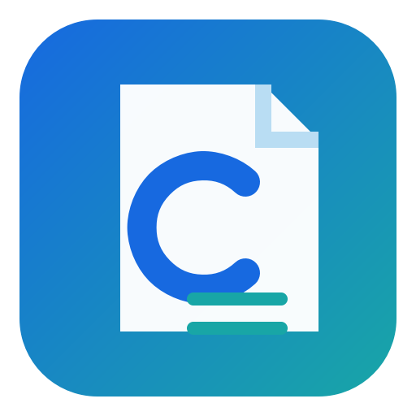

<div dir="rtl">

<p align="center"></p>

# استوديو النص النظيف

**تنظيف النص المحلي أولاً، واستعادة بنية المستند، والمعاينة مع مراعاة الصيغة، وتصدير DOCX/TXT للنص المنسوخ والمنشأ بواسطة الذكاء الاصطناعي والنص سيئ التنسيق.**

[الإنجليزية](README.md) · [简体中文](README.zh-CN.md) · [繁體中文](README.zh-TW.md) · [日本語](README.ja.md) · [한국어](README.ko.md) · [العربية الإسبانية](README.es.md) · [الفرنسية](README.fr.md) · [الألمانية](README.de.md) · [البرتغالية](README.pt-BR.md) · [Русский](README.ru.md) · [](README.ar.md) · [هندي](README.hi.md)

[](https://github.com/SiriZhao/CleanText-Studio/releases) [](https://github.com/SiriZhao/CleanText-Studio/actions/workflows/ci.yml)   [](LICENSE)

<!-- section:download -->
## تحميل لنظام التشغيل Windows

Current version: **v1.5.0**. Download the [Windows installer](https://github.com/SiriZhao/CleanText-Studio/releases/latest) for a per-user installation, or the **Portable ZIP** to run without installation. Packages are built for Windows x64 and do not require a separately installed Python runtime.


<!-- section:features -->
## ما هو الجديد في v1.5.0

- استكمال كتالوجات اللغة الثابتة ومربع حوار التعليمات المحلي والتحقق من صحة اللغة الذرية لطبقة العرض التقديمي.
- تم الاحتفاظ بتسميات مربع التحرير والسرد منفصلة عن قيم التنظيف الثابتة، لذا فإن تغيير اللغة لا يؤدي أبدًا إلى تغيير الإعداد المسبق أو تشغيل التنظيف.
- لوحة موحدة، وتحكم، وتركيز، ومربع اختيار، وتقريب البطاقة التلخيصية من خلال رموز التصميم المشتركة.
- يستخدم احتياطيات خط النظام القانوني. لم يتم تجميع ملف PingFang أو HarmonyOS Sans أو أي ملف خط آخر في هذا الإصدار.
- تمت إعادة صياغة الوثائق الرئيسية وإضافة عمليات فحص التمهيد التلقائي ولغة واجهة المستخدم وتجميد التنظيف.

## ماذا يفعل

يقوم CleanText Studio بإزالة بقايا التنسيق المنسوخة مع الحفاظ على بنية المستند المفيدة. فهو يتعرف على العناوين والقوائم والاقتباسات والأكواد وجداول Markdown والروابط والصيغ الرياضية الشائعة. يقوم نفس نموذج المستند المنظم بتغذية محرر النصوص والمعاينة وتصدير TXT وتصدير DOCX بحيث لا يتم فقدان الجدول أو الصيغة بصمت عند التصدير.

### التنظيف واستعادة الهيكل

- قم بتنظيف عناوين Markdown والتأكيد والتعليمات البرمجية المضمنة والروابط والصور والفواصل وبقايا نسخ HTML والرموز التعبيرية والشخصيات المزخرفة.
- اكتشف العناوين والقوائم والاقتباسات وكتل التعليمات البرمجية والجداول بدلاً من تسطيحها في جدار الأحرف.
- اختر الانضمام المضغوط، أو التباعد الذكي بين الأقسام، أو حدود الفقرات المحفوظة.
- احتفظ بعناوين URL المستقلة بشكل افتراضي؛ التعامل الاختياري مع عنوان URL واضح.

### تصدير الجداول والوورد

يتم تحليل جداول Markdown إلى كتل جدول منظمة. يعرض وضع المعاينة جدولًا حقيقيًا، ويقوم تصدير DOCX بكتابة جدول Word أصلي برأس غامق وحدود مرئية وعروض متكيفة ونص خلية نظيف. يظل المحتوى الطويل قابلاً للقراءة بدلاً من أن يصبح سلسلة من الأسطر القصيرة القسرية.

### الرياضيات

تتم حماية التعبيرات الرياضية المضمّنة والعرضية الشائعة LaTeX وUnicode والمعادلات البسيطة قبل تنظيف Markdown. يتم تصدير الصيغ المدعومة كمعادلات Word OMML الأصلية؛ تعود البنيات غير المدعومة إلى نص قابل للقراءة بدلاً من فقدان المتغيرات. التطبيق لا يقوم بحساب أو إثبات أو تغيير المعنى الرياضي.

### تحسين اختياري لـ BYOK AI

يعمل التنظيف المحلي دون اتصال بالإنترنت تمامًا. يعد تحسين الذكاء الاصطناعي أمرًا اختياريًا ويتم تشغيله فقط بعد تكوين الموفر ونقطة النهاية والنموذج ومفتاح واجهة برمجة التطبيقات (API). لا يوفر CleanText Studio مفاتيح عامة أو موفري بروكسي أو فواتير نموذجية للدفع. لا ترسل مواد غير مناسبة لطرف ثالث لمعالجتها.

<!-- section:privacy -->
## الخصوصية والأمان

يتم تشغيل التنظيف الأساسي والمعاينة وتصدير TXT وتصدير Word محليًا. لا يحتوي التطبيق على إعلانات أو قياس عن بعد أو نظام حساب أو مفتاح AI عام. إنها أداة تنسيق وبنية المستند وتخطيطه؛ فهو **لا** يقدم التهرب من اكتشاف الذكاء الاصطناعي، أو التهرب من الانتحال، أو انتحال الشخصية، أو سوء السلوك الأكاديمي، أو الاستشهادات الملفقة.

## بداية سريعة

1. ابدأ تشغيل التطبيق، والصق النص أو افتح TXT أو Markdown أو DOCX.
2. حدد إعدادًا مسبقًا للتنظيف ووضع الفقرة.
3. انقر فوق **تنظيف** وتفحص **وضع النص** أو **وضع المعاينة**.
4. تصدير المحتوى المنظم إلى TXT أو Word.

```text
Before: ### Test account
        ---
        **No login required**

After:  Test account
        No login required
```

## المدخلات والمخرجات ومتطلبات النظام

الإدخال: `.txt`، `.md`، `.markdown`، و`.docx`. الإخراج: UTF-8 `.txt` ومنظم `.docx`. الإصدار 1.5.0 هو إصدار Windows x64 لسطح المكتب. لا تتم المطالبة بأنظمة التشغيل macOS وLinux وAndroid باعتبارها منصات تم إصدارها.

## من المصدر

```powershell
py -3.12 -m venv .venv
.\.venv\Scripts\pip install -e ".[dev]"
$env:PYTHONPATH = "src"
.\.venv\Scripts\python -m cleantext_studio.main
```

<!-- section:build -->
## اختبار وبناء

```powershell
$env:PYTHONPATH = "src"
.\.venv\Scripts\ruff check .
.\.venv\Scripts\mypy src/cleantext_studio
.\.venv\Scripts\python -m pytest -q
.\.venv\Scripts\python scripts/check_translations.py
.\.venv\Scripts\python scripts/check_ui_language_consistency.py
.\.venv\Scripts\python scripts/check_readme_quality.py
.\.venv\Scripts\python scripts/verify_cleaning_freeze.py
.\scripts\build_windows.ps1
```

ينتج إصدار Windows تطبيق onedir، وملف ZIP محمول، ومثبت Inno Setup، والمجاميع الاختبارية SHA256، وملاحظات الإصدار ضمن `dist/`.

## التوطين والمساهمات والقيود

توفر الواجهة اللغات الصينية المبسطة والصينية التقليدية والإنجليزية واليابانية والكورية والإسبانية والفرنسية والألمانية والبرتغالية البرازيلية والروسية والعربية (RTL) والهندية. مراجعة الترجمة موضع ترحيب؛ راجع [دليل الترجمة](docs/TRANSLATION_GUIDE.md). قد تستخدم وحدات ماكرو LaTeX المعقدة المخصصة خيارًا احتياطيًا للنص، ولا يحافظ استيراد DOCX على كل نمط مستند مصدر أو صورة مضمنة.

Developer: [SiriZhao](https://github.com/SiriZhao) · Project: [SiriZhao/CleanText-Studio](https://github.com/SiriZhao/CleanText-Studio) · See [CONTRIBUTING.md](CONTRIBUTING.md) for contribution guidance.

<!-- section:license -->
## رخصة

رخصة معهد ماساتشوستس للتكنولوجيا. راجع [LICENSE](LICENSE) و[THIRD_PARTY_LICENSES.md](THIRD_PARTY_LICENSES.md).

> Translation review from the community is welcome.

</div>
