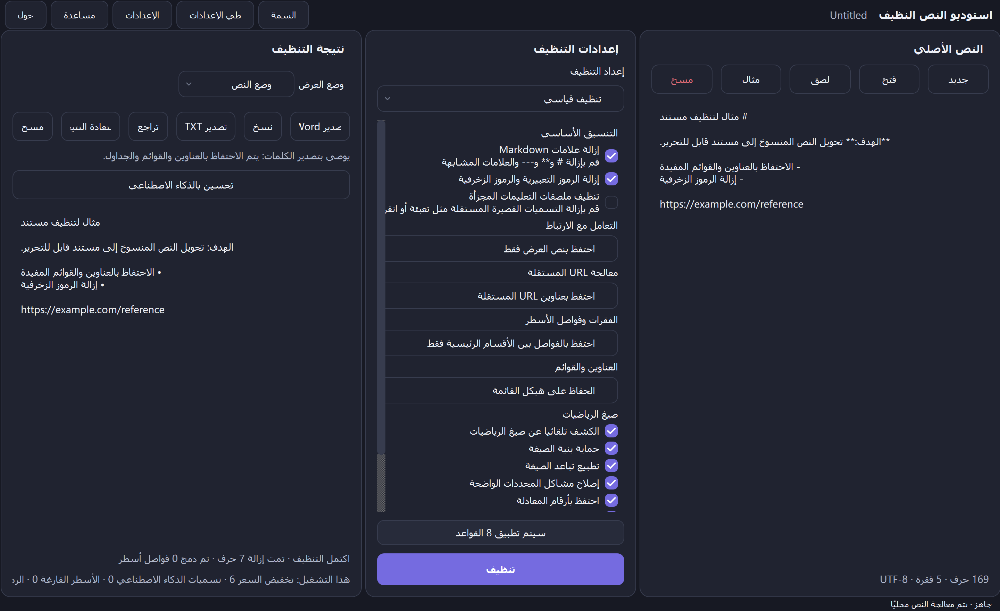
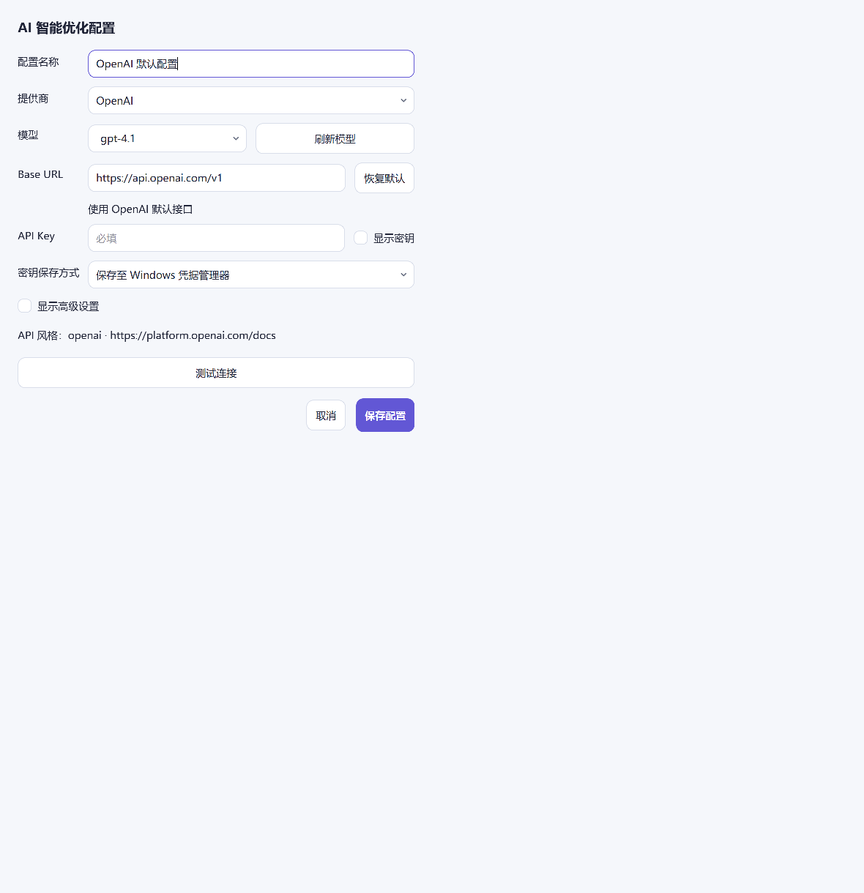

<div dir="rtl">

<p align="center">
  
</p>

<h1 align="center">CleanText Studio</h1>

<p align="center"><strong>تنظيف النص المحلي أولاً، واستعادة بنية المستند، والمعاينة مع مراعاة الصيغة، وتصدير DOCX/TXT المصقول للنص المنسوخ والمنشأ بواسطة الذكاء الاصطناعي.</strong></p>

<p align="center">
  <a href="README.md">English</a> · <a href="README.zh-CN.md">简体中文</a> · <a href="README.zh-TW.md">繁體中文</a> · <a href="README.ja.md">日本語</a> · <a href="README.ko.md">한국어</a> · <a href="README.es.md">Español</a> · <a href="README.fr.md">Français</a> · <a href="README.de.md">Deutsch</a> · <a href="README.pt-BR.md">Português (Brasil)</a> · <a href="README.ru.md">Русский</a> · <a href="README.ar.md">العربية</a> · <a href="README.hi.md">हिन्दी</a>
</p>

<p align="center">
  <a href="https://github.com/SiriZhao/CleanText-Studio/releases/tag/v1.5.1"></a>
  <a href="https://github.com/SiriZhao/CleanText-Studio/actions/workflows/ci.yml"></a>
  
  
  <a href="LICENSE"></a>
</p>

> **الإصدار الحالي: v1.5.1 · Windows x64 · محلي أولاً افتراضيًا**

<p align="center">
  <a href="https://github.com/SiriZhao/CleanText-Studio/releases/download/v1.5.1/CleanText-Studio-v1.5.1-Windows-x64-Setup.exe"><strong>تحميل المثبت</strong></a> ·
  <a href="https://github.com/SiriZhao/CleanText-Studio/releases/download/v1.5.1/CleanText-Studio-v1.5.1-Windows-x64-Portable.zip"><strong>تنزيل ملف ZIP</strong></a> المحمول ·
  <a href="https://github.com/SiriZhao/CleanText-Studio/releases/download/v1.5.1/SHA256SUMS.txt">SHA256 المجموع الاختباري</a>
</p>



CleanText Studio يحول النص المنسوخ الفوضوي إلى مستند قابل للقراءة والتحرير دون التعامل مع البنية المفيدة على أنها ضوضاء. فهو يزيل Markdown والزخارف الزائدة عن الحاجة، ويستعيد العناوين والقوائم والجداول والرموز الرياضية الشائعة، ثم يمنحك عرضًا نصيًا ومعاينة منظمة وتصدير DOCX أو TXT. يتم إجراء التنظيف الأساسي على الجهاز؛ يستخدم تحسين الذكاء الاصطناعي الاختياري فقط موفر API الذي تقوم بتكوينه بنفسك.

** لماذا هو مفيد **

- احتفظ بالمعنى أثناء إزالة البقايا المرئية من صفحات الويب والمحادثات والملاحظات والمسودات التي تم إنشاؤها.
- احتفظ بنموذج المستند بحيث لا يتم تسوية العناوين والجداول والارتباطات والصيغ بصمت قبل التصدير.
- قم بمراجعة النتيجة قبل كتابة جدول Word أصلي، أو معادلة قابلة للتحرير، أو ملف نصي UTF-8.
- قم بتبديل لغة الواجهة وموضوعها في وقت التشغيل دون تغيير إعدادات المصدر أو النتيجة أو التنظيف.

## تنزيل لـ Windows

تم إصدار CleanText Studio v1.5.1 لـ **Windows x64**. اختر برنامج التثبيت للتثبيت العادي لكل مستخدم، أو اختر ملف ZIP المحمول عندما تفضل التشغيل من مجلد مستخرج. لا تتطلب أي من الحزمتين تثبيت Python منفصلاً.

| الحزمة | الاستخدام المقصود | تحميل |
| --- | --- | --- |
| الإعداد | التثبيت وإدخال قائمة ابدأ وإلغاء الدعم | [CleanText-Studio-v1.5.1-Windows-x64-Setup.exe](https://github.com/SiriZhao/CleanText-Studio/releases/download/v1.5.1/CleanText-Studio-v1.5.1-Windows-x64-Setup.exe) |
| محمول | قم بالتشغيل بعد استخراج الملف المضغوط. لا يوجد تثبيت | [CleanText-Studio-v1.5.1-Windows-x64-Portable.zip](https://github.com/SiriZhao/CleanText-Studio/releases/download/v1.5.1/CleanText-Studio-v1.5.1-Windows-x64-Portable.zip) |
| التحقق | تحقق من الحزمة التي تم تنزيلها | [SHA256SUMS.txt](https://github.com/SiriZhao/CleanText-Studio/releases/download/v1.5.1/SHA256SUMS.txt) |

صفحة الإصدار هي مصدر الحقيقة للملفات المتاحة: [CleanText Studio v1.5.1](https://github.com/SiriZhao/CleanText-Studio/releases/tag/v1.5.1).

## ما يفعله CleanText Studio

### مصمم للتنظيف العملي للمستندات

غالبًا ما يصل المحتوى المنسوخ بعناوين مكتوبة كعلامات، أو فواصل متكررة، أو رموز تعبيرية مزخرفة، أو التفاف أسطر متقطعة، أو تسميات تعليمية، أو روابط ملصقة، أو جداول تكون مجدولة بشكل مرئي فقط. CleanText Studio يجعل هذه الاختيارات واضحة بدلاً من تطبيق إعادة كتابة مخفية بمقاس واحد يناسب الجميع. اختر إعدادًا مسبقًا، وافحص النتيجة، وقم بالتصدير فقط بعد أن تبدو البنية صحيحة.

### السيناريوهات النموذجية- تطبيع الملاحظات البحثية، وملاحظات الاجتماعات، ومقتطفات قاعدة المعرفة، ونسخة صفحة الويب.
- إعداد المسودات بمساعدة الذكاء الاصطناعي للتحرير وتسليم المستندات بشكل احترافي.
- استرجع جدول Markdown قبل إرساله كجدول Word أصلي.
- الحفاظ على الرياضيات المضمنة والكتلة البسيطة مع إزالة ضوضاء التنسيق المحيطة.
- أنشئ عملية تسليم نظيفة لـ TXT عندما يكون تخطيط Word غير ضروري.

## القدرات الأساسية

### Markdown وتنظيف التنسيق

يمكن أن يقوم مسار التنظيف بإزالة علامات العناوين Markdown وعلامات التركيز وعلامات التعليمات البرمجية المضمنة وبناء جملة الصورة والقواعد الأفقية وبقايا HTML المنسوخة والرموز الزخرفية والرموز التعبيرية والتسميات التعليمية المجزأة. فهو يحافظ على النص العادي ويجعل خيارات التنظيف مرئية في لوحة الإعدادات.

### استعادة بنية الوثيقة

يتم تمثيل العناوين والقوائم والاقتباسات وكتل التعليمات البرمجية والفقرات والجداول والروابط والكتل الرياضية كبنية مستند بدلاً من طيها بشكل أعمى في تدفق أحرف. ولهذا السبب يمكن للمعاينة والتصدير اتخاذ نفس القرارات الهيكلية.

### العناوين والقوائم

اختر ما إذا كنت تريد الاحتفاظ بالعلامات، أو إضفاء الطابع الطبيعي على البنية، أو إزالة العلامات حيثما كان ذلك مناسبًا. تم تصميم الأداة للاحتفاظ بالتسلسل الهرمي المفيد ودلالات القائمة؛ إنه ليس معيد كتابة عام هو الذي يخترع مخططًا تفصيليًا جديدًا.

### الفقرات وفواصل الأسطر

ثلاثة أوضاع تغطي المواد المصدرية المشتركة:

| الوضع | استخدمه عند |
| --- | --- |
| مدمج | تريد ربط خطوط المصدر الملفوفة العادية في فقرات مضغوطة. |
| الأقسام الذكية | تريد تباعدًا طبيعيًا للفقرات مع الاحتفاظ بفواصل المقاطع ذات المعنى. |
| حفظ الكل | أنت بحاجة إلى الحفاظ على حدود الفقرة المصدر بأكبر قدر ممكن. |

### الروابط وعناوين URL المستقلة

يمكن أن تؤدي معالجة الارتباط إلى الاحتفاظ بـ Markdown، أو الاحتفاظ بنص العرض فقط، أو الاحتفاظ بنص العرض مع عنوان URL الخاص به. يمكن الاحتفاظ بعناوين URL المستقلة، أو دمجها مع الفقرة السابقة، أو إزالتها عندما تكون مجرد بقايا للبرنامج التعليمي. يتم التعامل مع عناوين URL بشكل متعمد بدلاً من اختفائها كأثر جانبي لعملية تنظيف Markdown.

## الجداول والمعادلات والمعاينة

### جداول Markdown وجداول Word

يتم تحليل جداول Markdown إلى كتل جدول منظمة. يعرض وضع المعاينة الجدول كجدول، ويقوم تصدير DOCX بإنشاء جدول Word أصلي مع صف رأس ومحتوى خلية قابل للقراءة وحدود وعروض مختارة من المحتوى بدلاً من تقسيم متساوي ثابت. Markdown يتم تنظيف الصفوف الفاصلة وعلامات التركيز المتبقية والأعمدة الفارغة التي لا معنى لها وفواصل الأسطر الناعمة غير المقصودة قبل التصدير عندما تسمح إعدادات التنظيف النشطة بذلك.


### صيغ الرياضيات ومعادلات Word القابلة للتحرير

تتم حماية المحددات المضمنة والعرضية الشائعة LaTeX وتعبيرات Unicode الرياضية والمعادلات البسيطة أثناء تنظيف النص المحيط. يتم إصدار الصيغ المدعومة كمعادلات أصلية Word OMML، لذا تظل المتغيرات والتعبيرات الشائعة قابلة للتحرير في Word. يمكن تسوية تباعد الصيغ ومشكلات المحددات الواضحة وترقيم الصيغة وفقًا للخيارات المحددة.

لا يتم تجاهل وحدات الماكرو المخصصة المعقدة بصمت. عندما تكون الصيغة خارج نطاق التحويل المدعوم، يحتفظ التطبيق بنسخة احتياطية قابلة للقراءة ويبلغ عنها في معلومات جودة التصدير.


### وضع النص ووضع المعاينة

يعد وضع النص مفيدًا لمراجعة النتيجة البسيطة التي تمت تسويتها. يعرض وضع المعاينة العناوين والقوائم والجداول والروابط والصيغ في نموذج موجه نحو المستند. لا يؤدي تبديل وضع العرض إلى إعادة تشغيل عملية التنظيف أو تغيير النتيجة.

##قبل وبعديوضح المثال المدمج التالي نوع البقايا التي تم تصميم التطبيق لتنظيفها مع الحفاظ على المحتوى المفيد.

**مصدر**```markdown
### **Project notes** ✨
---
Read the **draft** first.

- Keep the main conclusion
- Remove decorative labels

| Item | Value |
| --- | --- |
| Formula | \( E = mc^2 \) |

https://example.com/reference
```**مفهوم النتيجة**```text
Project notes

Read the draft first.

• Keep the main conclusion
• Remove decorative labels

The table and E = mc² formula remain structured in Preview and DOCX export.
```

## تنسيقات التصدير

### تصدير Word

اختر تصدير Word عندما تحتاج الوجهة إلى العناوين والقوائم والجداول والصيغ المدعومة كعناصر مستند قابلة للتحرير. يقوم المصدر بإنتاج ملف `.docx`؛ ولا يقوم بأتمتة تطبيق Word المثبت محليًا. قبل التصدير، يمكن أن يعرض التطبيق ملخصًا للبنية والجودة بحيث تكون قيود الصيغة/الجدول القابلة للاسترداد مرئية.

### تصدير TXT

اختر TXT للحصول على نتيجة نص عادي UTF-8 محمولة. يحتفظ تصدير TXT بالمحتوى النصي الذي تمت تسويته، لكن لا يمكنه تمثيل جداول Word الأصلية أو معادلات OMML القابلة للتحرير ككائنات مستند منسقة.

| الإدخال | الإخراج |
| --- | --- |
| TXT, Markdown, دكتوراه في الطب, DOCX | UTF-8 TXT ومنظم DOCX |

## اللغات والموضوعات وإمكانية الوصول

توفر واجهة سطح المكتب اللغات الصينية المبسطة والصينية التقليدية والإنجليزية واليابانية والكورية والإسبانية والفرنسية والألمانية والبرتغالية البرازيلية والروسية والعربية والهندية. يتم تطبيق تغييرات اللغة في وقت التشغيل والاحتفاظ بالنص والنتائج والتحديدات الحالية والتراجع عن السجل. تستخدم اللغة العربية واجهة من اليمين إلى اليسار بينما تظل القيم الفنية مثل عناوين URL ومفاتيح API والتعليمات البرمجية قابلة للقراءة من اليسار إلى اليمين.

تشترك السمات الفاتحة والداكنة في نفس اللوحة والتحكم والتركيز ونظام السطح المستدير. يستخدم التطبيق النسخ الاحتياطية لخط النظام القانوني حيثما كان ذلك متاحًا؛ فهو لا يجمع ملفات Apple PingFang.


## تحسين اختياري للذكاء الاصطناعي (BYOK)

يعد تحسين الذكاء الاصطناعي أمرًا اختياريًا. تتوفر عمليات التنظيف الأساسية والمعاينة وتصدير TXT وتصدير DOCX بدون اتصال بالشبكة. عندما تقوم بتمكين تحسين الذكاء الاصطناعي عمدًا، فإنك تختار موفرًا مدعومًا ونقطة نهاية ونموذجًا ومفتاح API الخاص بك. لا يوفر التطبيق مفتاح API مجانيًا مشتركًا أو وكيلًا لحساب المزود الخاص بك.

يمكن تحديد DeepSeek والموفرين الآخرين الذين تم الكشف عنهم بواسطة تكوين التطبيق المثبت من خلال مربع حوار إعدادات الذكاء الاصطناعي. تظل معرفات الموفر والطراز منفصلة عن تسميات العرض المترجمة. قم بمراجعة شروط البيانات الخاصة بموفر الخدمة قبل إرسال المواد الحساسة.



## بداية سريعة

1. قم بتشغيل CleanText Studio والصق النص، أو افتح ملفًا مدعومًا.
2. اختر إعدادًا مسبقًا للتنظيف واضبط الخيارات المطلوبة لهذا المستند فقط.
3. انقر فوق **تنظيف**، ثم افحص وضع النص أو وضع المعاينة.
4. قم بالتصدير إلى Word للتسليم المنظم، أو TXT لملف نص عادي تمت تسويته.
5. إذا لزم الأمر، قم بتكوين مزود الذكاء الاصطناعي الخاص بك واختر بوعي متى ترسل النص إليه.

### نسخة مثبتة أو محمولة

- **المثبت:** قم بتشغيل ملف الإعداد القابل للتنفيذ، واتبع المثبت، وقم بتشغيل CleanText Studio من القائمة "ابدأ". استخدم إعدادات التطبيقات Windows أو أداة إلغاء التثبيت لإزالتها.
- **محمول:** قم باستخراج الملف المضغوط إلى مجلد قابل للكتابة وابدأ تشغيل الملف القابل للتنفيذ بداخله. احتفظ بالملفات المستخرجة معًا؛ لا تقم بتشغيله مباشرة من أرشيف مضغوط.

### سير العمل الكامل

1. ضع النص المصدر في اللوحة اليسرى.
2. استخدم اللوحة المركزية لتحديد كيفية التعامل مع Markdown والروابط والفقرات والقوائم والصيغ.
3. قم بمراجعة النتيجة التي تم تنظيفها على اليمين واستخدم المعاينة للجداول والمعادلات.
4. استخدم شريط أدوات النتائج لنسخ أحدث نتيجة أو التراجع عنها أو استعادتها أو مسحها أو تصدير TXT أو تصدير Word.
5. احتفظ بنسخة من المصدر الأصلي عندما يكون للوثيقة أهمية قانونية أو أرشيفية أو نشرية.

## الخصوصية والأمان وتدفق البيانات

### المعالجة الأساسية المحلية الأولىيتم تشغيل التنظيف الأساسي محليًا. لا يحتوي التطبيق على نظام حساب أو خدمة إعلانية أو خدمة قياس عن بعد أو مفتاح API عام مشترك. لا يتم تحميل النص الخاص بك لمجرد لصقه أو معاينته أو تنظيفه أو تصديره محليًا.

### طلبات الذكاء الاصطناعي قابلة للاشتراك

يستخدم إجراء تحسين الذكاء الاصطناعي الصريح فقط موفر الجهة الخارجية الذي قمت بتكوينه. يتلقى المزود المواد اللازمة لهذا الطلب بموجب شروطه الخاصة. لا تستخدم طلب مقدم الخدمة للمواد التي لا يحق لك مشاركتها.

### API التعامل مع المفاتيح

يتم توفير مفاتيح API بواسطة المستخدم ولا تتم كتابتها في تكوين المستند المُصدَّر. في Windows، يستخدم التطبيق آلية تخزين بيانات الاعتماد التي تم تكوينها عندما تكون متاحة؛ إذا لم يكن تخزين بيانات الاعتماد الآمن متاحًا، فإنه يتراجع بأمان بدلاً من تصدير مفتاح نص عادي بصمت. تعامل مع حساب نظام التشغيل الخاص بك وبيانات اعتماد الموفر كحدود أمنية.

## متطلبات النظام

- Windows x64.
- بيئة سطح المكتب Windows المدعومة حاليًا.
- لم يتم تثبيت وقت تشغيل Python بشكل منفصل لحزم الإصدار.
- يعد الوصول إلى الإنترنت اختياريًا وهو مطلوب فقط لتنزيلات GitHub أو استخدام الذكاء الاصطناعي الاختياري أو الروابط التي يفتحها المستخدم.

Windows بإمكان SmartScreen إظهار تحذير حول السمعة للإصدار الجديد غير الموقع أو منخفض السمعة. قم بالتنزيل فقط من صفحة إصدار المستودع، وتحقق من المجموع الاختباري SHA256، واتبع سياسة تثبيت البرامج الخاصة بمؤسستك.

## المكدس الفني وهندسة المشروع

CleanText Studio هو تطبيق سطح مكتب Python يستخدم PySide6 للواجهة، وpython-docx لكتابة DOCX، وPyInstaller للتغليف المحمول، وInno Setup لمثبت Windows، وpytest/Ruff/mypy لفحص الجودة. يوجد نموذج التنظيف وكتلة المستند أسفل طبقة العرض التقديمي، مما يسمح للنص والمعاينة والتصدير باستهلاك نفس البنية الطبيعية.```text
src/cleantext_studio/
├── app.py                 # desktop window and presentation wiring
├── cleaners/              # stable text-cleaning pipeline
├── math/                  # detection, parsing, preview, and OMML support
├── exporters/             # DOCX and TXT exporters
├── i18n/                  # locale catalogs and runtime translation service
├── ui/                    # cards, controls, and theme components
└── llm/                   # optional provider configuration and requests
assets/                    # icon, screenshots, and packaged resources
scripts/                   # validation, screenshot, and Windows-build helpers
tests/                     # unit, GUI, integration, and regression checks
```## تشغيل من المصدر

تتطابق الأوامر التالية مع تخطيط تطوير المستودع على PowerShell.```powershell
git clone https://github.com/SiriZhao/CleanText-Studio.git
cd CleanText-Studio
py -3.12 -m venv .venv
.\.venv\Scripts\pip install -e ".[dev]"
$env:PYTHONPATH = "src"
.\.venv\Scripts\python -m cleantext_studio.main
```## الاختبار والبناء```powershell
$env:PYTHONPATH = "src"
.\.venv\Scripts\ruff check .
.\.venv\Scripts\mypy src/cleantext_studio
.\.venv\Scripts\python -m pytest -q
.\.venv\Scripts\python scripts/check_translations.py
.\.venv\Scripts\python scripts/check_readme_quality.py
.\.venv\Scripts\python scripts/check_screenshot_quality.py
.\.venv\Scripts\python scripts/verify_cleaning_freeze.py
.\scripts\build_windows.ps1
```يقوم الإصدار Windows بكتابة العناصر الحالية والمجاميع الاختبارية وملاحظات الإصدار إلى `dist/`. لم يتم الالتزام بمخرجات البناء بالمستودع عمدًا.

## تحرير العناصر والتحقق من SHA256

يوفر كل إصدار ملف الإعداد القابل للتنفيذ، وملف ZIP المحمول، `SHA256SUMS.txt`، وملاحظات الإصدار عند توفرها. في PowerShell، قارن بين العناصر التي تم تنزيلها والمجموع الاختباري المنشور:```powershell
Get-FileHash .\CleanText-Studio-v1.5.1-Windows-x64-Setup.exe -Algorithm SHA256
Get-Content .\SHA256SUMS.txt
```##مساهمات التدويل والترجمة

الكتالوجات المحلية الرسمية هي `zh_CN`، `zh_TW`، `en_US`، `ja_JP`، `ko_KR`، `es_ES`، `fr_FR`، `de_DE`، `pt_BR`، `ru_RU`، `ar`، و `hi_IN`. راجع [docs/TRANSLATION_GLOSSARY.md](docs/TRANSLATION_GLOSSARY.md) و[docs/README_TRANSLATION_STATUS.md](docs/README_TRANSLATION_STATUS.md) قبل اقتراح تغييرات في المصطلحات. نرحب بمراجعة الترجمة المجتمعية؛ لا يدعي هذا المستودع أن كل ترجمة للوثائق قد تلقت مراجعة من المتحدث الأصلي.

##خارطة الطريق

الإصدار العام الحالي هو Windows x64. إن عمل النظام الأساسي المستقبلي، ودقة الاستيراد الأكثر ثراءً، وتغطية الصيغة الأوسع هي موضوعات خارطة الطريق بدلاً من مطالبات الشحن الحالية. نرحب بطلبات الميزات وتقارير المشكلات، ولكن عنصر خريطة الطريق لا يعد التزامًا أو إعلانًا للإصدار.

## القيود المعروفة

- يمكن أن تتطلب وحدات ماكرو LaTeX المعقدة إجراءً احتياطيًا قابلاً للقراءة بدلاً من تحويل المعادلة Word الأصلية.
- لا يمكن لاستيراد DOCX الحفاظ على كل نمط أصلي أو كائن مضمن أو ميزة تخطيط من ملفات Word عشوائية.
- لا يمكن لـ TXT تشفير الجداول الأصلية Word الغنية أو المعادلات القابلة للتحرير.
- يتم إنتاج مخرجات AI الاختيارية بواسطة موفر الطرف الثالث الذي تحدده ويتطلب مراجعة بشرية.
- التعبئة والتغليف Windows هي المنصة المنشورة الوحيدة المذكورة هنا؛ لا يتم الإعلان حاليًا عن أنظمة التشغيل macOS وLinux وAndroid وiOS كإصدارات تم إصدارها.

## الأسئلة الشائعة

### هل يجب أن أكون متصلاً بالإنترنت؟

لا. تعمل عمليات التنظيف المحلية والمعاينة والتصدير المحلي دون اتصال بالشبكة. الوصول إلى الشبكة مطلوب فقط لإجراءات مثل تنزيل الإصدارات أو فتح رابط خارجي أو طلب الذكاء الاصطناعي الذي تختاره.

### هل سيقوم التطبيق بتحميل النص الخاص بي؟

ليس للمعالجة المحلية الأساسية. يحدث طلب الجهة الخارجية فقط عندما تستخدم تحسين الذكاء الاصطناعي بشكل صريح مع المزود الذي تم تكوينه.

### هل يجب علي تكوين مفتاح API؟

لا. هناك حاجة إلى مفتاح API فقط لتحسين الذكاء الاصطناعي الاختياري.

### ما هي الملفات التي يمكنني استخدامها؟

يقبل التطبيق إدخال TXT وMarkdown/MD وDOCX ويمكنه تصدير UTF-8 TXT أو DOCX.

### ما الفرق بين تصدير Word وTXT؟

يمكن لـ Word الاحتفاظ ببنية غنية مثل العناوين والجداول الأصلية والمعادلات المدعومة القابلة للتحرير. TXT عبارة عن تسليم نصي UTF-8 نظيف بدون كائنات المستندات الغنية.

### لماذا يوصى بتصدير Word لبعض المستندات؟

إنه التنسيق الذي يمكنه حمل بنية المستند المسترد بأمانة أكبر، وخاصة الجداول والصيغ المدعومة.

### هل الصيغ قابلة للتحرير؟

يتم تصدير الصيغ المدعومة كمعادلات أصلية Word OMML. قد تستخدم وحدات الماكرو المعقدة غير المدعومة بديلاً قابلاً للقراءة ويجب التحقق منه قبل النشر.

### هل يتم تصدير الجداول كجداول Word؟

يتم تصدير جداول Markdown كجداول Word أصلية عند تحديد تصدير Word.

### كيف يمكنني تغيير اللغة أو الموضوع؟

استخدم عناصر التحكم في اللغة والموضوع في شريط أدوات/إعدادات التطبيق. يحافظ مفتاح وقت التشغيل على المستند النشط وتحديدات التنظيف.

### أين يتم تخزين مفتاح API الخاص بي؟

يستخدم التطبيق مسار تخزين بيانات الاعتماد Windows الذي تم تكوينه عندما يكون متاحًا ولا يتضمن المفتاح في التكوين الذي تم تصديره. راجع إعدادات الإصدار المثبت وسياسة أمان النظام لديك.

### برنامج تثبيت أم ملف ZIP محمول؟

اختر برنامج التثبيت للتكامل العادي Windows ودعم إلغاء التثبيت. اختر محمولًا عندما تريد مجلدًا مستخرجًا ومكتفيًا بذاته.

### كيف يمكنني الإبلاغ عن مشكلة أو المساهمة في الترجمة؟افتح مشكلة أو طلب سحب في [SiriZhao/CleanText-Studio](https://github.com/SiriZhao/CleanText-Studio)، بما في ذلك العينة غير الحساسة والنتيجة المتوقعة حيثما أمكن ذلك.

## المساهمة

يرجى قراءة [CONTRIBUTING.md](CONTRIBUTING.md) قبل فتح طلب السحب. حافظ على تركيز التغييرات، وأضف الاختبارات عند تغير السلوك، وتجنب الالتزام بمخرجات البناء أو بيانات الاعتماد، وحافظ على وضع الخصوصية المحلي الأول للمشروع.

## المطور

تتم صيانته بواسطة [SiriZhao](https://github.com/SiriZhao). الصفحة الرئيسية للمشروع: [SiriZhao/CleanText-Studio](https://github.com/SiriZhao/CleanText-Studio).

## تراخيص الطرف الثالث

راجع [THIRD_PARTY_LICENSES.md](THIRD_PARTY_LICENSES.md) للاطلاع على إشعارات التبعية الموزعة ووقت التشغيل. CleanText Studio لا يقوم بحزم ملفات خطوط Apple PingFang.

## الترخيص

CleanText Studio متاح بموجب [MIT License](الترخيص).

</div>

> نرحب بمراجعة المجتمع لترجمة ملف README هذا.
