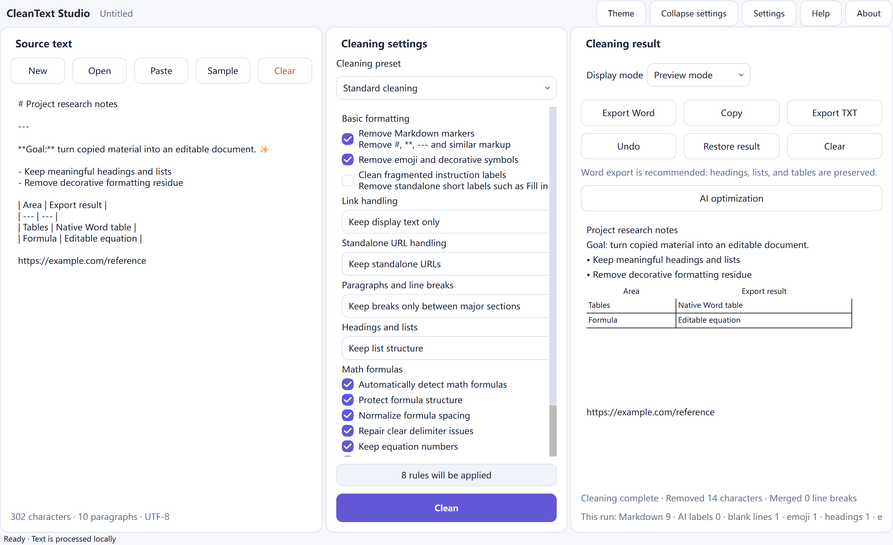
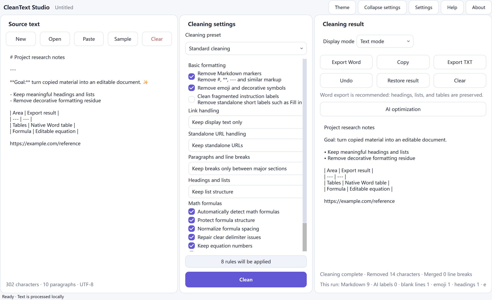
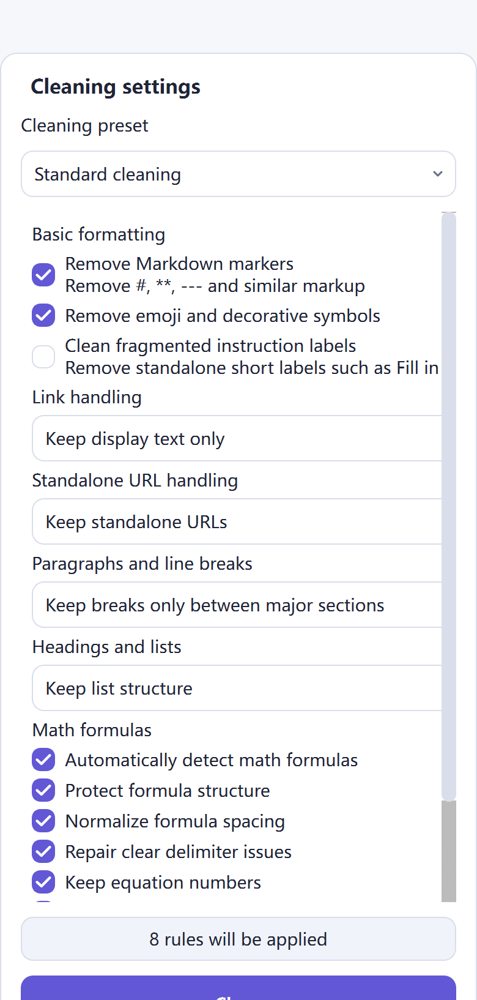

<p align="center">
  
</p>

<h1 align="center">CleanText Studio</h1>

<p align="center"><strong>Nettoyage du texte en priorité locale, récupération de la structure du document, aperçu tenant compte des formules et exportation DOCX/TXT raffinée pour le texte copié et généré par l'IA.</strong></p>

<p align="center">
  <a href="README.md">English</a> · <a href="README.zh-CN.md">简体中文</a> · <a href="README.zh-TW.md">繁體中文</a> · <a href="README.ja.md">日本語</a> · <a href="README.ko.md">한국어</a> · <a href="README.es.md">Español</a> · <a href="README.fr.md">Français</a> · <a href="README.de.md">Deutsch</a> · <a href="README.pt-BR.md">Português (Brasil)</a> · <a href="README.ru.md">Русский</a> · <a href="README.ar.md">العربية</a> · <a href="README.hi.md">हिन्दी</a>
</p>

<p align="center">
  <a href="https://github.com/SiriZhao/CleanText-Studio/releases/tag/v1.5.2"></a>
  <a href="https://github.com/SiriZhao/CleanText-Studio/actions/workflows/ci.yml"></a>
  
  
  <a href="LICENSE"></a>
</p>

> **Version actuelle : v1.5.2 · Windows x64 · local d'abord par défaut**

<p align="center">
  <a href="https://github.com/SiriZhao/CleanText-Studio/releases/download/v1.5.2/CleanText-Studio-v1.5.2-Windows-x64-Setup.exe"><strong>Télécharger le programme d'installation</strong></a> ·
  <a href="https://github.com/SiriZhao/CleanText-Studio/releases/download/v1.5.2/CleanText-Studio-v1.5.2-Windows-x64-Portable.zip"><strong>Télécharger le ZIP portable</strong></a> ·
  <a href="https://github.com/SiriZhao/CleanText-Studio/releases/download/v1.5.2/SHA256SUMS.txt">SHA256 sommes de contrôle</a>
</p>


CleanText Studio transforme le texte copié en désordre en un document lisible et modifiable sans traiter la structure utile comme du bruit. Il supprime les Markdown et la décoration redondants, récupère les titres, les listes, les tableaux et la notation mathématique courante, puis vous offre une vue texte, un aperçu structuré et une exportation DOCX ou TXT. Un nettoyage de base est effectué sur l'appareil ; L'optimisation facultative de l'IA utilise uniquement un fournisseur API que vous configurez vous-même.

**Pourquoi c'est utile**

- Conservez le sens tout en supprimant les résidus visuels des pages Web, des discussions, des notes et des brouillons générés.
- Préservez un modèle de document afin que les titres, tableaux, liens et formules ne s'aplatissent pas silencieusement avant l'exportation.
- Examinez le résultat avant d'écrire une table Word native, une équation modifiable ou un fichier texte UTF-8.
- Changez la langue et le thème de l'interface au moment de l'exécution sans modifier les paramètres de source, de résultat ou de nettoyage.

## Télécharger pour Windows

CleanText Studio v1.5.2 est publié pour **Windows x64**. Choisissez le programme d'installation pour une installation normale par utilisateur, ou choisissez le ZIP portable lorsque vous préférez exécuter à partir d'un dossier extrait. Aucun des deux packages ne nécessite une installation Python distincte.

| Forfait | Utilisation prévue | Télécharger |
| --- | --- | --- |
| Configuration | Prise en charge de l'installation, de l'entrée du menu Démarrer et de la désinstallation | [CleanText-Studio-v1.5.2-Windows-x64-Setup.exe](https://github.com/SiriZhao/CleanText-Studio/releases/download/v1.5.2/CleanText-Studio-v1.5.2-Windows-x64-Setup.exe) |
| Portable | Exécuter après avoir extrait le ZIP ; pas d'installation | [CleanText-Studio-v1.5.2-Windows-x64-Portable.zip](https://github.com/SiriZhao/CleanText-Studio/releases/download/v1.5.2/CleanText-Studio-v1.5.2-Windows-x64-Portable.zip) |
| Vérification | Vérifiez le package téléchargé | [SHA256SUMS.txt](https://github.com/SiriZhao/CleanText-Studio/releases/download/v1.5.2/SHA256SUMS.txt) |

La page de version est la source de vérité pour les fichiers disponibles : [CleanText Studio v1.5.2](https://github.com/SiriZhao/CleanText-Studio/releases/tag/v1.5.2).

## Que fait CleanText Studio

### Conçu pour un nettoyage pratique des documents

Le contenu copié arrive souvent avec des titres écrits sous forme de marqueurs, des séparateurs répétés, des emoji décoratifs, des retours à la ligne brisés, des étiquettes de didacticiel, des liens collés ou des tableaux qui ne sont que visuellement tabulaires. CleanText Studio rend ces choix explicites au lieu d'appliquer une réécriture cachée et universelle. Choisissez un préréglage, inspectez le résultat et exportez-le uniquement lorsque la structure semble correcte.

### Scénarios typiques- Normalisez les notes de recherche, les notes de réunion, les extraits de bases de connaissances et les copies de pages Web.
- Préparer des brouillons assistés par l'IA pour l'édition et la livraison de documents professionnels.
- Récupérer une table Markdown avant de l'envoyer en tant que table Word native.
- Préservez les mathématiques simples en ligne et en bloc tout en supprimant le bruit de formatage environnant.
- Créez un transfert TXT propre lorsqu'une mise en page Word n'est pas nécessaire.

## Capacités de base

### Markdown et nettoyage du formatage

Le pipeline de nettoyage peut supprimer les marqueurs de titre Markdown, les marqueurs d'accentuation, les marqueurs de code en ligne, la syntaxe d'image, les règles horizontales, les résidus HTML copiés, les symboles décoratifs, les emoji et les étiquettes d'instructions fragmentées. Il préserve le texte ordinaire et rend les options de nettoyage visibles dans le panneau des paramètres.

### Récupération de la structure du document

Les titres, listes, citations, blocs de code, paragraphes, tableaux, liens et blocs mathématiques sont représentés sous forme de structure de document plutôt que d'être aveuglément réduits en un flux de caractères. C'est pourquoi la prévisualisation et l'exportation peuvent prendre les mêmes décisions structurelles.

### Titres et listes

Choisissez si vous souhaitez conserver les marqueurs, naturaliser une structure ou supprimer les marqueurs le cas échéant. L'outil est conçu pour conserver la hiérarchie utile et la sémantique des listes ; ce n'est pas un réécrivain générique qui invente un nouveau schéma.

### Paragraphes et sauts de ligne

Trois modes couvrent le matériel source commun :

| Mode | Utilisez-le lorsque |
| --- | --- |
| Compacte | Vous souhaitez que les lignes sources ordinaires soient jointes en paragraphes compacts. |
| Sections intelligentes | Vous souhaitez un espacement naturel des paragraphes tout en conservant des sauts de section significatifs. |
| Préserver tout | Vous devez conserver les limites du paragraphe source aussi étroitement que possible. |

### Liens et URL autonomes

La gestion des liens peut conserver Markdown, conserver uniquement le texte à afficher ou conserver le texte à afficher avec son URL. Les URL autonomes peuvent être conservées, fusionnées avec le paragraphe précédent ou supprimées lorsqu'elles ne sont que des résidus de didacticiel. Les URL sont traitées délibérément plutôt que de disparaître comme effet secondaire du nettoyage Markdown.

## Tableaux, équations et aperçu

### Tables Markdown et tables Word

Les tables Markdown sont analysées en blocs de tables structurés. Le mode Aperçu affiche le tableau sous forme de tableau et l'exportation DOCX crée un tableau Word natif avec une ligne d'en-tête, un contenu de cellule lisible, des bordures et des largeurs choisies dans le contenu plutôt qu'une répartition égale fixe. Les lignes de séparation Markdown, les marqueurs d'accentuation résiduels, les colonnes vides sans signification et les sauts de ligne accidentels sont nettoyés avant l'exportation lorsque les paramètres de nettoyage actifs le permettent.



### Formules mathématiques et équations Word modifiables

Les délimiteurs communs en ligne et d'affichage LaTeX, les expressions mathématiques Unicode et les équations simples sont protégés tandis que le texte environnant est nettoyé. Les formules prises en charge sont émises sous forme d'équations natives Word OMML, de sorte que les variables et expressions communes restent modifiables dans Word. L'espacement des formules, les problèmes évidents de délimiteur et la numérotation des formules peuvent être normalisés en fonction des options sélectionnées.

Les macros personnalisées complexes ne sont pas ignorées en silence. Lorsqu'une formule se situe en dehors de la plage de conversion prise en charge, l'application conserve une solution de secours lisible et la signale dans les informations sur la qualité de l'exportation.



### Mode texte et mode aperçu

Le mode texte est utile pour examiner le résultat brut normalisé. Le mode Aperçu affiche les titres, les listes, les tableaux, les liens et les formules sous une forme orientée document. Le changement de mode d’affichage ne relance pas le nettoyage et ne modifie pas votre résultat.

## Avant et aprèsL'exemple compact suivant montre le type de résidus que l'application est conçue pour nettoyer tout en préservant le contenu utile.

**Source**```markdown
### **Project notes** ✨
---
Read the **draft** first.

- Keep the main conclusion
- Remove decorative labels

| Item | Value |
| --- | --- |
| Formula | \( E = mc^2 \) |

https://example.com/reference
```**Concept de résultat**```text
Project notes

Read the draft first.

• Keep the main conclusion
• Remove decorative labels

The table and E = mc² formula remain structured in Preview and DOCX export.
`


##Formats d'exportation

### Exporter Word

Choisissez l'exportation Word lorsque la destination nécessite des en-têtes, des listes, des tableaux et des formules prises en charge comme éléments de document modifiables. L'exportateur produit un fichier `.docx` ; il n'automatise pas une application Word installée localement. Avant l'exportation, l'application peut afficher un résumé de la structure et de la qualité afin que les limitations des formules/tableaux récupérables soient visibles.

### Exporter TXT

Choisissez TXT pour un résultat portable UTF-8 en texte brut. L'exportation TXT préserve le contenu textuel normalisé, mais ne peut pas représenter les tables natives Word ou les équations OMML modifiables en tant qu'objets de document enrichi.

| Entrée | Sortie |
| --- | --- |
| TXT, Markdown, MD, DOCX | UTF-8 TXT et structuré DOCX |

## Langues, thèmes et accessibilité

L'interface de bureau propose le chinois simplifié, le chinois traditionnel, l'anglais, le japonais, le coréen, l'espagnol, le français, l'allemand, le portugais brésilien, le russe, l'arabe et l'hindi. Les modifications de langue sont appliquées au moment de l'exécution et conservent le texte, les résultats, les sélections actuelles et l'historique des annulations. L'arabe utilise une interface de droite à gauche tandis que les valeurs techniques telles que les URL, les clés API et le code restent lisibles de gauche à droite.

Les thèmes clairs et sombres partagent le même système de panneau, de contrôle, de mise au point et de surface arrondie. L'application utilise des polices de secours légales du système lorsqu'elles sont disponibles ; il ne regroupe **pas** les fichiers Apple PingFang.



## Optimisation facultative de l'IA (BYOK)

L'optimisation de l'IA est facultative. Le nettoyage de base, l'aperçu, l'exportation TXT et l'exportation DOCX sont disponibles sans connexion réseau. Lorsque vous activez délibérément l'optimisation de l'IA, vous choisissez un fournisseur, un point de terminaison, un modèle pris en charge et votre propre clé API. L'application ne fournit pas de clé API gratuite partagée ni de proxy pour votre compte fournisseur.

DeepSeek et d'autres fournisseurs exposés par la configuration de l'application installée peuvent être sélectionnés via la boîte de dialogue des paramètres AI. Les identifiants du fournisseur et du modèle restent distincts des étiquettes d'affichage traduites. Consultez les propres conditions de données du fournisseur avant d’envoyer du matériel sensible.


## Démarrage rapide

1. Lancez CleanText Studio et collez le texte, ou ouvrez un fichier pris en charge.
2. Choisissez un préréglage de nettoyage et ajustez uniquement les options nécessaires pour ce document.
3. Cliquez sur **Nettoyer**, puis inspectez le mode Texte ou le mode Aperçu.
4. Exportez vers Word pour une livraison structurée ou TXT pour un fichier texte brut normalisé.
5. Si nécessaire, configurez votre propre fournisseur d'IA et choisissez consciemment quand lui envoyer du texte.

### Installateur ou version portable

- **Installateur :** exécutez l'exécutable d'installation, suivez le programme d'installation et lancez CleanText Studio à partir du menu Démarrer. Utilisez les paramètres des applications Windows ou le programme de désinstallation pour le supprimer.
- **Portable :** extrayez le ZIP dans un dossier inscriptible et démarrez l'exécutable qu'il contient. Conservez les fichiers extraits ensemble ; ne l'exécutez pas directement à partir d'une archive compressée.

### Flux de travail complet

1. Placez le texte source dans le panneau de gauche.
2. Utilisez le panneau central pour décider comment Markdown, les liens, les paragraphes, les listes et les formules sont gérés.
3. Examinez le résultat nettoyé à droite et utilisez Aperçu pour les tableaux et les équations.
4. Utilisez la barre d'outils des résultats pour copier, annuler, restaurer le résultat le plus récent, effacer, exporter TXT ou exporter Word.
5. Conservez une copie de la source originale chaque fois que le document a une importance juridique, archivistique ou de publication.

## Confidentialité, sécurité et flux de données

### Traitement de base prioritairement localLe nettoyage de base s'exécute localement. L'application n'a pas de système de compte, de service de publicité, de service de télémétrie ou de clé publique API partagée. Votre texte n'est pas téléchargé simplement parce qu'il est collé, prévisualisé, nettoyé ou exporté localement.

### Les demandes d'IA sont facultatives

Seule une action explicite d’optimisation de l’IA utilise le fournisseur tiers que vous configurez. Le prestataire reçoit le matériel nécessaire à cette demande selon ses propres conditions. N'utilisez pas de demande de fournisseur pour du matériel que vous n'êtes pas autorisé à partager.

### API gestion des clés

Les clés API sont fournies par l'utilisateur et ne sont pas écrites dans la configuration du document exporté. Sur Windows, l'application utilise son mécanisme de stockage d'informations d'identification configuré lorsqu'il est disponible ; si le stockage sécurisé des informations d'identification n'est pas disponible, il revient en toute sécurité plutôt que d'exporter silencieusement une clé en texte brut. Considérez votre compte de système d'exploitation et les informations d'identification de votre fournisseur comme des limites de sécurité.

## Configuration système requise

- Windows x64.
- Un environnement de bureau Windows actuellement pris en charge.
- Pas de runtime Python installé séparément pour les packages de version.
- L'accès à Internet est facultatif et n'est nécessaire que pour les téléchargements GitHub, l'utilisation facultative de l'IA ou les liens ouverts par l'utilisateur.

Windows SmartScreen peut afficher un avertissement de réputation pour une nouvelle version non signée ou de faible réputation. Téléchargez uniquement à partir de la page de version du référentiel, vérifiez la somme de contrôle SHA256 et suivez la politique d'installation logicielle de votre organisation.

## Pile technique et architecture du projet

CleanText Studio est une application de bureau Python utilisant PySide6 pour l'interface, python-docx pour l'écriture de DOCX, PyInstaller pour l'empaquetage portable, Inno Setup pour l'installateur Windows et pytest/Ruff/mypy pour les contrôles de qualité. Le modèle de nettoyage et de bloc de documents se situe sous la couche de présentation, permettant au texte, à l'aperçu et à l'exportation d'utiliser la même structure normalisée.```text
src/cleantext_studio/
├── app.py                 # desktop window and presentation wiring
├── cleaners/              # stable text-cleaning pipeline
├── math/                  # detection, parsing, preview, and OMML support
├── exporters/             # DOCX and TXT exporters
├── i18n/                  # locale catalogs and runtime translation service
├── ui/                    # cards, controls, and theme components
└── llm/                   # optional provider configuration and requests
assets/                    # icon, screenshots, and packaged resources
scripts/                   # validation, screenshot, and Windows-build helpers
tests/                     # unit, GUI, integration, and regression checks
```## Exécuter à partir des sources

Les commandes suivantes correspondent à la disposition de développement du référentiel sur PowerShell.```powershell
git clone https://github.com/SiriZhao/CleanText-Studio.git
cd CleanText-Studio
py -3.12 -m venv .venv
.\.venv\Scripts\pip install -e ".[dev]"
$env:PYTHONPATH = "src"
.\.venv\Scripts\python -m cleantext_studio.main
```## Tester et construire```powershell
$env:PYTHONPATH = "src"
.\.venv\Scripts\ruff check .
.\.venv\Scripts\mypy src/cleantext_studio
.\.venv\Scripts\python -m pytest -q
.\.venv\Scripts\python scripts/check_translations.py
.\.venv\Scripts\python scripts/check_readme_quality.py
.\.venv\Scripts\python scripts/check_screenshot_quality.py
.\.venv\Scripts\python scripts/verify_cleaning_freeze.py
.\scripts\build_windows.ps1
```La version Windows écrit ses artefacts, sommes de contrôle et notes de version actuels dans `dist/`. La sortie de la build n’est intentionnellement pas validée dans le référentiel.

## Libération des artefacts et vérification SHA256

Chaque version fournit l'exécutable d'installation, Portable ZIP, `SHA256SUMS.txt` et les notes de version lorsqu'elles sont disponibles. Dans PowerShell, comparez un artefact téléchargé avec la somme de contrôle publiée :```powershell
Get-FileHash .\CleanText-Studio-v1.5.2-Windows-x64-Setup.exe -Algorithm SHA256
Get-Content .\SHA256SUMS.txt
```## Contributions à l'internationalisation et à la traduction

Les catalogues locaux officiels sont `zh_CN`, `zh_TW`, `en_US`, `ja_JP`, `ko_KR`, `es_ES`, `fr_FR`, `de_DE`, `pt_BR`, `ru_RU`, `ar` et `hi_IN`. Voir [docs/TRANSLATION_GLOSSARY.md](docs/TRANSLATION_GLOSSARY.md) et [docs/README_TRANSLATION_STATUS.md](docs/README_TRANSLATION_STATUS.md) avant de proposer des modifications terminologiques. La révision des traductions par la communauté est la bienvenue ; ce référentiel ne prétend pas que chaque traduction de documentation a été révisée par un locuteur natif.

## Feuille de route

La version publique actuelle est Windows x64. Le travail futur de la plateforme, une fidélité d’importation plus riche et une couverture de formule plus large sont des sujets de feuille de route plutôt que des revendications d’expédition actuelles. Les demandes de fonctionnalités et les rapports de problèmes sont les bienvenus, mais un élément de feuille de route ne constitue pas un engagement ou une annonce de sortie.

## Limitations connues

- Les macros LaTeX personnalisées complexes peuvent nécessiter une solution de secours lisible au lieu d'une conversion d'équation Word native.
- L'importation DOCX ne peut pas conserver tous les styles d'origine, objets incorporés ou fonctionnalités de mise en page à partir de fichiers Word arbitraires.
- TXT ne peut pas encoder de riches tables natives Word ou des équations modifiables.
- La sortie IA facultative est produite par le fournisseur tiers que vous sélectionnez et nécessite un examen humain.
- L'emballage Windows est la seule plate-forme publiée indiquée ici ; macOS, Linux, Android et iOS ne sont actuellement pas annoncés comme versions publiées.

##FAQ

### Dois-je être en ligne ?

Non. Le nettoyage local, l’aperçu et l’exportation locale fonctionnent sans connexion réseau. L'accès au réseau n'est nécessaire que pour des actions telles que le téléchargement de versions, l'ouverture d'un lien externe ou une demande d'IA que vous choisissez de faire.

### L'application téléchargera-t-elle mon texte ?

Pas pour le traitement local de base. Une demande tierce se produit uniquement lorsque vous utilisez explicitement l'optimisation de l'IA avec votre propre fournisseur configuré.

### Dois-je configurer une clé API ?

Non. Une clé API est nécessaire uniquement pour l’optimisation facultative de l’IA.

### Quels fichiers puis-je utiliser ?

L'application accepte les entrées TXT, Markdown/MD et DOCX et peut exporter UTF-8 TXT ou DOCX structuré.

### Quelle est la différence entre l'exportation Word et TXT ?

Word peut conserver une structure riche telle que des en-têtes, des tableaux natifs et des équations modifiables prises en charge. TXT est un transfert de texte UTF-8 propre sans objets de document riches.

### Pourquoi l'export Word est-il recommandé pour certains documents ?

C'est le format qui permet de reproduire le plus fidèlement la structure du document récupéré, notamment les tableaux et les formules prises en charge.

### Les formules sont-elles modifiables ?

Les formules prises en charge sont exportées sous forme d'équations natives Word OMML. Les macros complexes non prises en charge peuvent utiliser une solution de secours lisible et doivent être vérifiées avant la publication.

### Les tables sont-elles exportées en tant que tables Word ?

Les tables Markdown structurées sont exportées en tant que tables Word natives lorsque l'exportation Word est sélectionnée.

### Comment changer de langue ou de thème ?

Utilisez les commandes de langue et de thème dans la barre d'outils/paramètres de l'application. Le commutateur d'exécution préserve le document actif et les sélections de nettoyage.

### Où est stockée ma clé API ?

L'application utilise son chemin de stockage des informations d'identification Windows configuré lorsqu'il est disponible et n'inclut pas la clé dans la configuration exportée. Vérifiez les paramètres de la version installée et la politique de sécurité de votre système.

### Installateur ou ZIP portable ?

Choisissez le programme d’installation pour l’intégration normale de Windows et la prise en charge de la désinstallation. Choisissez portable lorsque vous souhaitez un dossier extrait et autonome.

### Comment puis-je signaler un problème ou contribuer à une traduction ?Ouvrez un problème ou une pull request dans [SiriZhao/CleanText-Studio](https://github.com/SiriZhao/CleanText-Studio), y compris un échantillon non sensible et le résultat attendu si possible.

## Contribuer

Veuillez lire [CONTRIBUTING.md](CONTRIBUTING.md) avant d'ouvrir une pull request. Gardez les changements ciblés, ajoutez des tests lorsque le comportement change, évitez de valider les résultats de la build ou les informations d'identification et préservez la position de confidentialité du projet, axée sur le local.

## Développeur

Géré par [SiriZhao](https://github.com/SiriZhao). Accueil du projet : [SiriZhao/CleanText-Studio](https://github.com/SiriZhao/CleanText-Studio).

## Licences tierces

Voir [THIRD_PARTY_LICENSES.md](THIRD_PARTY_LICENSES.md) pour les avis de dépendance distribués et d'exécution. CleanText Studio ne regroupe pas les fichiers de polices Apple PingFang.

## Licence

CleanText Studio est disponible sous la [MIT License](LICENCE).

> Les contributions de la communauté pour relire cette traduction sont bienvenues.
