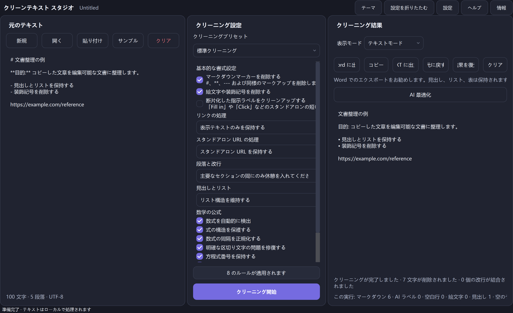

<p align="center">
  
</p>

<h1 align="center">CleanText Studio</h1>

<p align="center"><strong>ローカルファーストのテキスト クリーンアップ、ドキュメント構造の回復、数式対応プレビュー、およびコピーおよび AI 生成テキストの洗練された DOCX/TXT エクスポート。</strong></p>

<p align="center">
  <a href="README.md">English</a> · <a href="README.zh-CN.md">简体中文</a> · <a href="README.zh-TW.md">繁體中文</a> · <a href="README.ja.md">日本語</a> · <a href="README.ko.md">한국어</a> · <a href="README.es.md">Español</a> · <a href="README.fr.md">Français</a> · <a href="README.de.md">Deutsch</a> · <a href="README.pt-BR.md">Português (Brasil)</a> · <a href="README.ru.md">Русский</a> · <a href="README.ar.md">العربية</a> · <a href="README.hi.md">हिन्दी</a>
</p>

<p align="center">
  <a href="https://github.com/SiriZhao/CleanText-Studio/releases/tag/v1.5.2"></a>
  <a href="https://github.com/SiriZhao/CleanText-Studio/actions/workflows/ci.yml"></a>
  
  
  <a href="LICENSE"></a>
</p>

> **現在のリリース: v1.5.2 · Windows x64 · デフォルトでローカルファースト**

<p align="center">
  <a href="https://github.com/SiriZhao/CleanText-Studio/releases/download/v1.5.2/CleanText-Studio-v1.5.2-Windows-x64-Setup.exe"><strong>インストーラーをダウンロード</strong></a> ·
  <a href="https://github.com/SiriZhao/CleanText-Studio/releases/download/v1.5.2/CleanText-Studio-v1.5.2-Windows-x64-Portable.zip"><strong>ポータブル ZIP をダウンロード</strong></a> ·
  <a href="https://github.com/SiriZhao/CleanText-Studio/releases/download/v1.5.2/SHA256SUMS.txt">SHA256 チェックサム</a>
</p>



CleanText Studio は、有用な構造をノイズとして扱うことなく、乱雑にコピーされたテキストを読みやすく編集可能な文書に変換します。冗長な Markdown と装飾を削除し、見出し、リスト、表、一般的な数学表記を復元し、テキスト ビュー、構造化プレビュー、DOCX または TXT エクスポートを提供します。基本的なクリーンアップはデバイス上で実行されます。オプションの AI 最適化では、自分で構成した API プロバイダーのみを使用します。

**なぜ便利なのか**

- Web ページ、チャット、メモ、生成された下書きから視覚的な残留物を削除しながら、意味を維持します。
- エクスポート前に見出し、表、リンク、式が暗黙的にフラット化されないようにドキュメント モデルを保存します。
- ネイティブ Word テーブル、編集可能な数式、または UTF-8 テキスト ファイルを作成する前に、結果を確認してください。
- ソース、結果、クリーンアップの設定を変更せずに、実行時にインターフェイス言語とテーマを切り替えます。

## Windows をダウンロード

CleanText Studio v1.5.2 が **Windows x64** 用にリリースされました。通常のユーザーごとのインストールの場合はインストーラーを選択するか、抽出したフォルダーから実行する場合はポータブル ZIP を選択します。どちらのパッケージも、Python を個別にインストールする必要はありません。

|パッケージ |使用目的 |ダウンロード |
| --- | --- | --- |
|セットアップ |インストール、スタート メニューのエントリ、およびアンインストールのサポート | [CleanText-Studio-v1.5.2-Windows-x64-Setup.exe](https://github.com/SiriZhao/CleanText-Studio/releases/download/v1.5.2/CleanText-Studio-v1.5.2-Windows-x64-Setup.exe) |
|ポータブル | ZIP を解凍した後に実行します。インストールなし | [CleanText-Studio-v1.5.2-Windows-x64-Portable.zip](https://github.com/SiriZhao/CleanText-Studio/releases/download/v1.5.2/CleanText-Studio-v1.5.2-Windows-x64-Portable.zip) |
|検証 |ダウンロードしたパッケージを確認します | [SHA256SUMS.txt](https://github.com/SiriZhao/CleanText-Studio/releases/download/v1.5.2/SHA256SUMS.txt) |

リリース ページは、利用可能なファイルに関する信頼できる情報源です: [CleanText Studio v1.5.2](https://github.com/SiriZhao/CleanText-Studio/releases/tag/v1.5.2)。

## CleanText Studio が行うこと

### 実用的なドキュメントのクリーンアップのために構築

コピーされたコンテンツは、多くの場合、マーカーとして書かれた見出し、繰り返しの区切り記号、装飾的な絵文字、破線の折り返し、チュートリアルのラベル、貼り付けられたリンク、または見た目だけの表形式の表とともに到着します。 CleanText Studio は、隠された万能の書き換えを適用するのではなく、これらの選択を明示的にします。プリセットを選択し、結果を検査し、構造が正しくなった場合にのみエクスポートします。

### 一般的なシナリオ- 研究メモ、会議メモ、知識ベースの抜粋、Web ページのコピーを正規化します。
- 編集および専門的な文書配信のために AI 支援の下書きを準備します。
- Markdown テーブルをネイティブ Word テーブルとして送信する前にリカバリします。
- 周囲の書式設定ノイズを除去しながら、単純なインラインおよびブロック数学を保持します。
- Word レイアウトが不要な場合は、クリーンな TXT ハンドオフを作成します。

## コア機能

### Markdown と書式設定のクリーンアップ

クリーンアップ パイプラインは、Markdown 見出しマーカー、強調マーカー、インライン コード マーカー、画像構文、水平罫線、コピーされた HTML 残留物、装飾記号、絵文字、および断片化された説明ラベルを削除できます。通常のテキストを保持し、クリーンアップ オプションを設定パネルに表示します。

### 文書構造の回復

見出し、リスト、引用、コード ブロック、段落、表、リンク、数学的ブロックは、文字ストリームに盲目的に折りたたまれるのではなく、文書構造として表現されます。これが、プレビューとエクスポートで同じ構造上の決定を行うことができる理由です。

### 見出しとリスト

必要に応じて、マーカーを保持するか、構造を自然化するか、マーカーを削除するかを選択します。このツールは、有用な階層とリストのセマンティクスを保持するように設計されています。新しいアウトラインを発明する汎用のリライターではありません。

### 段落と改行

3 つのモードで共通のソース素材をカバーします。

|モード | | の場合に使用します。
| --- | --- |
|コンパクト |通常の折り返されたソース行をコンパクトな段落に結合したいとします。 |
|スマートセクション |意味のあるセクション区切りを維持しながら、自然な段落間隔が必要です。 |
|すべて保存 |ソース段落の境界をできるだけ近づける必要があります。 |

### リンクとスタンドアロン URL

リンク処理では、Markdown を保持することも、表示テキストのみを保持することも、表示テキストを URL とともに保持することもできます。スタンドアロン URL は、チュートリアルの残り物に過ぎない場合は、保持したり、前の段落とマージしたり、削除したりできます。 URL は、Markdown クリーンアップの副作用として消えるのではなく、意図的に処理されます。

## テーブル、方程式、プレビュー

### Markdown テーブルと Word テーブル

Markdown テーブルは構造化されたテーブル ブロックに解析されます。プレビュー モードではテーブルがテーブルとして表示され、DOCX エクスポートでは、ヘッダー行、読み取り可能なセルの内容、境界線、および固定均等分割ではなく内容から選択された幅を備えたネイティブの Word テーブルが作成されます。 Markdown 区切り行、残留強調マーカー、意味のない空の列、および偶発的なソフト改行は、アクティブなクリーンアップ設定で許可されている場合、エクスポート前にクリーンアップされます。


### 数式と編集可能な Word 方程式

一般的なインラインおよびディスプレイの LaTeX 区切り文字、Unicode の数式、および単純な方程式は保護され、周囲のテキストは削除されます。サポートされている数式は Word OMML ネイティブ方程式として出力されるため、一般的な変数と式は Word で編集可能なままです。数式の間隔、明らかな区切り文字の問題、および数式の番号付けは、選択したオプションに従って正規化できます。

複雑なカスタム マクロはサイレントに破棄されません。式がサポートされている変換範囲外にある場合、アプリケーションは読み取り可能なフォールバックを保持し、エクスポート品質情報でそれを報告します。


### テキストモードとプレビューモード

テキスト モードは、正規化されたプレーンな結果を確認するのに役立ちます。プレビュー モードでは、見出し、リスト、表、リンク、数式がドキュメント指向の形式で表示されます。表示モードを切り替えても、クリーンアップが再実行されたり、結果が変更されたりすることはありません。

## 前後次の簡潔な例は、有用なコンテンツを保持しながらアプリケーションが除去するように設計された残留物の種類を示しています。

**ソース**```markdown
### **Project notes** ✨
---
Read the **draft** first.

- Keep the main conclusion
- Remove decorative labels

| Item | Value |
| --- | --- |
| Formula | \( E = mc^2 \) |

https://example.com/reference
```**結果コンセプト**```text
Project notes

Read the draft first.

• Keep the main conclusion
• Remove decorative labels

The table and E = mc² formula remain structured in Preview and DOCX export.
```

## エクスポート形式

### Word をエクスポート

エクスポート先に、編集可能な文書要素として見出し、リスト、表、およびサポートされている数式が必要な場合は、Word エクスポートを選択します。エクスポーターは `.docx` ファイルを生成します。ローカルにインストールされた Word アプリケーションは自動化されません。エクスポート前に、アプリは構造と品質の概要を表示して、回復可能な式/テーブルの制限を確認できます。

### TXT をエクスポート

移植可能な UTF-8 プレーンテキストの結果を得るには、TXT を選択してください。 TXT エクスポートは、正規化されたテキスト コンテンツを保持しますが、Word ネイティブ テーブルや編集可能な OMML 式をリッチ ドキュメント オブジェクトとして表すことはできません。

|入力 |出力 |
| --- | --- |
| TXT、Markdown、医学博士、DOCX | UTF-8 TXT および構造化 DOCX |

## 言語、テーマ、アクセシビリティ

デスクトップ インターフェイスは、簡体字中国語、繁体字中国語、英語、日本語、韓国語、スペイン語、フランス語、ドイツ語、ブラジル系ポルトガル語、ロシア語、アラビア語、ヒンディー語を提供します。言語の変更は実行時に適用され、テキスト、結果、現在の選択内容、および元に戻す履歴が保持されます。アラビア語は右から左へのインターフェイスを使用しますが、URL、API キー、コードなどの技術的な値は左から右に読み取ることができます。

明るいテーマと暗いテーマは、同じパネル、コントロール、フォーカス、および丸い表面システムを共有します。アプリケーションは、可能な場合は合法的なシステム フォント フォールバックを使用します。 Apple PingFang ファイルはバンドルされません**。


## オプションの AI 最適化 (BYOK)

AI の最適化はオプションです。基本的なクリーンアップ、プレビュー、TXT エクスポート、および DOCX エクスポートは、ネットワーク接続なしで利用できます。 AI 最適化を意図的に有効にする場合は、サポートされているプロバイダー、エンドポイント、モデル、および独自の API キーを選択します。このアプリケーションは、共有の無料 API キーを提供したり、プロバイダー アカウントをプロキシしたりすることはありません。

DeepSeek およびインストールされたアプリケーション構成によって公開されるその他のプロバイダーは、AI 設定ダイアログから選択できます。プロバイダーとモデルの識別子は、翻訳された表示ラベルとは別のままです。機密データを送信する前に、プロバイダー独自のデータ規約を確認してください。


## クイックスタート

1. CleanText Studio を起動してテキストを貼り付けるか、サポートされているファイルを開きます。
2. クリーニング プリセットを選択し、このドキュメントに必要なオプションのみを調整します。
3. [**クリーン**] をクリックし、テキスト モードまたはプレビュー モードを調べます。
4. 構造化配信の場合は Word に、正規化されたプレーンテキスト ファイルの場合は TXT にエクスポートします。
5. 必要に応じて、独自の AI プロバイダーを構成し、AI プロバイダーにテキストを送信するタイミングを意識的に選択します。

### インストーラーまたはポータブル バージョン

- **インストーラー:** セットアップ実行可能ファイルを実行し、インストーラーに従って、[スタート] メニューから CleanText Studio を起動します。 Windows アプリ設定またはアンインストーラーを使用して削除します。
- **ポータブル:** ZIP を書き込み可能なフォルダーに抽出し、その中にある実行可能ファイルを起動します。抽出したファイルをまとめて保管します。圧縮アーカイブから直接実行しないでください。

### 完全なワークフロー

1. 左側のパネルにソーステキストを入力します。
2. 中央のパネルを使用して、Markdown、リンク、段落、リスト、および数式をどのように処理するかを決定します。
3. 右側でクリーンアップされた結果を確認し、テーブルと方程式のプレビューを使用します。
4. 結果ツールバーを使用して、最新の結果のコピー、元に戻し、復元、クリア、TXT または Word のエクスポートを行います。
5. 文書に法的、アーカイブ、または出版上の重要性がある場合は、必ず元の情報源のコピーを保管してください。

## プライバシー、セキュリティ、データ フロー

### ローカルファーストの基本処理基本的なクリーンアップはローカルで実行されます。このアプリケーションには、アカウント システム、広告サービス、テレメトリ サービス、または共有公開 API キーがありません。テキストは、ローカルで貼り付け、プレビュー、クリーニング、エクスポートしただけでアップロードされるわけではありません。

### AI リクエストはオプトインです

明示的な AI 最適化アクションのみが、構成したサードパーティ プロバイダーを使用します。プロバイダーは、独自の条件に基づいて、そのリクエストに必要なマテリアルを受け取ります。共有する資格のない素材に対してプロバイダー リクエストを使用しないでください。

### API キーの処理

API キーはユーザーが提供するものであり、エクスポートされたドキュメント構成には書き込まれません。 Windows では、アプリケーションは、構成された資格情報ストレージ メカニズムが利用可能な場合にはそれを使用します。安全な資格情報ストレージが利用できない場合は、平文キーをサイレントにエクスポートするのではなく、安全にフォールバックします。オペレーティング システムのアカウントとプロバイダーの資格情報をセキュリティ境界として扱います。

## システム要件

- Windows x64。
- 現在サポートされている Windows デスクトップ環境。
- リリース パッケージ用に個別にインストールされた Python ランタイムはありません。
- インターネット アクセスはオプションであり、GitHub のダウンロード、オプションの AI の使用、またはユーザーが開いたリンクの場合にのみ必要です。

Windows SmartScreen は、新しい署名のないビルドまたは評判の低いビルドに対して評判の警告を表示できます。リポジトリのリリース ページからのみダウンロードし、SHA256 チェックサムを確認し、組織のソフトウェア インストール ポリシーに従ってください。

## 技術スタックとプロジェクトのアーキテクチャ

CleanText Studio は、インターフェイスに PySide6、DOCX の書き込みに python-docx、ポータブル パッケージングに PyInstaller、Windows インストーラーに Inno Setup、品質チェックに pytest/Ruff/mypy を使用する Python デスクトップ アプリケーションです。クリーンアップ モデルとドキュメント ブロック モデルはプレゼンテーション レイヤーの下に位置し、テキスト、プレビュー、エクスポートが同じ正規化された構造を使用できるようにします。```text
src/cleantext_studio/
├── app.py                 # desktop window and presentation wiring
├── cleaners/              # stable text-cleaning pipeline
├── math/                  # detection, parsing, preview, and OMML support
├── exporters/             # DOCX and TXT exporters
├── i18n/                  # locale catalogs and runtime translation service
├── ui/                    # cards, controls, and theme components
└── llm/                   # optional provider configuration and requests
assets/                    # icon, screenshots, and packaged resources
scripts/                   # validation, screenshot, and Windows-build helpers
tests/                     # unit, GUI, integration, and regression checks
```## ソースから実行

次のコマンドは、PowerShell 上のリポジトリの開発レイアウトと一致します。```powershell
git clone https://github.com/SiriZhao/CleanText-Studio.git
cd CleanText-Studio
py -3.12 -m venv .venv
.\.venv\Scripts\pip install -e ".[dev]"
$env:PYTHONPATH = "src"
.\.venv\Scripts\python -m cleantext_studio.main
```## テストとビルド```powershell
$env:PYTHONPATH = "src"
.\.venv\Scripts\ruff check .
.\.venv\Scripts\mypy src/cleantext_studio
.\.venv\Scripts\python -m pytest -q
.\.venv\Scripts\python scripts/check_translations.py
.\.venv\Scripts\python scripts/check_readme_quality.py
.\.venv\Scripts\python scripts/check_screenshot_quality.py
.\.venv\Scripts\python scripts/verify_cleaning_freeze.py
.\scripts\build_windows.ps1
```Windows ビルドは、現在のアーティファクト、チェックサム、リリース ノートを `dist/` に書き込みます。ビルド出力は意図的にリポジトリにコミットされません。

## アーティファクトと SHA256 検証をリリースする

各リリースでは、セットアップ実行可能ファイル、ポータブル ZIP、`SHA256SUMS.txt`、およびリリース ノート (利用可能な場合) が提供されます。 PowerShell で、ダウンロードされたアーティファクトと公開されたチェックサムを比較します。```powershell
Get-FileHash .\CleanText-Studio-v1.5.2-Windows-x64-Setup.exe -Algorithm SHA256
Get-Content .\SHA256SUMS.txt
```## 国際化と翻訳への貢献

公式ロケール カタログは、`zh_CN`、`zh_TW`、`en_US`、`ja_JP`、`ko_KR`、`es_ES`、`fr_FR`、`de_DE`、`pt_BR`、`ru_RU`、`ar`、および `hi_IN` です。用語の変更を提案する前に、[docs/TRANSLATION_GLOSSARY.md](docs/TRANSLATION_GLOSSARY.md) および [docs/README_TRANSLATION_STATUS.md](docs/README_TRANSLATION_STATUS.md) を参照してください。コミュニティによる翻訳レビューは歓迎です。このリポジトリは、すべてのドキュメント翻訳がネイティブ スピーカーによるレビューを受けているとは主張しません。

## ロードマップ

現在の公開リリースは Windows x64 です。現在の出荷要求よりも、将来のプラットフォームの取り組み、より豊富な輸入忠実度、およびより広範なフォーミュラの対象範囲がロードマップのトピックです。機能のリクエストや問題の報告は歓迎されますが、ロードマップ項目はコミットメントやリリースの発表ではありません。

## 既知の制限事項

- 複雑なカスタム LaTeX マクロでは、ネイティブ Word 方程式変換の代わりに読み取り可能なフォールバックが必要になる場合があります。
- DOCX インポートでは、任意の Word ファイルからの元のスタイル、埋め込みオブジェクト、またはレイアウト機能をすべて保存することはできません。
- TXT は、豊富な Word ネイティブのテーブルや編集可能な数式をエンコードできません。
- オプションの AI 出力は、選択したサードパーティ プロバイダーによって生成され、人間によるレビューが必要です。
- Windows パッケージは、ここで説明されている唯一の公開プラットフォームです。 macOS、Linux、Android、iOS は現在、リリースされたビルドとして宣伝されていません。

## よくある質問

### オンラインでなければなりませんか?

いいえ。ローカル クリーンアップ、プレビュー、ローカル エクスポートはネットワーク接続なしでも機能します。ネットワーク アクセスは、リリースのダウンロード、外部リンクを開く、選択した AI リクエストなどのアクションにのみ必要です。

### アプリケーションは私のテキストをアップロードしますか?

基本的なローカル処理には使用できません。サードパーティのリクエストは、独自に構成されたプロバイダーで AI 最適化を明示的に使用する場合にのみ発生します。

### API キーを構成する必要がありますか?

いいえ。API キーは、オプションの AI 最適化の場合にのみ必要です。

### どのファイルを使用できますか?

アプリケーションは TXT、Markdown/MD、および DOCX 入力を受け入れ、UTF-8 TXT または構造化された DOCX をエクスポートできます。

### Word エクスポートと TXT エクスポートの違いは何ですか?

Word は、見出し、ネイティブ テーブル、サポートされている編集可能な数式などの豊富な構造を保持できます。 TXT は、リッチ ドキュメント オブジェクトを含まないクリーンな UTF-8 テキスト ハンドオフです。

### 一部のドキュメントでは `en_US` エクスポートが推奨されるのはなぜですか?

これは、復元された文書構造、特に表やサポートされている数式を最も忠実に伝えることができる形式です。

### 数式は編集可能ですか?

サポートされている数式は、Word OMML ネイティブ数式としてエクスポートされます。サポートされていない複雑なマクロは、読み取り可能なフォールバックを使用する可能性があるため、公開する前にチェックする必要があります。

### テーブルは Word テーブルとしてエクスポートされますか?

Word エクスポートが選択されている場合、構造化 Markdown テーブルはネイティブ Word テーブルとしてエクスポートされます。

### 言語やテーマを変更するにはどうすればよいですか?

アプリケーションのツールバー/設定で言語とテーマのコントロールを使用します。ランタイム スイッチは、アクティブなドキュメントとクリーンアップの選択内容を保持します。

### 私の API キーはどこに保存されていますか?

アプリは、構成された Windows 認証情報ストレージ パスが利用可能な場合はそれを使用し、エクスポートされた構成にはキーは含まれません。インストールされているビルドの設定とシステム セキュリティ ポリシーを確認します。

### インストーラーまたはポータブル ZIP?

通常の Windows 統合およびアンインストール サポートのインストーラーを選択します。抽出された自己完結型フォルダーが必要な場合は、ポータブルを選択します。

### 問題を報告したり、翻訳に貢献するにはどうすればよいですか?[SiriZhao/CleanText-Studio](https://github.com/SiriZhao/CleanText-Studio) で問題またはプル リクエストを開き、可能であれば機密性のないサンプルと期待される結果を含めます。

## 貢献する

プル リクエストを開く前に、[CONTRIBUTING.md](CONTRIBUTING.md) をお読みください。変更に重点を置き、動作が変化した場合はテストを追加し、ビルド出力や認証情報のコミットを回避し、プロジェクトのローカルファーストのプライバシー姿勢を維持します。

## 開発者

[SiriZhao](https://github.com/SiriZhao) によって管理されています。プロジェクト ホーム: [SiriZhao/CleanText-Studio](https://github.com/SiriZhao/CleanText-Studio)。

## サードパーティのライセンス

分散および実行時の依存関係に関する通知については、[THIRD_PARTY_LICENSES.md](THIRD_PARTY_LICENSES.md) を参照してください。 CleanText Studio は Apple PingFang フォント ファイルをパッケージ化しません。

## ライセンス

CleanText Studio は [MIT License](ライセンス) に基づいて利用可能です。

> この README の翻訳レビューへのコミュニティ参加を歓迎します。
