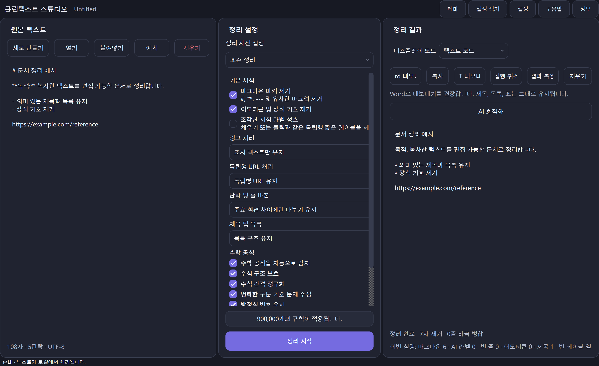

<p align="center">
  
</p>

<h1 align="center">CleanText Studio</h1>

<p align="center"><strong>로컬 우선 텍스트 정리, 문서 구조 복구, 수식 인식 미리 보기 및 세련된 DOCX/TXT 복사 및 AI 생성 텍스트 내보내기.</strong></p>

<p align="center">
  <a href="README.md">English</a> · <a href="README.zh-CN.md">简体中文</a> · <a href="README.zh-TW.md">繁體中文</a> · <a href="README.ja.md">日本語</a> · <a href="README.ko.md">한국어</a> · <a href="README.es.md">Español</a> · <a href="README.fr.md">Français</a> · <a href="README.de.md">Deutsch</a> · <a href="README.pt-BR.md">Português (Brasil)</a> · <a href="README.ru.md">Русский</a> · <a href="README.ar.md">العربية</a> · <a href="README.hi.md">हिन्दी</a>
</p>

<p align="center">
  <a href="https://github.com/SiriZhao/CleanText-Studio/releases/tag/v1.5.1"></a>
  <a href="https://github.com/SiriZhao/CleanText-Studio/actions/workflows/ci.yml"></a>
  
  
  <a href="LICENSE"></a>
</p>

> **현재 릴리스: v1.5.1 · Windows x64 · 기본적으로 로컬 우선**

<p align="center">
  <a href="https://github.com/SiriZhao/CleanText-Studio/releases/download/v1.5.1/CleanText-Studio-v1.5.1-Windows-x64-Setup.exe"><strong>설치 프로그램 다운로드</strong></a> ·
  <a href="https://github.com/SiriZhao/CleanText-Studio/releases/download/v1.5.1/CleanText-Studio-v1.5.1-Windows-x64-Portable.zip"><strong>휴대용 ZIP 다운로드</strong></a> ·
  <a href="https://github.com/SiriZhao/CleanText-Studio/releases/download/v1.5.1/SHA256SUMS.txt">SHA256 체크섬</a>
</p>



CleanText Studio은 유용한 구조를 노이즈로 처리하지 않고 지저분하게 복사된 텍스트를 읽기 가능하고 편집 가능한 문서로 바꿉니다. 중복된 Markdown 및 장식을 제거하고 제목, 목록, 표 및 일반적인 수학 표기법을 복구한 다음 텍스트 보기, 구조화된 미리 보기 및 DOCX 또는 TXT 내보내기를 제공합니다. 기본 정리는 장치에서 수행됩니다. 선택적 AI 최적화는 사용자가 직접 구성한 API 공급자만 사용합니다.

**유용한 이유**

- 웹페이지, 채팅, 메모, 생성된 초안에서 시각적 잔여물을 제거하면서 의미를 유지하세요.
- 내보내기 전에 제목, 표, 링크 및 수식이 자동으로 병합되지 않도록 문서 모델을 유지합니다.
- 기본 Word 테이블, 편집 가능한 방정식 또는 UTF-8 텍스트 파일을 작성하기 전에 결과를 검토하세요.
- 소스, 결과 또는 정리 설정을 변경하지 않고 런타임에 인터페이스 언어와 테마를 전환합니다.

## Windows용 다운로드

CleanText Studio v1.5.1은 **Windows x64**용으로 출시되었습니다. 일반 사용자별 설치를 위해 설치 프로그램을 선택하거나, 추출된 폴더에서 실행하려는 경우 휴대용 ZIP을 선택하세요. 두 패키지 모두 별도의 Python 설치가 필요하지 않습니다.

| 패키지 | 용도 | 다운로드 |
| --- | --- | --- |
| 설정 | 설치, 시작 메뉴 항목 및 제거 지원 | [CleanText-Studio-v1.5.1-Windows-x64-Setup.exe](https://github.com/SiriZhao/CleanText-Studio/releases/download/v1.5.1/CleanText-Studio-v1.5.1-Windows-x64-Setup.exe) |
| 휴대용 | ZIP을 추출한 후 실행하십시오. 설치 없음 | [CleanText-Studio-v1.5.1-Windows-x64-Portable.zip](https://github.com/SiriZhao/CleanText-Studio/releases/download/v1.5.1/CleanText-Studio-v1.5.1-Windows-x64-Portable.zip) |
| 검증 | 다운로드한 패키지 확인 | [SHA256SUMS.txt](https://github.com/SiriZhao/CleanText-Studio/releases/download/v1.5.1/SHA256SUMS.txt) |

릴리스 페이지는 사용 가능한 파일의 정보 소스입니다: [CleanText Studio v1.5.1](https://github.com/SiriZhao/CleanText-Studio/releases/tag/v1.5.1).

## CleanText Studio이 하는 일

### 실용적인 문서 정리를 위해 제작됨

복사된 콘텐츠는 표식으로 작성된 제목, 반복 구분 기호, 장식용 이모티콘, 줄바꿈 줄바꿈, 튜토리얼 라벨, 붙여넣은 링크 또는 시각적으로만 표 형식인 표와 함께 도착하는 경우가 많습니다. CleanText Studio은 숨겨진 일률적인 재작성을 적용하는 대신 이러한 선택을 명시적으로 만듭니다. 사전 설정을 선택하고 결과를 검사한 후 구조가 올바르게 보이는 경우에만 내보냅니다.

### 일반적인 시나리오- 연구 노트, 회의 노트, 지식 기반 추출, 웹페이지 사본을 표준화합니다.
- 편집 및 전문적인 문서 전달을 위해 AI 지원 초안을 준비합니다.
- 네이티브 Word 테이블로 보내기 전에 Markdown 테이블을 복구합니다.
- 주변 서식 노이즈를 제거하면서 간단한 인라인 및 블록 수학을 유지합니다.
- Word 레이아웃이 불필요한 경우 깨끗한 TXT 핸드오프를 만듭니다.

## 핵심 기능

### Markdown 및 서식 정리

정리 파이프라인은 Markdown 제목 표시자, 강조 표시자, 인라인 코드 표시자, 이미지 구문, 가로 규칙, 복사된 HTML 잔여물, 장식 기호, 이모티콘 및 조각난 지침 레이블을 제거할 수 있습니다. 일반 텍스트를 유지하고 설정 패널에 정리 옵션을 표시합니다.

### 문서 구조 복구

제목, 목록, 인용문, 코드 블록, 단락, 표, 링크 및 수학 블록은 맹목적으로 문자 스트림으로 축소되지 않고 문서 구조로 표현됩니다. 이것이 미리보기와 내보내기가 동일한 구조적 결정을 내릴 수 있는 이유입니다.

### 제목 및 목록

마커를 보존할지, 구조를 자연화할지, 적절한 경우 마커를 제거할지 선택합니다. 이 도구는 유용한 계층 구조와 목록 의미를 유지하도록 설계되었습니다. 새로운 개요를 만들어내는 일반적인 재작성이 아닙니다.

### 단락 및 줄 바꿈

일반적인 소스 자료를 다루는 세 가지 모드는 다음과 같습니다.

| 모드 | 다음과 같은 경우에 사용하세요 |
| --- | --- |
| 컴팩트 | 일반 래핑된 소스 줄을 압축된 단락으로 결합하려고 합니다. |
| 스마트 섹션 | 의미 있는 섹션 나누기를 유지하면서 자연스러운 단락 간격을 원합니다. |
| 모두 보존 | 소스 단락 경계를 최대한 가깝게 유지해야 합니다. |

### 링크 및 독립형 URL

링크 처리에서는 Markdown을 유지하거나 표시 텍스트만 유지하거나 URL과 함께 표시 텍스트를 보존할 수 있습니다. 독립 실행형 URL은 유지되거나 이전 단락과 병합되거나 튜토리얼 잔여물인 경우 제거될 수 있습니다. URL은 Markdown 정리의 부작용으로 사라지지 않고 의도적으로 처리됩니다.

## 표, 방정식 및 미리보기

### Markdown 테이블 및 Word 테이블

Markdown 테이블은 구조화된 테이블 블록으로 구문 분석됩니다. 미리보기 모드는 테이블을 테이블로 표시하고 DOCX 내보내기는 고정된 동일 분할 대신 헤더 행, 읽을 수 있는 셀 내용, 테두리 및 콘텐츠에서 선택한 너비가 있는 기본 Word 테이블을 생성합니다. Markdown 구분 행, 잔여 강조 표식, 무의미한 빈 열 및 실수로 소프트 라인 분리는 활성 정리 설정에서 허용하는 경우 내보내기 전에 정리됩니다.


### 수학 공식 및 편집 가능한 Word 방정식

일반적인 인라인 및 디스플레이 LaTeX 구분 기호, 유니코드 수학 표현식 및 간단한 방정식은 주변 텍스트를 정리하는 동안 보호됩니다. 지원되는 수식은 Word OMML 기본 방정식으로 내보내지므로 일반 변수와 표현식은 Word에서 편집 가능한 상태로 유지됩니다. 수식 간격, 명확한 구분 기호 문제 및 수식 번호 매기기는 선택한 옵션에 따라 정규화될 수 있습니다.

복잡한 사용자 정의 매크로는 자동으로 삭제되지 않습니다. 수식이 지원되는 변환 범위를 벗어나면 애플리케이션은 읽을 수 있는 대체를 유지하고 이를 내보내기 품질 정보에 보고합니다.


### 텍스트 모드 및 미리보기 모드

텍스트 모드는 정규화된 일반 결과를 검토하는 데 유용합니다. 미리보기 모드에서는 제목, 목록, 표, 링크, 수식을 문서 중심 형식으로 보여줍니다. 디스플레이 모드를 전환해도 정리가 다시 실행되거나 결과가 변경되지 않습니다.

## 전후다음의 간략한 예는 유용한 콘텐츠를 보존하면서 청소하도록 설계된 잔류물의 종류를 보여줍니다.

**원천**```markdown
### **Project notes** ✨
---
Read the **draft** first.

- Keep the main conclusion
- Remove decorative labels

| Item | Value |
| --- | --- |
| Formula | \( E = mc^2 \) |

https://example.com/reference
```**결과 개념**```text
Project notes

Read the draft first.

• Keep the main conclusion
• Remove decorative labels

The table and E = mc² formula remain structured in Preview and DOCX export.
```

## 내보내기 형식

### 내보내기 Word

대상에 편집 가능한 문서 요소로 제목, 목록, 표 및 지원되는 수식이 필요한 경우 Word 내보내기를 선택합니다. 내보내기는 `.docx` 파일을 생성합니다. 로컬에 설치된 Word 애플리케이션을 자동화하지 않습니다. 내보내기 전에 앱은 복구 가능한 공식/표 제한 사항을 볼 수 있도록 구조 및 품질 요약을 표시할 수 있습니다.

### 내보내기 TXT

이식 가능한 UTF-8 일반 텍스트 결과를 얻으려면 TXT을 선택하세요. TXT 내보내기는 정규화된 텍스트 콘텐츠를 유지하지만 Word 기본 테이블이나 편집 가능한 OMML 방정식을 풍부한 문서 개체로 나타낼 수 없습니다.

| 입력 | 출력 |
| --- | --- |
| TXT, Markdown, MD, DOCX | UTF-8 TXT 및 구조화된 DOCX |

## 언어, 테마 및 접근성

데스크탑 인터페이스는 중국어 간체, 중국어 번체, 영어, 일본어, 한국어, 스페인어, 프랑스어, 독일어, 브라질 포르투갈어, 러시아어, 아랍어 및 힌디어를 제공합니다. 언어 변경 사항은 런타임에 적용되며 텍스트, 결과, 현재 선택 사항 및 실행 취소 기록을 유지합니다. 아랍어는 오른쪽에서 왼쪽 인터페이스를 사용하지만 URL, API 키, 코드와 같은 기술 값은 왼쪽에서 오른쪽으로 읽을 수 있습니다.

밝은 테마와 어두운 테마는 동일한 패널, 컨트롤, 포커스 및 둥근 표면 시스템을 공유합니다. 애플리케이션은 가능한 경우 법적 시스템 글꼴 대체를 사용합니다. Apple PingFang 파일을 번들로 묶지 **않습니다**.


## 선택적 AI 최적화(BYOK)

AI 최적화는 선택 사항입니다. 기본 정리, 미리보기, TXT 내보내기 및 DOCX 내보내기는 네트워크 연결 없이 사용할 수 있습니다. 의도적으로 AI 최적화를 활성화하는 경우 지원되는 공급자, 엔드포인트, 모델 및 자체 API 키를 선택합니다. 애플리케이션은 공유된 무료 API 키를 제공하거나 공급자 계정을 프록시하지 않습니다.

DeepSeek 및 설치된 애플리케이션 구성에 의해 노출되는 기타 공급자는 AI 설정 대화 상자를 통해 선택할 수 있습니다. 공급자 및 모델 식별자는 번역된 표시 라벨과 별도로 유지됩니다. 민감한 자료를 보내기 전에 제공업체의 자체 데이터 약관을 검토하세요.


## 빠른 시작

1. CleanText Studio을 실행하고 텍스트를 붙여넣거나 지원되는 파일을 엽니다.
2. 청소 사전 설정을 선택하고 이 문서에 필요한 옵션만 조정합니다.
3. **Clean**을 클릭한 다음 텍스트 모드 또는 미리보기 모드를 검사합니다.
4. 구조화된 전달의 경우 Word로 내보내고 정규화된 일반 텍스트 파일의 경우 TXT로 내보냅니다.
5. 필요한 경우 자체 AI 제공자를 구성하고 의식적으로 텍스트를 보낼 시기를 선택하십시오.

### 설치 프로그램 또는 휴대용 버전

- **설치 프로그램:** 설치 실행 파일을 실행하고 설치 프로그램에 따라 시작 메뉴에서 CleanText Studio을 실행합니다. Windows 앱 설정이나 제거 프로그램을 사용하여 제거하세요.
- **이식 가능:** 쓰기 가능한 폴더에 ZIP 압축을 풀고 그 안에서 실행 파일을 시작합니다. 추출된 파일을 함께 보관하십시오. 압축된 아카이브에서 직접 실행하지 마십시오.

### 작업 흐름 완료

1. 왼쪽 패널에 소스 텍스트를 입력하세요.
2. 중앙 패널을 사용하여 Markdown, 링크, 단락, 목록 및 수식을 처리하는 방법을 결정합니다.
3. 오른쪽에서 정리된 결과를 검토하고 표와 방정식에 대한 미리보기를 사용합니다.
4. 결과 도구 모음을 사용하여 가장 최근 결과를 복사, 실행 취소, 복원하고, TXT을 지우거나 내보내거나 Word을 내보냅니다.
5. 문서가 법적, 보관 또는 출판의 중요성을 가질 때마다 원본 소스의 사본을 보관하십시오.

## 개인정보 보호, 보안, 데이터 흐름

### 로컬 우선 기본 처리기본 정리는 로컬로 실행됩니다. 애플리케이션에는 계정 시스템, 광고 서비스, 원격 측정 서비스 또는 공유 공개 API 키가 없습니다. 텍스트를 붙여넣거나, 미리 보거나, 정리하거나, 로컬로 내보낸다는 이유만으로 텍스트가 업로드되지 않습니다.

### AI 요청은 선택 사항입니다.

명시적인 AI 최적화 작업만 구성한 타사 공급자를 사용합니다. 공급자는 자체 조건에 따라 해당 요청에 필요한 자료를 받습니다. 공유할 자격이 없는 자료에 대해 공급자 요청을 사용하지 마십시오.

### API 키 처리

API 키는 사용자가 제공하며 내보낸 문서 구성에 기록되지 않습니다. Windows에서 애플리케이션은 사용 가능한 경우 구성된 자격 증명 저장 메커니즘을 사용합니다. 보안 자격 증명 저장소를 사용할 수 없는 경우 일반 텍스트 키를 자동으로 내보내는 대신 안전하게 대체됩니다. 운영 체제 계정과 공급자 자격 증명을 보안 경계로 취급하십시오.

## 시스템 요구사항

- Windows x64.
- 현재 지원되는 Windows 데스크탑 환경입니다.
- 릴리스 패키지에 대해 별도로 설치된 Python 런타임이 없습니다.
- 인터넷 접속은 선택 사항이며 GitHub 다운로드, 선택적 AI 사용 또는 사용자가 연 링크에만 필요합니다.

Windows SmartScreen은 서명되지 않았거나 평판이 낮은 새 빌드에 대한 평판 경고를 표시할 수 있습니다. 저장소 릴리스 페이지에서만 다운로드하고 SHA256 체크섬을 확인하고 조직의 소프트웨어 설치 정책을 따르십시오.

## 기술 스택 및 프로젝트 아키텍처

CleanText Studio은 인터페이스용 PySide6, 쓰기용 python-docx, 휴대용 패키징용 PyInstaller, Windows 설치 프로그램용 Inno Setup, 품질 검사용 pytest/Ruff/mypy를 사용하는 Python 데스크톱 애플리케이션입니다. 정리 및 문서 블록 모델은 프레젠테이션 레이어 아래에 위치하므로 텍스트, 미리 보기 및 내보내기가 동일한 정규화된 구조를 사용할 수 있습니다.```text
src/cleantext_studio/
├── app.py                 # desktop window and presentation wiring
├── cleaners/              # stable text-cleaning pipeline
├── math/                  # detection, parsing, preview, and OMML support
├── exporters/             # DOCX and TXT exporters
├── i18n/                  # locale catalogs and runtime translation service
├── ui/                    # cards, controls, and theme components
└── llm/                   # optional provider configuration and requests
assets/                    # icon, screenshots, and packaged resources
scripts/                   # validation, screenshot, and Windows-build helpers
tests/                     # unit, GUI, integration, and regression checks
```## 소스에서 실행

다음 명령은 PowerShell의 저장소 개발 레이아웃과 일치합니다.```powershell
git clone https://github.com/SiriZhao/CleanText-Studio.git
cd CleanText-Studio
py -3.12 -m venv .venv
.\.venv\Scripts\pip install -e ".[dev]"
$env:PYTHONPATH = "src"
.\.venv\Scripts\python -m cleantext_studio.main
```## 테스트 및 빌드```powershell
$env:PYTHONPATH = "src"
.\.venv\Scripts\ruff check .
.\.venv\Scripts\mypy src/cleantext_studio
.\.venv\Scripts\python -m pytest -q
.\.venv\Scripts\python scripts/check_translations.py
.\.venv\Scripts\python scripts/check_readme_quality.py
.\.venv\Scripts\python scripts/check_screenshot_quality.py
.\.venv\Scripts\python scripts/verify_cleaning_freeze.py
.\scripts\build_windows.ps1
```Windows 빌드는 현재 아티팩트, 체크섬 및 릴리스 노트를 `dist/`에 기록합니다. 빌드 출력은 의도적으로 저장소에 커밋되지 않습니다.

## 릴리스 아티팩트 및 SHA256 확인

각 릴리스는 설치 실행 파일, Portable ZIP, `SHA256SUMS.txt` 및 사용 가능한 경우 릴리스 노트를 제공합니다. PowerShell에서 다운로드한 아티팩트를 게시된 체크섬과 비교합니다.```powershell
Get-FileHash .\CleanText-Studio-v1.5.1-Windows-x64-Setup.exe -Algorithm SHA256
Get-Content .\SHA256SUMS.txt
```## 국제화 및 번역 기여

공식 로케일 카탈로그는 `zh_CN`, `zh_TW`, `en_US`, `ja_JP`, `ko_KR`, `es_ES`, `fr_FR`, `de_DE`, `pt_BR`, `ru_RU`, `ar` 및 `hi_IN`. 용어 변경을 제안하기 전에 [docs/TRANSLATION_GLOSSARY.md](docs/TRANSLATION_GLOSSARY.md) 및 [docs/README_TRANSLATION_STATUS.md](docs/README_TRANSLATION_STATUS.md)를 참조하세요. 커뮤니티 번역 검토를 환영합니다. 이 저장소는 모든 문서 번역이 원어민의 검토를 받았다고 주장하지 않습니다.

## 로드맵

현재 공개 릴리스는 Windows x64입니다. 향후 플랫폼 작업, 더욱 풍부한 수입 충실성, 더욱 폭넓은 포뮬러 적용 범위는 현재의 배송 주장보다는 로드맵 주제입니다. 기능 요청 및 문제 보고서는 환영하지만 로드맵 항목은 약속이나 릴리스 발표가 아닙니다.

## 알려진 제한사항

- 복잡한 사용자 정의 LaTeX 매크로에는 기본 Word 방정식 변환 대신 읽기 가능한 대체가 필요할 수 있습니다.
- DOCX 가져오기는 임의의 Word 파일의 모든 원본 스타일, 포함된 개체 또는 레이아웃 기능을 보존할 수 없습니다.
- TXT은 풍부한 Word 기본 테이블이나 편집 가능한 방정식을 인코딩할 수 없습니다.
- 선택적 AI 출력은 귀하가 선택한 제3자 제공업체에 의해 생성되며 사람의 검토가 필요합니다.
- Windows 패키징은 여기에 언급된 유일한 공개 플랫폼입니다. macOS, Linux, Android 및 iOS는 현재 릴리스된 빌드로 광고되지 않습니다.

## FAQ

### 온라인 상태여야 하나요?

아니요. 로컬 정리, 미리보기 및 로컬 내보내기는 네트워크 연결 없이 작동합니다. 네트워크 액세스는 릴리스 다운로드, 외부 링크 열기 또는 선택한 AI 요청과 같은 작업에만 필요합니다.

### 애플리케이션이 내 텍스트를 업로드하나요?

기본적인 로컬 처리용이 아닙니다. 타사 요청은 자체 구성된 공급자와 함께 AI 최적화를 명시적으로 사용하는 경우에만 발생합니다.

### API 키를 구성해야 하나요?

아니요. API 키는 선택적 AI 최적화에만 필요합니다.

### 어떤 파일을 사용할 수 있나요?

애플리케이션은 TXT, Markdown/MD 및 DOCX 입력을 허용하고 UTF-8 TXT 또는 구조화된 DOCX을 내보낼 수 있습니다.

### Word과 TXT 내보내기의 차이점은 무엇인가요?

Word은 제목, 기본 테이블 및 지원되는 편집 가능한 방정식과 같은 풍부한 구조를 유지할 수 있습니다. TXT은 풍부한 문서 개체가 없는 깔끔한 UTF-8 텍스트 전달입니다.

### 일부 문서에 Word 내보내기가 권장되는 이유는 무엇인가요?

복구된 문서 구조, 특히 테이블과 지원되는 수식을 가장 충실하게 전달할 수 있는 형식입니다.

### 수식을 편집할 수 있나요?

지원되는 수식은 Word OMML 기본 방정식으로 내보내집니다. 지원되지 않는 복잡한 매크로는 읽기 가능한 대체 매크로를 사용할 수 있으므로 게시하기 전에 확인해야 합니다.

### 테이블을 Word 테이블로 내보내나요?

Word 내보내기를 선택하면 구조화된 Markdown 테이블이 기본 Word 테이블로 내보내집니다.

### 언어나 테마를 어떻게 변경하나요?

애플리케이션 도구 모음/설정에서 언어 및 테마 컨트롤을 사용하세요. 런타임 스위치는 활성 문서 및 정리 선택 항목을 유지합니다.

### 내 API 키는 어디에 저장되어 있나요?

앱은 사용 가능한 경우 구성된 Windows 자격 증명 저장소 경로를 사용하고 내보낸 구성에 키를 포함하지 않습니다. 설치된 빌드의 설정과 시스템 보안 정책을 검토하세요.

### 설치 프로그램 또는 휴대용 ZIP?

일반적인 Windows 통합 및 제거 지원을 위해 설치 프로그램을 선택하세요. 추출된 자체 포함 폴더를 원할 경우 휴대용을 선택하십시오.

### 문제를 신고하거나 번역을 제공하려면 어떻게 해야 하나요?가능하다면 민감하지 않은 샘플과 예상 결과를 포함하여 [SiriZhao/CleanText-Studio](https://github.com/SiriZhao/CleanText-Studio)에서 이슈나 끌어오기 요청을 엽니다.

## 기여

끌어오기 요청을 열기 전에 [CONTRIBUTING.md](CONTRIBUTING.md)를 읽어보세요. 변경 사항에 초점을 맞추고, 동작 변경 시 테스트를 추가하고, 빌드 출력 또는 자격 증명 커밋을 방지하고, 프로젝트의 로컬 우선 개인 정보 보호 정책을 유지하세요.

## 개발자

[SiriZhao](https://github.com/SiriZhao)에서 관리합니다. 프로젝트 홈: [SiriZhao/CleanText-Studio](https://github.com/SiriZhao/CleanText-Studio).

## 타사 라이선스

분산 및 런타임 종속성 알림은 [THIRD_PARTY_LICENSES.md](THIRD_PARTY_LICENSES.md)를 참조하세요. CleanText Studio은 Apple PingFang 글꼴 파일을 패키지하지 않습니다.

## 라이센스

CleanText Studio은 [MIT License](LICENSE)에 따라 사용할 수 있습니다.

> 이 README의 번역 검토에 대한 커뮤니티 참여를 환영합니다.
