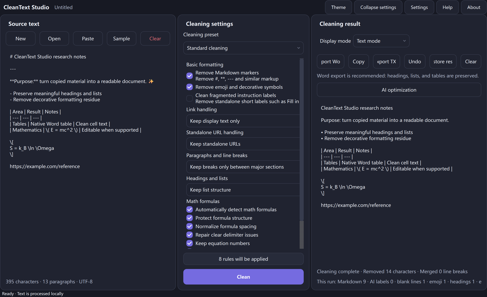
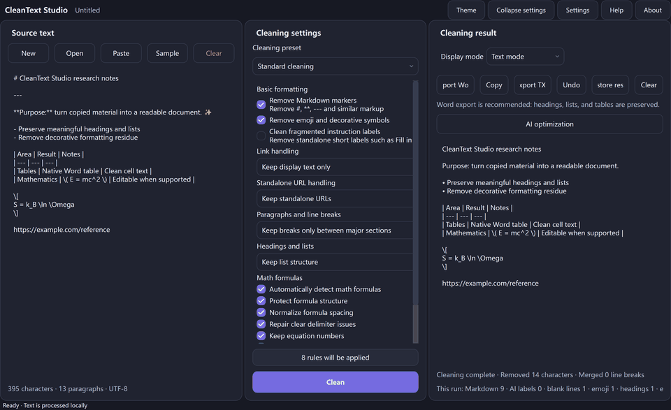
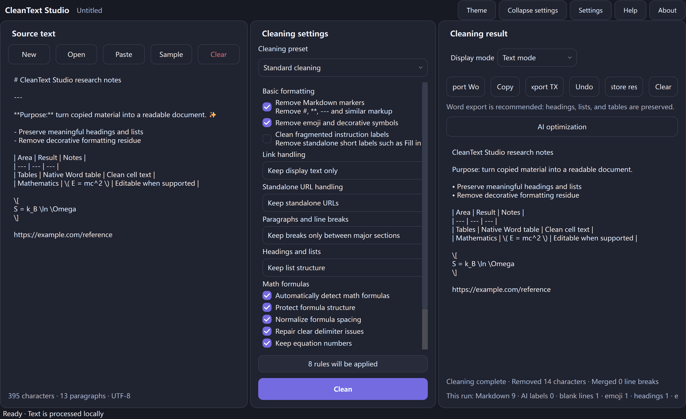
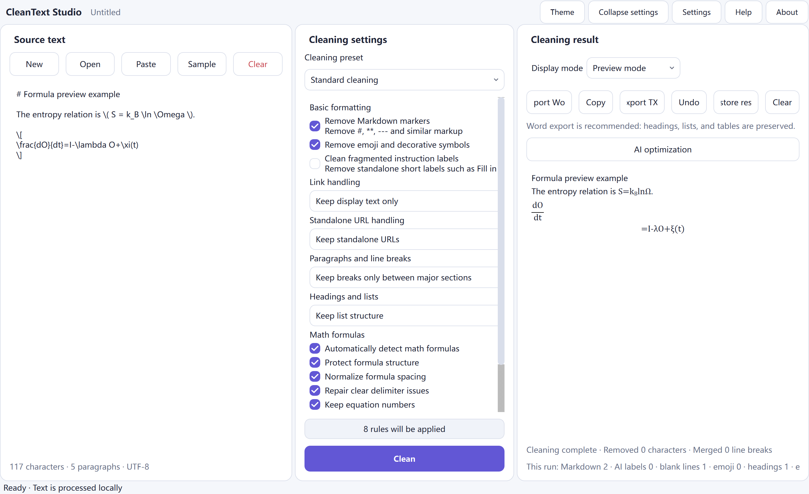
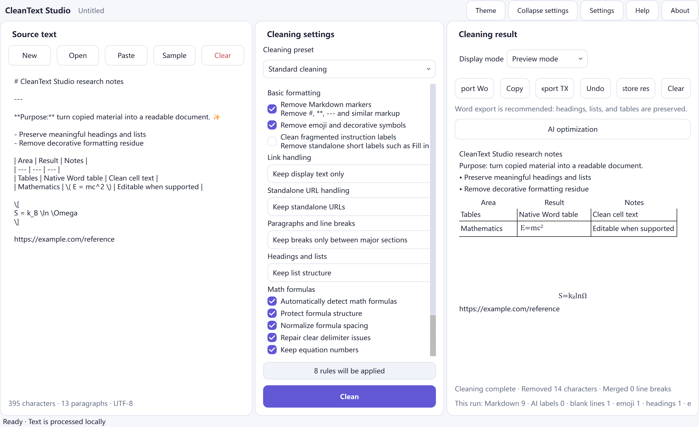
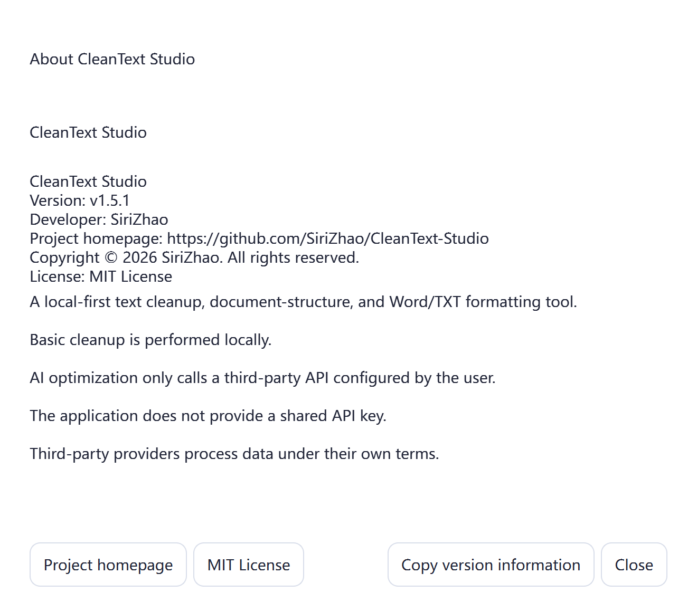

<p align="center">
  
</p>

<h1 align="center">CleanText Studio</h1>

<p align="center"><strong>Transform messy AI-generated and copied text into clean, structured, professional documents.</strong></p>

<p align="center">
  A privacy-first, local-first AI text cleanup and document formatting application for Windows.
</p>

<p align="center">
  <a href="README.md"><strong>English</strong></a> ·
  <a href="README.zh-CN.md">简体中文</a> ·
  <a href="README.zh-TW.md">繁體中文</a> ·
  <a href="README.ja.md">日本語</a> ·
  <a href="README.ko.md">한국어</a> ·
  <a href="README.es.md">Español</a> ·
  <a href="README.fr.md">Français</a> ·
  <a href="README.de.md">Deutsch</a> ·
  <a href="README.pt-BR.md">Português</a> ·
  <a href="README.ru.md">Русский</a> ·
  <a href="README.ar.md">العربية</a> ·
  <a href="README.hi.md">हिन्दी</a>
</p>

<p align="center">
  <a href="https://github.com/SiriZhao/CleanText-Studio/releases"></a>
  <a href="https://github.com/SiriZhao/CleanText-Studio/actions/workflows/ci.yml"></a>
  
  
  <a href="LICENSE"></a>
  
</p>

<p align="center">
  <a href="#download-for-windows"><strong>Download for Windows</strong></a> ·
  <a href="#quick-start">Quick start</a> ·
  <a href="#contributing">Contribute</a>
</p>

<div align="center">
  
</div>

> **Current source tag:** v1.5.2 · **Published desktop platform:** Windows x64 · **Basic cleanup:** local-first

CleanText Studio helps turn copied pages, notes, and AI-assisted drafts into editable documents without flattening their useful structure. It cleans presentation residue, recovers headings, lists, tables, and supported mathematical expressions, then exports polished DOCX or UTF-8 TXT files.

- **Keep structure:** recover headings, quotations, lists, tables, links, and paragraphs instead of treating the document as a character stream.
- **Keep formulas editable:** detect supported LaTeX, normalize it safely, and emit native Word OMML equations.
- **Keep control local:** basic cleanup, preview, and export work on-device; optional AI refinement is explicitly user initiated.
- **Keep review in the loop:** inspect Text mode or Preview mode before exporting.

<div align="center">
  
</div>

## ✨ Features

### AI text cleanup for document quality

CleanText Studio is a writing-productivity and document-formatting tool. It removes unnecessary formatting residue from copied and AI-assisted text while preserving meaning. Its purpose is document quality, structure recovery, and export.

- Remove Markdown markers, emphasis residue, horizontal rules, copied HTML fragments, decorative emoji, and fragmented instruction labels.
- Restore natural paragraphs with compact, smart-section, or preserve-all line-break modes.
- Choose how display text, links, and standalone URLs should be kept.

### Markdown cleanup

Remove presentation-only Markdown while retaining the content that a document needs: headings, emphasis meaning, links, code, and tables can be handled independently instead of by a destructive global replacement.

### Paragraph refinement

Choose whether short source wraps should become compact prose, remain separated at meaningful boundaries, or retain every paragraph break for editorial review.

### Document structure recovery

The cleaning pipeline keeps a document-block model so the same structure can be reviewed and exported.

- Headings and hierarchy
- Ordered and unordered lists
- Quotes and code blocks
- Markdown tables and cleaned cells
- Paragraphs, links, and source-aware inline runs

### Headings and lists

Use preservation or naturalization modes to keep useful hierarchy without carrying accidental Markdown markers into a professional document.

### Tables and quotations

Markdown table cells receive the same cleanup protection as normal prose, and quotations/code blocks remain distinct blocks rather than being merged into surrounding text.

### Advanced formula support

Formula handling is deliberately structural rather than a collection of display-text replacements.

- Detect `$...$`, `$$...$$`, `\(...\)`, `\[...]`, and bounded bare formula candidates in prose, lists, and table cells.
- Parse a safe LaTeX subset into one AST shared by Preview and DOCX export.
- Support fractions, indexed roots, scripts, delimiters, accents, common styles, Greek symbols, functions, integrals, sums, products, limits, and supported matrices.
- Export supported formulas as editable Word OMML instead of visible LaTeX source.

**Detection boundaries.**

Formula candidates are protected before ordinary cleanup. The detector rejects obvious URLs, Windows paths, code-like text, and currency-like dollar values to avoid turning normal text into equations.

**Formula normalization.**

Spacing and obvious delimiter problems can be normalized within the protected formula run. The source text around an inline formula stays ordinary text and keeps its punctuation.

**Word OMML.**

Supported formulas become native Office Math elements such as fractions, roots, scripts, accents, delimiters, matrices, and n-ary operators. They are intended to remain editable in Word.

### Export and review

| Capability | What you get |
| --- | --- |
| **DOCX export** | Native Word headings, lists, tables, and supported editable equations. |
| **TXT export** | A clean UTF-8 text handoff without rich document objects. |
| **Markdown input** | Clean Markdown/MD source while preserving meaningful structure. |
| **Text and Preview modes** | Review normalized text or a document-oriented preview before exporting. |

### DOCX export

Use DOCX when a recipient needs an editable document with headings, lists, native tables, and supported equations. The exporter reports structural limitations rather than silently flattening a recognized object.

### TXT export

Use TXT for a portable UTF-8 handoff. It retains normalized text semantics but intentionally cannot encode native Word tables or OMML objects.

**Preview before delivery.**

Preview mode renders the same block and formula model used by export. It is a review surface, not a separate rewrite engine.

### Privacy first

- Basic cleanup, preview, and DOCX/TXT export are performed locally.
- Text is not uploaded merely because it is pasted, cleaned, previewed, or exported.
- AI enhancement is optional and uses a provider, endpoint, model, and API key chosen by you.
- API keys are never included in exported document configuration.

**Local processing.**

Local cleanup does not require an account. The application has no shared public key and does not upload a document as part of ordinary paste, preview, cleaning, or export.

**User-owned AI access.**

When AI refinement is used, the selected provider receives only the material required by that user-initiated request. Provider terms and your organization’s sharing policy still apply.

## Screenshots

<div align="center">
  
  
</div>

<div align="center">
  
  
</div>

<div align="center">
  
</div>

All screenshots are captured from the real Qt application with public sample content. They contain no API key, private path, browser window, or generated mockup.

## Download for Windows

CleanText Studio ships Windows x64 packages. Use the [GitHub Releases page](https://github.com/SiriZhao/CleanText-Studio/releases) as the source of truth for published installers, portable ZIP files, release notes, and SHA256 checksums.

| Package | Best for | Notes |
| --- | --- | --- |
| **Windows Installer** | Everyday use | Per-user install, Start-menu entry, and uninstall support. |
| **Portable ZIP** | A self-contained folder | Extract first, then run the executable; no separate Python install. |
| **SHA256SUMS.txt** | Download verification | Compare your downloaded package before installation. |

> The v1.5.2 source tag is available. The release page states which package assets are currently published; this README intentionally does not fabricate direct download links for draft or incomplete releases.

### Installer

Choose the installer when you want normal Windows integration, a Start-menu entry, and uninstallation through Windows.

### Portable version

Choose the portable ZIP when you want a self-contained folder. Extract it to a writable location and keep the extracted files together.

### Verify a download

```powershell
Get-FileHash .\CleanText-Studio-v1.5.2-Windows-x64-Setup.exe -Algorithm SHA256
Get-Content .\SHA256SUMS.txt
```

## Quick start

1. **Paste or open text.** Add copied text, Markdown, TXT, or a supported document.
2. **Choose cleanup rules.** Select a preset, then adjust Markdown, links, paragraphs, headings/lists, tables, and formula options.
3. **Process and review.** Click **Clean**, switch between Text and Preview modes, and inspect the result.
4. **Export.** Choose Word for recovered document structure or TXT for a portable normalized text file.

### Import text

Paste directly into the source panel or open supported text/document input. Keep the original source when working with archival, contractual, or publication material.

### Select rules

Start with a preset, then change only the settings needed for the current document. Cleaning selections are stable values rather than translated labels.

### Review output

Use Text mode to inspect normalized text and Preview mode to inspect headings, lists, tables, and formulas before committing to an export.

## A short before-and-after example

**Input**

```markdown
### **Research notes** ✨
---

Read the **draft** first.

- Keep the main conclusion
- Remove decorative labels

| Item | Value |
| --- | --- |
| Formula | \( E = mc^2 \) |

https://example.com/reference
```

**Result**

```text
Research notes

Read the draft first.

• Keep the main conclusion
• Remove decorative labels

The table and supported formula remain structured in Preview and DOCX export.
```

## Tables, formulas, and Word export

Markdown tables become structured table blocks. Preview mode displays a table, and DOCX export writes a native Word table with a header row and content-aware widths.

For formulas, CleanText Studio protects supported math while surrounding prose is cleaned. v1.5.2 specifically improves bare LaTeX expressions embedded in prose, lists, and table cells. Its verification index exported 15 native OMath elements with no supported LaTeX command residue in `word/document.xml`.

<div align="center">
  
</div>

### Table workflow

Review table headers, cells, and layout in Preview mode. The DOCX result is a native table rather than a pasted Markdown separator grid.

### Formula workflow

Keep formulas in their textual context. For supported syntax, export Word equations as OMML; for unknown macros, review the whole-formula fallback warning before delivery.

## Optional AI refinement (BYOK)

AI refinement is optional. Local cleanup does not require an account, a network connection, or an API key. When you deliberately use AI refinement, you supply your own provider configuration and API key. DeepSeek and other providers exposed by the installed configuration are presented in the AI settings dialog; review the selected provider’s data terms before sending sensitive material.

### Provider configuration

Provider, endpoint, model, API style, and key storage are configured in the application. Technical IDs remain independent from localized display labels.

### Data flow

The app does not operate a shared proxy API. A request travels only to the provider endpoint you configure when you explicitly request AI refinement.

## Localization and themes

The desktop UI supports Simplified Chinese, Traditional Chinese, English, Japanese, Korean, Spanish, French, German, Brazilian Portuguese, Russian, Arabic, and Hindi. Language changes occur at runtime and retain the source, result, selections, and undo state. Arabic uses RTL layout while URLs, code, and technical values remain readable.

Light and dark themes share a rounded component system. The project does not redistribute Apple PingFang fonts.

### Languages

Twelve official UI catalogs are checked for key completeness and runtime text consistency. Community review of translations is welcome.

### Themes

The light and dark palettes use the same card, focus, checkbox, and scroll-surface rules so visual hierarchy remains consistent.

## System requirements

- Windows x64
- A current supported Windows desktop environment
- No separate Python runtime for release packages
- Internet only for GitHub downloads, external links, or an AI request you explicitly make

Windows SmartScreen can warn about a new unsigned or low-reputation build. Download from the repository Releases page, verify the SHA256 checksum, and follow your organization’s installation policy.

### Offline use

No network connection is needed for local cleanup, preview, or DOCX/TXT export after installation.

## Run from source

```powershell
git clone https://github.com/SiriZhao/CleanText-Studio.git
cd CleanText-Studio
py -3.12 -m venv .venv
.\.venv\Scripts\pip install -e ".[dev]"
$env:PYTHONPATH = "src"
.\.venv\Scripts\python -m cleantext_studio.main
```

### Development environment

Use Python 3.12 and the development extras. The project’s Windows tooling is exercised by CI on a Windows runner.

## Test and build

```powershell
$env:PYTHONPATH = "src"
.\.venv\Scripts\ruff check .
.\.venv\Scripts\mypy src/cleantext_studio
.\.venv\Scripts\python -m pytest -q
.\.venv\Scripts\python scripts/check_translations.py
.\.venv\Scripts\python scripts/verify_cleaning_freeze.py
.\scripts\build_windows.ps1
```

The build writes portable and installer artifacts, checksums, and release notes to `dist/`. Build output is intentionally not committed.

### Quality gates

Ruff, mypy, pytest, translation checks, screenshot checks, and the cleaning freeze guard run locally and in CI. A change that affects stable cleanup output must explain and test that compatibility impact.

## Project architecture

```text
src/cleantext_studio/
├── cleaners/    stable cleanup pipeline and document blocks
├── math/        detection, parsing, preview, and Word OMML rendering
├── exporters/   DOCX and TXT export
├── i18n/        runtime locale service and catalogs
├── ui/          themes, cards, and desktop widgets
└── llm/         optional user-configured AI providers
```

### Presentation layer

The desktop UI, theme system, and i18n service render stable data and message IDs. Switching language or theme should not re-run cleanup or change the document state.

### Core layer

Cleaners, formula parsing, table handling, and exporters consume structured document blocks. This separation keeps UI work from silently changing content semantics.

## Roadmap

### v1.5 — completed

- Runtime multilingual UI
- Formula detection and Word OMML export
- Native Word tables, DOCX export, and Windows packaging

### Future exploration

- Linux support
- macOS support
- Plugin system
- More optional AI providers

Roadmap items are not promises or currently released platforms.

### Community priorities

High-quality bug reports, translation review, documentation improvements, and reproducible export fixtures are particularly useful contributions.

## Known limitations

- Unknown custom LaTeX macros can require a readable whole-formula fallback instead of native Word equations.
- DOCX import cannot preserve every original Word layout, embedded object, or style.
- TXT cannot carry native Word tables or editable equations.
- Markdown is supported as input; the current release exports DOCX and TXT, not a separate Markdown-output format.
- macOS, Linux, Android, and iOS packages are not currently published.

## FAQ

**Do I need to be online?** No. Local cleanup, preview, and local export work offline. Networking is needed only for actions you choose, such as AI refinement or opening external links.

### Is my text uploaded automatically?

**Will my document be uploaded?** Not for normal local processing. A third-party request occurs only when you explicitly invoke AI refinement with your own provider.

### Is an API key required?

**Do I need an API key?** No. A key is only needed for optional AI refinement.

### Which documents are supported?

**Why is Word export recommended?** DOCX preserves recovered hierarchy, native tables, and supported editable equations more faithfully than TXT.

### Are equations editable?

**Are formulas editable?** Supported formulas are exported as Word OMML equations. Check unknown custom macros before publishing a document.

### How do I switch language or theme?

Use the language and theme controls in the desktop UI. Runtime switching retains the current document and cleanup choices.

### How can I contribute?

**How can I report an issue?** Use the issue templates and include a minimal, non-sensitive sample plus the expected result.

## Contributing

Contributions are welcome: bug reports, focused fixes, tests, documentation, translations, and platform research. Read [CONTRIBUTING.md](CONTRIBUTING.md) before opening a pull request and [SECURITY.md](SECURITY.md) before reporting a vulnerability.

If CleanText Studio saves you time, a **Star** helps other developers discover it and supports continued maintenance. ⭐

## Showcase and launch material

- [Why CleanText Studio?](docs/showcase.md)
- [GitHub launch copy](docs/launch/github-launch.md)
- [Open-source launch kit](docs/launch/README.md)
- [Translation glossary](docs/TRANSLATION_GLOSSARY.md)

## License

CleanText Studio is available under the [MIT License](LICENSE). See [THIRD_PARTY_LICENSES.md](THIRD_PARTY_LICENSES.md) for dependency and font notices.
