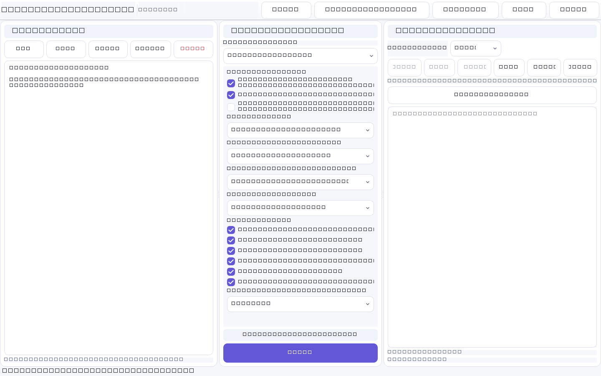

<p align="center"></p>

# CleanText Studio

**Local-first text cleanup, document structure recovery, formula-aware preview, and DOCX/TXT export for copied, AI-generated, and poorly formatted text.**

[English](README.md) · [简体中文](README.zh-CN.md) · [繁體中文](README.zh-TW.md) · [日本語](README.ja.md) · [한국어](README.ko.md) · [Español](README.es.md) · [Français](README.fr.md) · [Deutsch](README.de.md) · [Português](README.pt-BR.md) · [Русский](README.ru.md) · [العربية](README.ar.md) · [हिन्दी](README.hi.md)

[](https://github.com/SiriZhao/CleanText-Studio/releases) [](https://github.com/SiriZhao/CleanText-Studio/actions/workflows/ci.yml)   [](LICENSE)

<!-- section:download -->
## Download for Windows

Current version: **v1.4.2**. Download the [Windows installer](https://github.com/SiriZhao/CleanText-Studio/releases/latest) for a per-user installation, or the **Portable ZIP** to run without installation. Packages are built for Windows x64 and do not require a separately installed Python runtime.



<!-- section:features -->
## What is new in v1.4.2

- Fixed runtime retranslation of action buttons, display-mode choices, placeholders, status feedback, rule counts, and formula tooltips.
- Kept combo-box labels separate from stable cleaning values, so changing language never changes a preset or triggers cleaning.
- Unified panel, control, focus, checkbox, and summary-card rounding through shared design tokens.
- Uses legal system-font fallbacks. No PingFang, HarmonyOS Sans, or other font file is bundled in this release.
- Reworked the flagship documentation and added automated README, UI-language, and cleaning-freeze checks.

## What it does

CleanText Studio removes copied formatting residue while preserving useful document structure. It recognizes headings, lists, quotations, code, Markdown tables, links, and common mathematical formulas. The same structured document model feeds the text editor, preview, TXT export, and DOCX export so a table or formula is not silently lost on export.

### Cleaning and structure recovery

- Clean Markdown headings, emphasis, inline code, links, images, separators, HTML copy residue, emoji, and decorative characters.
- Detect headings, lists, quotations, code blocks, and tables instead of flattening them into a character wall.
- Choose compact joining, smart section spacing, or preserved paragraph boundaries.
- Keep standalone URLs by default; optional URL handling is explicit.

### Tables and Word export

Markdown tables are parsed into structured table blocks. Preview mode displays a real table, and DOCX export writes a native Word table with a bold header, visible borders, adaptive widths, and clean cell text. Long content remains readable instead of becoming a sequence of forced short lines.

### Mathematics

Common inline and display LaTeX, Unicode mathematical expressions, and simple equations are protected before Markdown cleanup. Supported formulas are exported as Word OMML native equations; unsupported constructs fall back to readable text rather than losing variables. The application does not calculate, prove, or change mathematical meaning.

### Optional BYOK AI optimization

Local cleanup works completely offline. AI optimization is optional and only runs after you configure your own provider, endpoint, model, and API key. CleanText Studio does not provide public keys, proxy providers, or pay model bills. Do not send material that is unsuitable for a third party to process.

<!-- section:privacy -->
## Privacy and safety

Basic cleanup, preview, TXT export, and Word export run locally. The app has no advertising, telemetry, account system, or public AI key. It is a formatting, document-structure, and layout tool; it does **not** offer AI-detection evasion, plagiarism evasion, impersonation, academic misconduct, or fabricated citations.

## Quick start

1. Start the application, paste text or open TXT, Markdown, or DOCX.
2. Select a cleaning preset and paragraph mode.
3. Click **Clean** and inspect **Text mode** or **Preview mode**.
4. Export structured content to TXT or Word.

```text
Before: ### Test account
        ---
        **No login required**

After:  Test account
        No login required
```

## Input, output, and system requirements

Input: `.txt`, `.md`, `.markdown`, and `.docx`. Output: UTF-8 `.txt` and structured `.docx`. v1.4.2 is a Windows x64 desktop release. macOS, Linux, and Android are not claimed as released platforms.

## From source

```powershell
py -3.12 -m venv .venv
.\.venv\Scripts\pip install -e ".[dev]"
$env:PYTHONPATH = "src"
.\.venv\Scripts\python -m cleantext_studio.main
```

<!-- section:build -->
## Test and build

```powershell
$env:PYTHONPATH = "src"
.\.venv\Scripts\ruff check .
.\.venv\Scripts\mypy src/cleantext_studio
.\.venv\Scripts\python -m pytest -q
.\.venv\Scripts\python scripts/check_translations.py
.\.venv\Scripts\python scripts/check_ui_language_consistency.py
.\.venv\Scripts\python scripts/check_readme_quality.py
.\.venv\Scripts\python scripts/verify_cleaning_freeze.py
.\scripts\build_windows.ps1
```

The Windows build produces an onedir application, a portable ZIP, an Inno Setup installer, SHA256 checksums, and release notes under `dist/`.

## Localization, contributions, and limitations

The interface provides Simplified Chinese, Traditional Chinese, English, Japanese, Korean, Spanish, French, German, Brazilian Portuguese, Russian, Arabic (RTL), and Hindi. Translation review is welcome; see [the translation guide](docs/TRANSLATION_GUIDE.md). Complex custom LaTeX macros may use a text fallback, and DOCX import does not preserve every source-document style or embedded image.

Developer: [SiriZhao](https://github.com/SiriZhao) · Project: [SiriZhao/CleanText-Studio](https://github.com/SiriZhao/CleanText-Studio) · See [CONTRIBUTING.md](CONTRIBUTING.md) for contribution guidance.

<!-- section:license -->
## License

MIT License. See [LICENSE](LICENSE) and [THIRD_PARTY_LICENSES.md](THIRD_PARTY_LICENSES.md).
