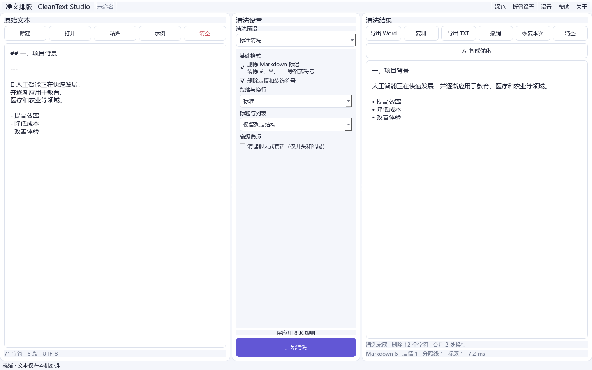

# 净文排版 CleanText Studio

CleanText Studio v1.1.0 是一款本地优先的 Windows 文本格式清洗与 Word 排版工具。基础清洗和 TXT/DOCX 导出完全离线；AI 智能优化是可选功能，只在用户主动配置并确认第三方 API 后发送选定文本。



> 本软件用于清理文本格式和规范文档排版，不提供规避 AI 检测、学术不端或绕过查重的功能。

## 功能

- 结构感知的中英文碎片换行合并，保护标题、列表、代码和表格
- 支持 1–6 级 Markdown 标题、全角井号、异常空白和嵌套强调标记
- 三种列表处理方式、清洗预设、残留检测及结果过期提示
- 输入、清洗设置、结果与导出三栏现代界面，支持浅色和深色主题
- Markdown、Emoji、空白和 Unicode 修复
- 可编辑结果、撤销恢复、修改统计、后台处理
- TXT 编码识别及 DOCX 导入；原子写入 DOCX，中文字体和页码字段
- 无账户、无网络请求、无遥测
- 可选 BYOK AI：OpenAI、DeepSeek、Anthropic Claude、OpenAI 兼容接口和本地兼容模型
- API Key 使用 Windows Credential Manager；配置导入导出不包含密钥
- 结构化输出校验、敏感信息提醒、长文本估算、AI 差异确认和失败回退

AI 智能优化启用后，用户选定的文本会发送至其自行配置的第三方 API 提供商。第三方如何处理数据取决于对应服务条款和隐私政策。CleanText Studio 不提供公共 API Key，不代付调用费用，也不代理或转售模型服务。请勿发送不适合交由第三方处理的机密或敏感内容。

## 开发与运行

```powershell
py -3.12 -m venv .venv
.\.venv\Scripts\pip install -e ".[dev]"
.\.venv\Scripts\python -m cleantext_studio.main
pytest
```

Windows 构建见 [docs/BUILD_WINDOWS.md](docs/BUILD_WINDOWS.md)，用户说明见 [docs/USER_GUIDE.md](docs/USER_GUIDE.md)。截图需由真实构建运行后添加，仓库不使用虚假界面图。

API 配置见 [docs/API_CONFIGURATION.md](docs/API_CONFIGURATION.md)，AI 隐私说明见 [docs/AI_PRIVACY.md](docs/AI_PRIVACY.md)。

## 已知限制

首版不处理 DOCX 图片或复杂原始样式；目录域需在 Word 中更新；超长文本差异视图仅提供修改日志与一键恢复。

MIT License。详见 [LICENSE](LICENSE)。英文说明见 [README_EN.md](README_EN.md)。
