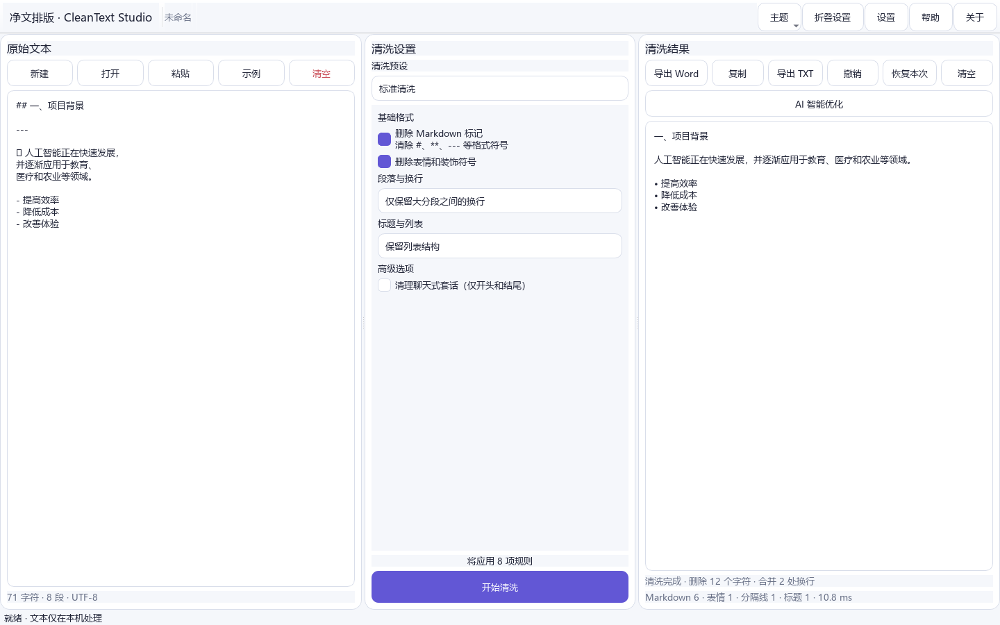
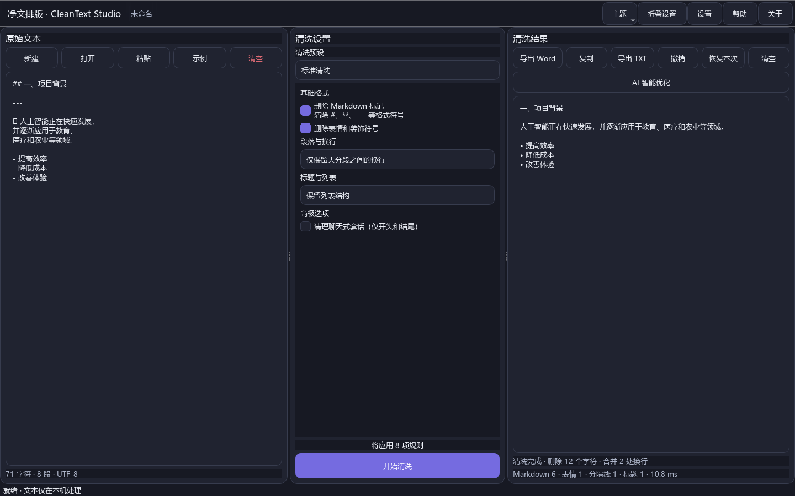
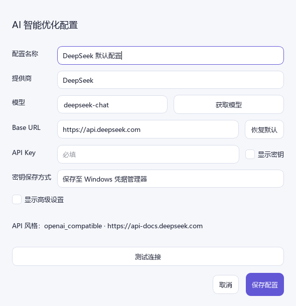
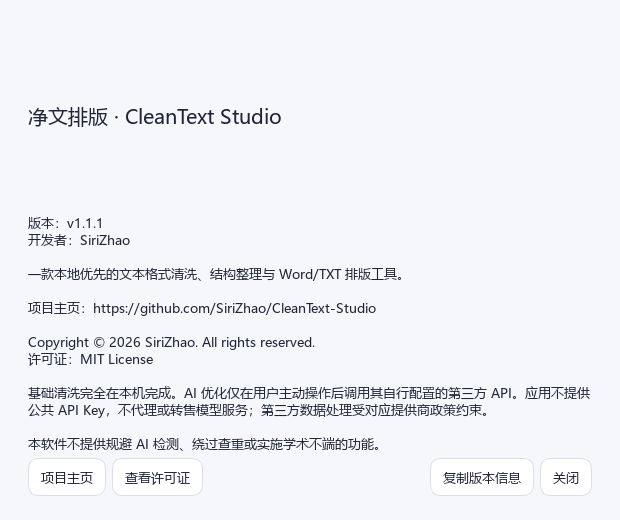
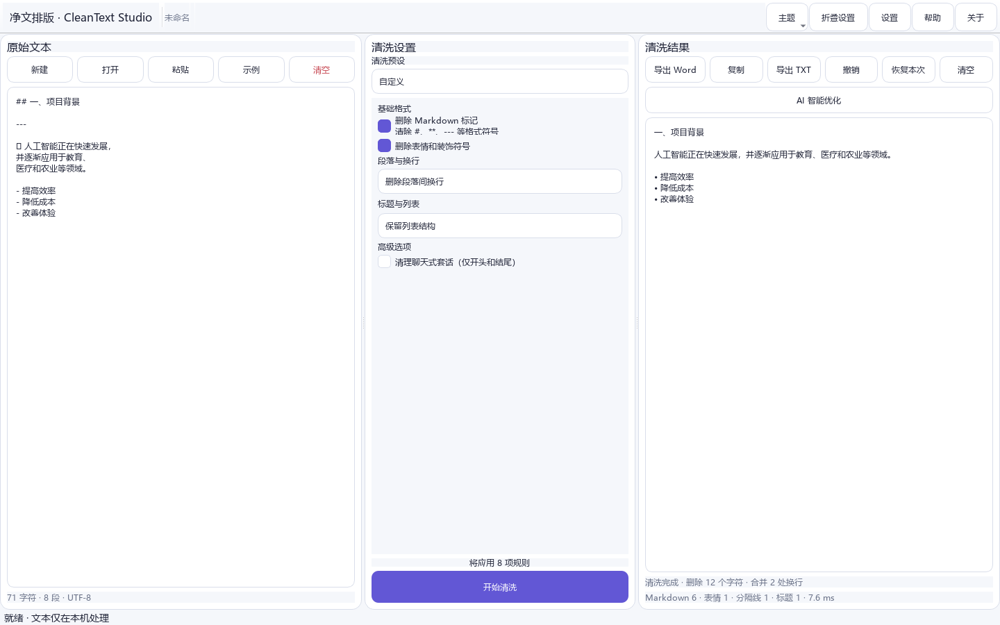

<p align="center"></p>

# 净文排版 · CleanText Studio

本地优先的文本格式清洗、结构整理与 Word/TXT 排版工具。当前版本：**v1.1.1**。

开发者：**SiriZhao** · 项目主页：[github.com/SiriZhao/CleanText-Studio](https://github.com/SiriZhao/CleanText-Studio)

> 本软件不提供规避 AI 检测、绕过查重或实施学术不端的功能。

## 下载

从 [GitHub Releases](https://github.com/SiriZhao/CleanText-Studio/releases) 下载 Windows x64 安装版或便携版。安装版按当前用户安装；便携版解压后运行 `CleanText Studio.exe`。

## 界面

| 浅色模式 | 深色模式 |
|---|---|
|  |  |

| AI Provider 设置 | 关于页面 |
|---|---|
|  |  |




## 核心功能

- 清理 Markdown 标题、强调、链接、分隔线、Emoji、装饰符号与复制残留
- 保护代码、表格、列表和标题结构，检测清洗残留
- 三种换行模式：删除段落间换行、仅保留大分段、保留所有段落间换行
- 离线清理文档首尾聊天式套话，默认关闭且不检查正文中间
- 导入 TXT、Markdown、DOCX，导出 UTF-8 TXT 和规范 DOCX
- 跟随 Windows 系统主题，也可固定浅色或深色
- 可选 BYOK AI：OpenAI、DeepSeek、Anthropic、OpenAI 兼容和本地兼容接口

清洗示例：`✅ 当然可以！以下是整理后的内容：`、`#### 项目背景` 和碎片换行可以在不扩写事实的前提下整理为干净标题与正文。

## 本地模式与 BYOK

基础清洗、TXT 和 Word 导出完全离线。AI 智能优化仅在用户配置自己的 API、查看发送范围并主动确认后调用第三方服务。API Key 保存至 Windows 凭据管理器或仅保留在当前会话，普通配置和导出文件不含密钥。项目不提供公共 API Key、不代付费用、不代理或转售模型服务。第三方数据处理取决于对应服务条款和隐私政策。

Provider 切换会更新默认 Base URL 和推荐模型；模型始终允许手动输入。DeepSeek 默认地址为 `https://api.deepseek.com`，本地兼容接口默认 `http://localhost:11434/v1`。

## 字体与视觉

应用只使用系统已安装字体，不分发商业字体或下载未知字体。Windows 回退顺序：HarmonyOS Sans SC、HarmonyOS Sans、Microsoft YaHei UI、Microsoft YaHei、Segoe UI、系统默认字体；macOS 预留 PingFang SC、SF Pro Text、Helvetica Neue 回退。

## 开发、测试与构建

```powershell
py -3.12 -m venv .venv
.\.venv\Scripts\pip install -e ".[dev]"
.\.venv\Scripts\python -m cleantext_studio.main
.\.venv\Scripts\ruff check .
.\.venv\Scripts\mypy src
.\.venv\Scripts\pytest
.\scripts\build_windows.ps1
```

详细文档：[用户指南](docs/USER_GUIDE.md) · [API 配置](docs/API_CONFIGURATION.md) · [开发](docs/DEVELOPMENT.md) · [Windows 构建](docs/BUILD_WINDOWS.md) · [隐私](docs/PRIVACY.md)

## 已知限制与路线图

- AI 差异目前以全文接受/放弃为主，逐段精细确认仍待增强
- DOCX 导入不保留复杂原始样式和图片；自动目录域需在 Word 中更新
- 后续将增强模板管理、逐项差异恢复和无障碍支持

## 许可证

MIT License。Copyright © 2026 SiriZhao. All rights reserved.
