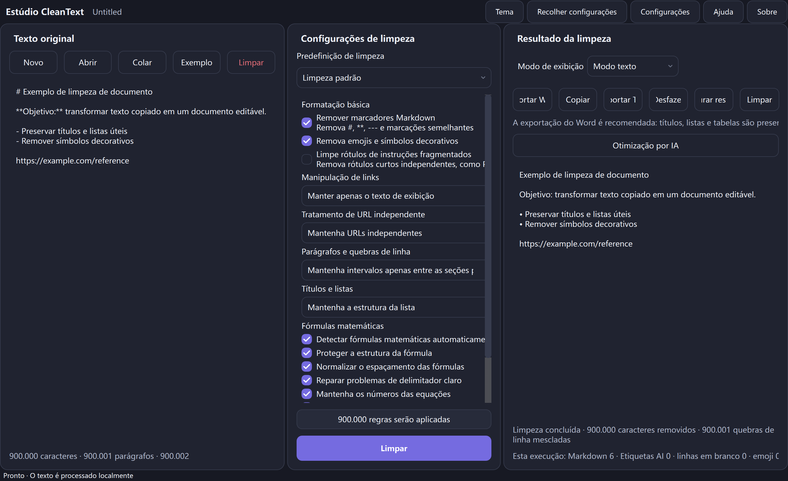

<p align="center">
  
</p>

<h1 align="center">CleanText Studio</h1>

<p align="center"><strong>Limpeza de texto local, recuperação de estrutura de documento, visualização com reconhecimento de fórmula e exportação DOCX/TXT refinada para texto copiado e gerado por IA.</strong></p>

<p align="center">
  <a href="README.md">English</a> · <a href="README.zh-CN.md">简体中文</a> · <a href="README.zh-TW.md">繁體中文</a> · <a href="README.ja.md">日本語</a> · <a href="README.ko.md">한국어</a> · <a href="README.es.md">Español</a> · <a href="README.fr.md">Français</a> · <a href="README.de.md">Deutsch</a> · <a href="README.pt-BR.md">Português (Brasil)</a> · <a href="README.ru.md">Русский</a> · <a href="README.ar.md">العربية</a> · <a href="README.hi.md">हिन्दी</a>
</p>

<p align="center">
  <a href="https://github.com/SiriZhao/CleanText-Studio/releases/tag/v1.5.1"></a>
  <a href="https://github.com/SiriZhao/CleanText-Studio/actions/workflows/ci.yml"></a>
  
  
  <a href="LICENSE"></a>
</p>

> **Versão atual: v1.5.1 · Windows x64 · local primeiro por padrão**

<p align="center">
  <a href="https://github.com/SiriZhao/CleanText-Studio/releases/download/v1.5.1/CleanText-Studio-v1.5.1-Windows-x64-Setup.exe"><strong>Baixar instalador</strong></a> ·
  <a href="https://github.com/SiriZhao/CleanText-Studio/releases/download/v1.5.1/CleanText-Studio-v1.5.1-Windows-x64-Portable.zip"><strong>Baixar ZIP portátil</strong></a> ·
  <a href="https://github.com/SiriZhao/CleanText-Studio/releases/download/v1.5.1/SHA256SUMS.txt">SHA256 somas de verificação</a>
</p>



CleanText Studio transforma texto copiado confuso em um documento legível e editável sem tratar a estrutura útil como ruído. Ele remove Markdown redundantes e decoração, recupera títulos, listas, tabelas e notações matemáticas comuns e, em seguida, fornece uma visualização de texto, uma visualização estruturada e exportação de DOCX ou TXT. A limpeza básica é realizada no dispositivo; a otimização de IA opcional usa apenas um provedor API que você mesmo configura.

**Por que é útil**

- Mantenha o significado enquanto remove resíduos visuais de páginas da web, chats, notas e rascunhos gerados.
- Preserve um modelo de documento para que títulos, tabelas, links e fórmulas não sejam nivelados silenciosamente antes da exportação.
- Revise o resultado antes de escrever uma tabela nativa Word, uma equação editável ou um arquivo de texto UTF-8.
- Alterne o idioma e o tema da interface em tempo de execução sem alterar as configurações de origem, resultado ou limpeza.

## Baixar para Windows

CleanText Studio v1.5.1 foi lançado para **Windows x64**. Escolha o instalador para uma instalação normal por usuário ou escolha o ZIP portátil quando preferir executar a partir de uma pasta extraída. Nenhum dos pacotes requer uma instalação separada do Python.

| Pacote | Utilização prevista | Baixar |
| --- | --- | --- |
| Configuração | Instalação, entrada no menu Iniciar e suporte para desinstalação | [CleanText-Studio-v1.5.1-Windows-x64-Setup.exe](https://github.com/SiriZhao/CleanText-Studio/releases/download/v1.5.1/CleanText-Studio-v1.5.1-Windows-x64-Setup.exe) |
| Portátil | Execute após extrair o ZIP; sem instalação | [CleanText-Studio-v1.5.1-Windows-x64-Portable.zip](https://github.com/SiriZhao/CleanText-Studio/releases/download/v1.5.1/CleanText-Studio-v1.5.1-Windows-x64-Portable.zip) |
| Verificação | Verifique o pacote baixado | [SHA256SUMS.txt](https://github.com/SiriZhao/CleanText-Studio/releases/download/v1.5.1/SHA256SUMS.txt) |

A página de lançamento é a fonte da verdade dos arquivos disponíveis: [CleanText Studio v1.5.1](https://github.com/SiriZhao/CleanText-Studio/releases/tag/v1.5.1).

## O que CleanText Studio faz

### Construído para limpeza prática de documentos

O conteúdo copiado geralmente chega com títulos escritos como marcadores, separadores repetidos, emoji decorativos, quebras de linhas quebradas, rótulos de tutoriais, links colados ou tabelas que são apenas visualmente tabulares. CleanText Studio torna essas escolhas explícitas em vez de aplicar uma reescrita oculta de tamanho único. Escolha uma predefinição, inspecione o resultado e exporte somente depois que a estrutura estiver correta.

### Cenários típicos- Normalize notas de pesquisa, notas de reuniões, extratos de base de conhecimento e cópias de páginas da web.
- Prepare rascunhos assistidos por IA para edição e entrega profissional de documentos.
- Recupere uma tabela Markdown antes de enviá-la como tabela Word nativa.
- Preserve a matemática simples em linha e de bloco enquanto remove o ruído de formatação circundante.
- Crie uma transferência TXT limpa quando um layout Word for desnecessário.

## Capacidades principais

### Markdown e limpeza de formatação

O pipeline de limpeza pode remover marcadores de cabeçalho Markdown, marcadores de ênfase, marcadores de código embutido, sintaxe de imagem, regras horizontais, resíduos de HTML copiados, símbolos decorativos, emoji e rótulos instrucionais fragmentados. Ele preserva o texto comum e torna as opções de limpeza visíveis no painel de configurações.

### Recuperação da estrutura do documento

Títulos, listas, citações, blocos de código, parágrafos, tabelas, links e blocos matemáticos são representados como estrutura de documento, em vez de serem cegamente recolhidos em um fluxo de caracteres. É por isso que a pré-visualização e a exportação podem tomar as mesmas decisões estruturais.

### Títulos e listas

Escolha se deseja preservar marcadores, naturalizar uma estrutura ou remover marcadores quando apropriado. A ferramenta foi projetada para reter hierarquia útil e semântica de lista; não é um reescritor genérico que inventa um novo esboço.

### Parágrafos e quebras de linha

Três modos cobrem material de origem comum:

| Modo | Use-o quando |
| --- | --- |
| Compacto | Você deseja linhas de origem agrupadas comuns unidas em parágrafos compactos. |
| Seções inteligentes | Você deseja um espaçamento natural entre parágrafos e, ao mesmo tempo, mantém quebras de seção significativas. |
| Preservar tudo | Você precisa que os limites do parágrafo de origem sejam mantidos o mais próximo possível. |

### Links e URLs independentes

O tratamento do link pode manter Markdown, manter apenas o texto de exibição ou preservar o texto de exibição junto com seu URL. URLs independentes podem ser retidos, mesclados com o parágrafo anterior ou removidos quando forem apenas resíduos do tutorial. URLs são manipulados deliberadamente, em vez de desaparecerem como efeito colateral da limpeza Markdown.

## Tabelas, equações e visualização

### Markdown tabelas e Word tabelas

As tabelas Markdown são analisadas em blocos de tabelas estruturadas. O modo de visualização exibe a tabela como uma tabela e a exportação DOCX cria uma tabela Word nativa com uma linha de cabeçalho, conteúdo de célula legível, bordas e larguras escolhidas do conteúdo em vez de uma divisão igual fixa. Markdown linhas separadoras, marcadores de ênfase residual, colunas vazias sem sentido e quebras de linha suaves acidentais são limpas antes da exportação quando as configurações de limpeza ativas permitem.


### Fórmulas matemáticas e equações Word editáveis

Delimitadores LaTeX comuns embutidos e de exibição, expressões matemáticas Unicode e equações simples são protegidos enquanto o texto ao redor é limpo. As fórmulas suportadas são emitidas como equações nativas Word OMML, portanto, variáveis ​​e expressões comuns permanecem editáveis ​​em Word. Espaçamento de fórmulas, problemas óbvios de delimitador e numeração de fórmulas podem ser normalizados de acordo com as opções selecionadas.

Macros personalizadas complexas não são descartadas silenciosamente. Quando uma fórmula está fora do intervalo de conversão suportado, o aplicativo mantém um substituto legível e relata-o nas informações de qualidade de exportação.


### Modo de texto e modo de visualização

O modo texto é útil para revisar o resultado simples normalizado. O modo de visualização mostra títulos, listas, tabelas, links e fórmulas em um formato orientado a documentos. A mudança do modo de exibição não executa novamente a limpeza nem altera o resultado.

## Antes e depoisO exemplo compacto a seguir mostra o tipo de resíduo que o aplicativo foi projetado para limpar, preservando ao mesmo tempo o conteúdo útil.

**Fonte**```markdown
### **Project notes** ✨
---
Read the **draft** first.

- Keep the main conclusion
- Remove decorative labels

| Item | Value |
| --- | --- |
| Formula | \( E = mc^2 \) |

https://example.com/reference
```**Conceito de resultado**```text
Project notes

Read the draft first.

• Keep the main conclusion
• Remove decorative labels

The table and E = mc² formula remain structured in Preview and DOCX export.
```

## Exportar formatos

### Exportar Word

Escolha exportar Word quando o destino precisar de títulos, listas, tabelas e fórmulas suportadas como elementos editáveis do documento. O exportador produz um arquivo `.docx`; ele não automatiza um aplicativo Word instalado localmente. Antes da exportação, o aplicativo pode mostrar um resumo da estrutura e da qualidade para que as limitações recuperáveis ​​da fórmula/tabela fiquem visíveis.

### Exportar TXT

Escolha TXT para um resultado de texto simples UTF-8 portátil. A exportação TXT preserva o conteúdo textual normalizado, mas não pode representar tabelas nativas Word ou equações OMML editáveis ​​como objetos de documento ricos.

| Entrada | Saída |
| --- | --- |
| TXT, Markdown, MD, DOCX | UTF-8 TXT e estruturado DOCX |

## Idiomas, temas e acessibilidade

A interface da área de trabalho oferece chinês simplificado, chinês tradicional, inglês, japonês, coreano, espanhol, francês, alemão, português do Brasil, russo, árabe e hindi. As alterações de idioma são aplicadas em tempo de execução e retêm texto, resultados, seleções atuais e histórico de desfazer. O árabe usa uma interface da direita para a esquerda, enquanto valores técnicos como URLs, chaves API e código permanecem legíveis da esquerda para a direita.

Os temas claros e escuros compartilham o mesmo painel, controle, foco e sistema de superfície arredondada. O aplicativo usa alternativas de fontes do sistema legal, quando disponíveis; ele **não** agrupa arquivos Apple PingFang.


## Otimização de IA opcional (BYOK)

A otimização de IA é opcional. Limpeza básica, visualização, exportação TXT e exportação DOCX estão disponíveis sem uma conexão de rede. Ao habilitar deliberadamente a otimização de IA, você escolhe um provedor, endpoint, modelo compatível e sua própria chave API. O aplicativo não fornece uma chave API gratuita compartilhada ou proxy de sua conta de provedor.

DeepSeek e outros provedores expostos pela configuração do aplicativo instalado podem ser selecionados por meio da caixa de diálogo de configurações do AI. Os identificadores de fornecedor e modelo permanecem separados dos rótulos de exibição traduzidos. Revise os termos de dados do próprio fornecedor antes de enviar material confidencial.


## Início rápido

1. Inicie CleanText Studio e cole o texto ou abra um arquivo compatível.
2. Escolha uma predefinição de limpeza e ajuste apenas as opções necessárias para este documento.
3. Clique em **Limpar** e inspecione o modo de texto ou o modo de visualização.
4. Exporte para Word para entrega estruturada ou TXT para um arquivo de texto simples normalizado.
5. Se necessário, configure seu próprio provedor de IA e escolha conscientemente quando enviar texto para ele.

### Instalador ou versão portátil

- **Instalador:** execute o executável de instalação, siga o instalador e inicie CleanText Studio no menu Iniciar. Use as configurações do Windows Apps ou o desinstalador para removê-lo.
- **Portátil:** extraia o ZIP para uma pasta gravável e inicie o executável dentro dela. Mantenha os arquivos extraídos juntos; não execute-o diretamente de um arquivo compactado.

### Fluxo de trabalho completo

1. Coloque o texto fonte no painel esquerdo.
2. Use o painel central para decidir como Markdown, links, parágrafos, listas e fórmulas são tratados.
3. Revise o resultado limpo à direita e use Visualização para tabelas e equações.
4. Use a barra de ferramentas de resultados para copiar, desfazer, restaurar o resultado mais recente, limpar, exportar TXT ou exportar Word.
5. Mantenha uma cópia da fonte original sempre que o documento tiver importância legal, arquivística ou de publicação.

## Privacidade, segurança e fluxo de dados

### Processamento básico local primeiroA limpeza básica é executada localmente. O aplicativo não possui sistema de conta, serviço de publicidade, serviço de telemetria ou chave pública compartilhada API. Seu texto não é carregado apenas porque foi colado, visualizado, limpo ou exportado localmente.

### As solicitações de IA são opcionais

Somente uma ação explícita de otimização de IA usa o provedor terceirizado que você configura. O fornecedor recebe o material necessário para essa solicitação nos seus próprios termos. Não use uma solicitação de fornecedor para material que você não tem direito de compartilhar.

### API manipulação de chave

As chaves API são fornecidas pelo usuário e não são gravadas na configuração do documento exportado. Em Windows, o aplicativo usa seu mecanismo de armazenamento de credenciais configurado quando disponível; se o armazenamento seguro de credenciais não estiver disponível, ele retornará com segurança, em vez de exportar silenciosamente uma chave de texto simples. Trate a conta do sistema operacional e as credenciais do provedor como limites de segurança.

## Requisitos do sistema

- Windows x64.
- Um ambiente de desktop Windows atualmente suportado.
- Nenhum tempo de execução Python instalado separadamente para pacotes de lançamento.
- O acesso à Internet é opcional e necessário apenas para downloads de GitHub, uso opcional de IA ou links abertos pelo usuário.

Windows O SmartScreen pode mostrar um aviso de reputação para uma nova compilação não assinada ou de baixa reputação. Faça download apenas da página de lançamento do repositório, verifique a soma de verificação SHA256 e siga a política de instalação de software da sua organização.

## Pilha técnica e arquitetura do projeto

CleanText Studio é um aplicativo de desktop Python que usa PySide6 para a interface, python-docx para gravação DOCX, PyInstaller para embalagem portátil, Inno Setup para o instalador Windows e pytest/Ruff/mypy para verificações de qualidade. O modelo de limpeza e bloco de documento fica abaixo da camada de apresentação, permitindo que texto, visualização e exportação consumam a mesma estrutura normalizada.```text
src/cleantext_studio/
├── app.py                 # desktop window and presentation wiring
├── cleaners/              # stable text-cleaning pipeline
├── math/                  # detection, parsing, preview, and OMML support
├── exporters/             # DOCX and TXT exporters
├── i18n/                  # locale catalogs and runtime translation service
├── ui/                    # cards, controls, and theme components
└── llm/                   # optional provider configuration and requests
assets/                    # icon, screenshots, and packaged resources
scripts/                   # validation, screenshot, and Windows-build helpers
tests/                     # unit, GUI, integration, and regression checks
```## Executar a partir da fonte

Os comandos a seguir correspondem ao layout de desenvolvimento do repositório em PowerShell.```powershell
git clone https://github.com/SiriZhao/CleanText-Studio.git
cd CleanText-Studio
py -3.12 -m venv .venv
.\.venv\Scripts\pip install -e ".[dev]"
$env:PYTHONPATH = "src"
.\.venv\Scripts\python -m cleantext_studio.main
```## Teste e construa```powershell
$env:PYTHONPATH = "src"
.\.venv\Scripts\ruff check .
.\.venv\Scripts\mypy src/cleantext_studio
.\.venv\Scripts\python -m pytest -q
.\.venv\Scripts\python scripts/check_translations.py
.\.venv\Scripts\python scripts/check_readme_quality.py
.\.venv\Scripts\python scripts/check_screenshot_quality.py
.\.venv\Scripts\python scripts/verify_cleaning_freeze.py
.\scripts\build_windows.ps1
```A compilação Windows grava seus artefatos atuais, somas de verificação e notas de versão em `dist/`. A saída da compilação não é intencionalmente confirmada no repositório.

## Liberar artefatos e verificação SHA256

Cada versão fornece o executável de configuração, ZIP portátil, `SHA256SUMS.txt` e notas de versão, quando disponíveis. Em PowerShell, compare um artefato baixado com a soma de verificação publicada:```powershell
Get-FileHash .\CleanText-Studio-v1.5.1-Windows-x64-Setup.exe -Algorithm SHA256
Get-Content .\SHA256SUMS.txt
```## Contribuições de internacionalização e tradução

Os catálogos de localidade oficiais são `zh_CN`, `zh_TW`, `en_US`, `ja_JP`, `ko_KR`, `es_ES`, `fr_FR`, `de_DE`, `pt_BR`, `ru_RU`, `ar` e `hi_IN`. Consulte [docs/TRANSLATION_GLOSSARY.md](docs/TRANSLATION_GLOSSARY.md) e [docs/README_TRANSLATION_STATUS.md](docs/README_TRANSLATION_STATUS.md) antes de propor alterações terminológicas. A revisão da tradução comunitária é bem-vinda; este repositório não afirma que todas as traduções de documentação tenham recebido revisão de falantes nativos.

## Roteiro

A versão pública atual é Windows x64. O trabalho futuro da plataforma, uma fidelidade de importação mais rica e uma cobertura mais ampla de fórmulas são tópicos do roteiro, e não reivindicações de remessa atuais. Solicitações de recursos e relatórios de problemas são bem-vindos, mas um item de roteiro não é um compromisso ou anúncio de lançamento.

## Limitações conhecidas

- Macros LaTeX personalizadas complexas podem exigir um substituto legível em vez da conversão de equação Word nativa.
- A importação DOCX não pode preservar todos os estilos originais, objetos incorporados ou recursos de layout de arquivos Word arbitrários.
- TXT não pode codificar tabelas nativas ricas em Word ou equações editáveis.
- A saída de IA opcional é produzida pelo fornecedor terceirizado que você seleciona e requer revisão humana.
- A embalagem Windows é a única plataforma publicada aqui indicada; macOS, Linux, Android e iOS não são anunciados atualmente como versões lançadas.

## Perguntas frequentes

### Devo estar online?

Não. A limpeza local, a visualização e a exportação local funcionam sem uma conexão de rede. O acesso à rede só é necessário para ações como baixar lançamentos, abrir um link externo ou uma solicitação de IA que você decidir fazer.

### O aplicativo carregará meu texto?

Não para processamento local básico. Uma solicitação de terceiros ocorre somente quando você usa explicitamente a otimização de IA com seu próprio provedor configurado.

### Devo configurar uma chave API?

Não. Uma chave API é necessária apenas para otimização opcional de IA.

### Quais arquivos posso usar?

O aplicativo aceita entradas TXT, Markdown/MD e DOCX e pode exportar UTF-8 TXT ou DOCX estruturado.

### Qual é a diferença entre a exportação de Word e TXT?

Word pode reter uma estrutura rica, como títulos, tabelas nativas e equações editáveis ​​suportadas. TXT é uma transferência de texto UTF-8 limpa, sem objetos de documento ricos.

### Por que a exportação de Word é recomendada para alguns documentos?

É o formato que consegue transportar com mais fidelidade a estrutura do documento recuperado, principalmente tabelas e fórmulas suportadas.

### As fórmulas são editáveis?

As fórmulas suportadas são exportadas como equações nativas Word OMML. Macros complexas não suportadas podem usar um substituto legível e devem ser verificadas antes da publicação.

### As tabelas são exportadas como tabelas Word?

Tabelas Markdown estruturadas são exportadas como tabelas Word nativas quando a exportação Word é selecionada.

### Como altero o idioma ou o tema?

Use os controles de idioma e tema na barra de ferramentas/configurações do aplicativo. A opção de tempo de execução preserva o documento ativo e as seleções de limpeza.

### Onde minha chave API está armazenada?

O aplicativo usa seu caminho de armazenamento de credenciais Windows configurado quando disponível e não inclui a chave na configuração exportada. Revise as configurações da compilação instalada e a política de segurança do sistema.

### Instalador ou ZIP portátil?

Escolha o instalador para integração normal de Windows e suporte para desinstalação. Escolha portátil quando desejar uma pasta independente e extraída.

### Como posso relatar um problema ou contribuir com uma tradução?Abra um problema ou solicitação pull em [SiriZhao/CleanText-Studio](https://github.com/SiriZhao/CleanText-Studio), incluindo uma amostra não confidencial e o resultado esperado sempre que possível.

## Contribuindo

Leia [CONTRIBUTING.md](CONTRIBUTING.md) antes de abrir uma solicitação pull. Mantenha o foco nas mudanças, adicione testes quando o comportamento mudar, evite comprometer resultados de build ou credenciais e preserve a postura de privacidade local do projeto.

## Desenvolvedor

Mantido por [SiriZhao](https://github.com/SiriZhao). Página inicial do projeto: [SiriZhao/CleanText-Studio](https://github.com/SiriZhao/CleanText-Studio).

## Licenças de terceiros

Consulte [THIRD_PARTY_LICENSES.md](THIRD_PARTY_LICENSES.md) para avisos de dependência distribuída e de tempo de execução. CleanText Studio não empacota arquivos de fontes Apple PingFang.

## Licença

CleanText Studio está disponível sob a [MIT License](LICENÇA).

> A revisão comunitária desta tradução do README é bem-vinda.
