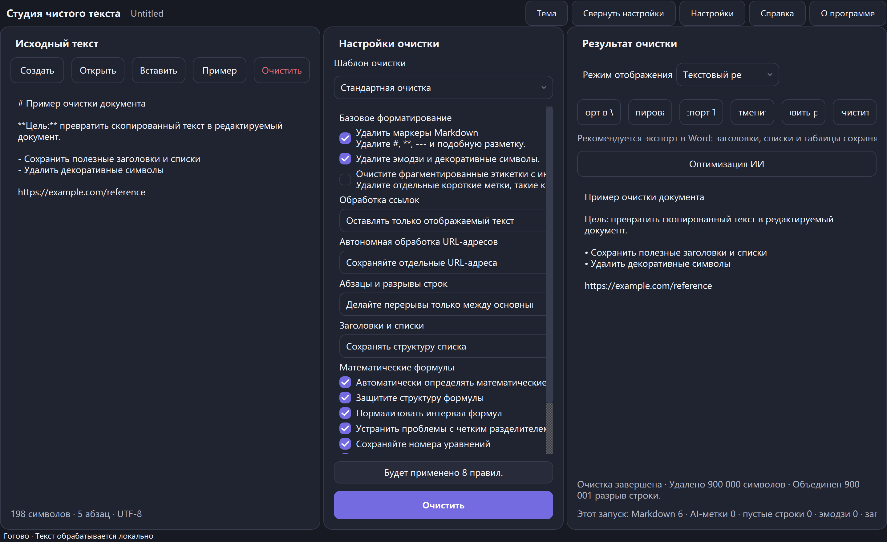

<p align="center">
  
</p>

<h1 align="center">CleanText Studio</h1>

<p align="center"><strong>Локальная очистка текста, восстановление структуры документа, предварительный просмотр с учетом формул и улучшенный экспорт DOCX/TXT для скопированного и сгенерированного AI текста.</strong></p>

<p align="center">
  <a href="README.md">English</a> · <a href="README.zh-CN.md">简体中文</a> · <a href="README.zh-TW.md">繁體中文</a> · <a href="README.ja.md">日本語</a> · <a href="README.ko.md">한국어</a> · <a href="README.es.md">Español</a> · <a href="README.fr.md">Français</a> · <a href="README.de.md">Deutsch</a> · <a href="README.pt-BR.md">Português (Brasil)</a> · <a href="README.ru.md">Русский</a> · <a href="README.ar.md">العربية</a> · <a href="README.hi.md">हिन्दी</a>
</p>

<p align="center">
  <a href="https://github.com/SiriZhao/CleanText-Studio/releases/tag/v1.5.1"></a>
  <a href="https://github.com/SiriZhao/CleanText-Studio/actions/workflows/ci.yml"></a>
  
  
  <a href="LICENSE"></a>
</p>

> **Текущая версия: v1.5.1 · Windows x64 · по умолчанию — сначала локальный**

<p align="center">
  <a href="https://github.com/SiriZhao/CleanText-Studio/releases/download/v1.5.1/CleanText-Studio-v1.5.1-Windows-x64-Setup.exe"><strong>Загрузить установщик</strong></a> ·
  <a href="https://github.com/SiriZhao/CleanText-Studio/releases/download/v1.5.1/CleanText-Studio-v1.5.1-Windows-x64-Portable.zip"><strong>Загрузить портативный ZIP</strong></a> ·
  <a href="https://github.com/SiriZhao/CleanText-Studio/releases/download/v1.5.1/SHA256SUMS.txt">SHA256 контрольные суммы</a>
</p>



CleanText Studio превращает беспорядочно скопированный текст в читаемый и редактируемый документ, не рассматривая полезную структуру как шум. Он удаляет избыточные Markdown и украшения, восстанавливает заголовки, списки, таблицы и общие математические обозначения, затем предоставляет текстовое представление, структурированный предварительный просмотр и экспорт DOCX или TXT. На устройстве выполняется базовая очистка; дополнительная оптимизация AI использует только поставщика API, который вы настраиваете самостоятельно.

**Почему это полезно**

- Сохраняйте смысл, удаляя визуальные остатки с веб-страниц, чатов, заметок и созданных черновиков.
- Сохраняйте модель документа, чтобы заголовки, таблицы, ссылки и формулы не выравнивались перед экспортом.
- Просмотрите результат, прежде чем писать собственную таблицу Word, редактируемое уравнение или текстовый файл UTF-8.
- Переключайте язык интерфейса и тему во время выполнения без изменения источника, результата или настроек очистки.

## Скачать для Windows

CleanText Studio v1.5.1 выпущен для **Windows x64**. Выберите установщик для обычной индивидуальной установки или выберите переносной ZIP-файл, если вы предпочитаете запускать из извлеченной папки. Ни один из пакетов не требует отдельной установки Python.

| Пакет | Использование по назначению | Скачать |
| --- | --- | --- |
| Настройка | Поддержка установки, входа в меню «Пуск» и удаления | [CleanText-Studio-v1.5.1-Windows-x64-Setup.exe](https://github.com/SiriZhao/CleanText-Studio/releases/download/v1.5.1/CleanText-Studio-v1.5.1-Windows-x64-Setup.exe) |
| Портативный | Запустить после распаковки ZIP; без установки | [CleanText-Studio-v1.5.1-Windows-x64-Portable.zip](https://github.com/SiriZhao/CleanText-Studio/releases/download/v1.5.1/CleanText-Studio-v1.5.1-Windows-x64-Portable.zip) |
| Проверка | Проверьте загруженный пакет | [SHA256SUMS.txt](https://github.com/SiriZhao/CleanText-Studio/releases/download/v1.5.1/SHA256SUMS.txt) |

Страница выпуска является источником достоверной информации о доступных файлах: [CleanText Studio v1.5.1](https://github.com/SiriZhao/CleanText-Studio/releases/tag/v1.5.1).

## Что делает CleanText Studio

### Создан для практической очистки документов

Скопированный контент часто поставляется с заголовками, написанными в виде маркеров, повторяющимися разделителями, декоративными смайлами, переносами ломаных линий, метками учебных пособий, вставленными ссылками или таблицами, которые являются только визуально табличными. CleanText Studio делает этот выбор явным, а не применяет скрытую универсальную перезапись. Выберите пресет, проверьте результат и экспортируйте только после того, как структура станет правильной.

### Типичные сценарии- Нормализуйте исследовательские заметки, заметки совещаний, выдержки из базы знаний и копии веб-страниц.
- Подготавливайте черновики с помощью искусственного интеллекта для редактирования и профессиональной доставки документов.
— Восстановите таблицу Markdown перед отправкой ее как собственной таблицы Word.
- Сохраняйте простую встроенную и блочную математику, удаляя при этом окружающий шум форматирования.
— Создайте чистую передачу обслуживания TXT, если макет Word не нужен.

## Основные возможности

### Markdown и очистка форматирования

Конвейер очистки может удалять маркеры заголовков Markdown, маркеры выделения, маркеры встроенного кода, синтаксис изображений, горизонтальные правила, скопированные остатки HTML, декоративные символы, смайлики и фрагментированные инструкции. Он сохраняет обычный текст и делает параметры очистки видимыми на панели настроек.

### Восстановление структуры документа

Заголовки, списки, цитаты, блоки кода, абзацы, таблицы, ссылки и математические блоки представлены в виде структуры документа, а не слепо свернуты в поток символов. Вот почему предварительный просмотр и экспорт могут принимать одни и те же структурные решения.

### Заголовки и списки

Выберите, следует ли сохранить маркеры, натурализовать структуру или удалить маркеры, где это необходимо. Инструмент предназначен для сохранения полезной иерархии и семантики списков; это не универсальный рерайтер, который изобретает новую схему.

### Абзацы и разрывы строк

Три режима охватывают общий исходный материал:

| Режим | Используйте его, когда |
| --- | --- |
| Компактный | Вы хотите, чтобы обычные строки исходного кода были объединены в компактные абзацы. |
| Умные разделы | Вам нужен естественный интервал между абзацами, сохраняя при этом значимые разрывы разделов. |
| Сохранить все | Вам необходимо, чтобы границы исходного абзаца сохранялись как можно ближе. |

### Ссылки и отдельные URL-адреса

Обработка ссылок может сохранять Markdown, сохранять только отображаемый текст или сохранять отображаемый текст вместе с его URL-адресом. Отдельные URL-адреса можно сохранить, объединить с предыдущим абзацем или удалить, если они представляют собой лишь остатки учебного пособия. URL-адреса обрабатываются намеренно, а не исчезают как побочный эффект очистки Markdown.

## Таблицы, уравнения и предварительный просмотр

### Таблицы Markdown и таблицы Word

Таблицы Markdown анализируются на блоки структурированных таблиц. В режиме предварительного просмотра таблица отображается как таблица, а экспорт DOCX создает собственную таблицу Word со строкой заголовка, читаемым содержимым ячейки, границами и шириной, выбранными из содержимого, а не с фиксированным равным разделением. Markdown строки-разделители, остаточные маркеры выделения, бессмысленные пустые столбцы и случайные мягкие разрывы строк удаляются перед экспортом, если это позволяют активные настройки очистки.


### Математические формулы и редактируемые уравнения Word

Общие встроенные и отображаемые разделители LaTeX, математические выражения Юникода и простые уравнения защищены, а окружающий текст очищен. Поддерживаемые формулы создаются как собственные уравнения Word OMML, поэтому общие переменные и выражения остаются редактируемыми в Word. Расстояние между формулами, очевидные проблемы с разделителями и нумерацию формул можно нормализовать в соответствии с выбранными параметрами.

Сложные пользовательские макросы не отбрасываются молча. Если формула выходит за пределы поддерживаемого диапазона преобразования, приложение сохраняет читаемый резервный вариант и сообщает об этом в информации о качестве экспорта.


### Текстовый режим и режим предварительного просмотра

Текстовый режим полезен для просмотра нормализованного простого результата. В режиме предварительного просмотра заголовки, списки, таблицы, ссылки и формулы отображаются в ориентированной на документ форме. Переключение режима отображения не приводит к повторному запуску очистки и изменению результата.

## До и послеВ следующем компактном примере показано, какие остатки приложение предназначено для очистки, сохраняя при этом полезный контент.

**Источник**```markdown
### **Project notes** ✨
---
Read the **draft** first.

- Keep the main conclusion
- Remove decorative labels

| Item | Value |
| --- | --- |
| Formula | \( E = mc^2 \) |

https://example.com/reference
```**Концепция результата**```text
Project notes

Read the draft first.

• Keep the main conclusion
• Remove decorative labels

The table and E = mc² formula remain structured in Preview and DOCX export.
```

## Форматы экспорта

### Экспорт Word

Выберите экспорт Word, если в месте назначения требуются заголовки, списки, таблицы и поддерживаемые формулы в качестве редактируемых элементов документа. Экспортер создает файл `.docx`; он не автоматизирует локально установленное приложение Word. Перед экспортом приложение может отображать сводную информацию о структуре и качестве, чтобы были видны восстанавливаемые ограничения формулы/таблицы.

### Экспорт TXT

Выберите TXT для переносимого результата в виде обычного текста UTF-8. Экспорт TXT сохраняет нормализованное текстовое содержимое, но не может представлять собственные таблицы Word или редактируемые уравнения OMML как объекты расширенного документа.

| Ввод | Выход |
| --- | --- |
| TXT, Markdown, MD, DOCX | UTF-8 TXT и структурированный DOCX |

## Языки, темы и доступность

Интерфейс рабочего стола поддерживает упрощенный китайский, традиционный китайский, английский, японский, корейский, испанский, французский, немецкий, бразильский португальский, русский, арабский и хинди. Изменения языка применяются во время выполнения и сохраняют текст, результаты, текущие выборки и историю отмены. В арабском языке используется интерфейс с письмом справа налево, а технические значения, такие как URL-адреса, ключи API и код, остаются читаемыми слева направо.

Светлые и темные темы используют одну и ту же панель, элементы управления, фокус и систему закругленных поверхностей. Приложение использует допустимые резервные системные шрифты, где это возможно; он **не** объединяет файлы Apple PingFang.


## Дополнительная оптимизация AI (BYOK)

Оптимизация AI не является обязательной. Базовая очистка, предварительный просмотр, экспорт TXT и экспорт DOCX доступны без подключения к сети. Когда вы намеренно включаете оптимизацию ИИ, вы выбираете поддерживаемого поставщика, конечную точку, модель и свой собственный ключ API. Приложение не предоставляет общий бесплатный ключ API или прокси-сервер вашей учетной записи провайдера.

DeepSeek и другие поставщики, предоставляемые конфигурацией установленного приложения, можно выбрать в диалоговом окне настроек AI. Идентификаторы поставщика и модели остаются отдельными от переведенных отображаемых меток. Прежде чем отправлять конфиденциальные материалы, ознакомьтесь с собственными условиями использования данных поставщика.


## Быстрый старт

1. Запустите CleanText Studio и вставьте текст или откройте поддерживаемый файл.
2. Выберите предустановку очистки и настройте только те параметры, которые необходимы для этого документа.
3. Нажмите **Очистить**, затем проверьте текстовый режим или режим предварительного просмотра.
4. Экспортируйте в Word для структурированной доставки или в TXT для нормализованного текстового файла.
5. При необходимости настройте собственного провайдера ИИ и осознанно выбирайте, когда отправлять ему текст.

### Установщик или портативная версия

- **Установщик:** запустите исполняемый файл установки, следуйте инструкциям установщика и запустите CleanText Studio из меню «Пуск». Используйте настройки приложения Windows или программу удаления, чтобы удалить его.
- **Портативный:** извлеките ZIP-архив в папку, доступную для записи, и запустите в нем исполняемый файл. Храните извлеченные файлы вместе; не запускайте его напрямую из сжатого архива.

### Полный рабочий процесс

1. Поместите исходный текст на левую панель.
2. Используйте центральную панель, чтобы решить, как обрабатывать Markdown, ссылки, абзацы, списки и формулы.
3. Просмотрите очищенный результат справа и используйте предварительный просмотр для таблиц и уравнений.
4. Используйте панель инструментов результатов для копирования, отмены, восстановления самого последнего результата, очистки, экспорта TXT или экспорта Word.
5. Сохраняйте копию первоисточника всякий раз, когда документ имеет юридическое, архивное или публикационное значение.

## Конфиденциальность, безопасность и поток данных

### Базовая обработка с локальным приоритетомБазовая очистка выполняется локально. Приложение не имеет системы учетных записей, рекламной службы, службы телеметрии или общего открытого ключа API. Ваш текст не загружается только потому, что он вставлен, просматривается, очищается или экспортируется локально.

### Запросы ИИ принимаются по согласию

Только явное действие по оптимизации ИИ использует настроенного вами стороннего поставщика. Поставщик получает материалы, необходимые для этого запроса, на своих условиях. Не используйте запрос поставщика для материалов, которыми вы не имеете права делиться.

### API обработка ключей

Ключи API предоставляются пользователем и не записываются в конфигурацию экспортируемого документа. В Windows приложение использует настроенный механизм хранения учетных данных, если он доступен; если безопасное хранилище учетных данных недоступно, оно безопасно возвращается, а не экспортирует открытый текстовый ключ в автоматическом режиме. Рассматривайте свою учетную запись операционной системы и учетные данные поставщика как границы безопасности.

## Системные требования

- Windows x64.
- Текущая поддерживаемая среда рабочего стола Windows.
— Для пакетов выпуска отдельно не устанавливается среда выполнения Python.
- Доступ в Интернет не является обязательным и необходим только для загрузки GitHub, дополнительного использования искусственного интеллекта или ссылок, открываемых пользователем.

Windows SmartScreen может отображать предупреждение о репутации для новой неподписанной сборки или сборки с низкой репутацией. Загружайте только со страницы выпуска репозитория, проверяйте контрольную сумму SHA256 и следуйте политике установки программного обеспечения вашей организации.

## Технический стек и архитектура проекта

CleanText Studio — это настольное приложение Python, использующее PySide6 для интерфейса, python-docx для написания DOCX, PyInstaller для портативной упаковки, Inno Setup для установщика Windows и pytest/Ruff/mypy для проверки качества. Модель очистки и блока документов находится ниже уровня представления, что позволяет тексту, предварительному просмотру и экспорту использовать одну и ту же нормализованную структуру.```text
src/cleantext_studio/
├── app.py                 # desktop window and presentation wiring
├── cleaners/              # stable text-cleaning pipeline
├── math/                  # detection, parsing, preview, and OMML support
├── exporters/             # DOCX and TXT exporters
├── i18n/                  # locale catalogs and runtime translation service
├── ui/                    # cards, controls, and theme components
└── llm/                   # optional provider configuration and requests
assets/                    # icon, screenshots, and packaged resources
scripts/                   # validation, screenshot, and Windows-build helpers
tests/                     # unit, GUI, integration, and regression checks
```## Запуск из исходного кода

Следующие команды соответствуют макету разработки репозитория на PowerShell.```powershell
git clone https://github.com/SiriZhao/CleanText-Studio.git
cd CleanText-Studio
py -3.12 -m venv .venv
.\.venv\Scripts\pip install -e ".[dev]"
$env:PYTHONPATH = "src"
.\.venv\Scripts\python -m cleantext_studio.main
```## Тестирование и сборка```powershell
$env:PYTHONPATH = "src"
.\.venv\Scripts\ruff check .
.\.venv\Scripts\mypy src/cleantext_studio
.\.venv\Scripts\python -m pytest -q
.\.venv\Scripts\python scripts/check_translations.py
.\.venv\Scripts\python scripts/check_readme_quality.py
.\.venv\Scripts\python scripts/check_screenshot_quality.py
.\.venv\Scripts\python scripts/verify_cleaning_freeze.py
.\scripts\build_windows.ps1
```Сборка Windows записывает текущие артефакты, контрольные суммы и примечания к выпуску в `dist/`. Вывод сборки намеренно не сохраняется в репозитории.

## Выпуск артефактов и проверка SHA256

Каждый выпуск включает исполняемый файл установки, Portable ZIP, `SHA256SUMS.txt` и примечания к выпуску, если они доступны. В PowerShell сравните загруженный артефакт с опубликованной контрольной суммой:```powershell
Get-FileHash .\CleanText-Studio-v1.5.1-Windows-x64-Setup.exe -Algorithm SHA256
Get-Content .\SHA256SUMS.txt
```## Вклад в интернационализацию и перевод

Официальные каталоги локалей: `zh_CN`, `zh_TW`, `en_US`, `ja_JP`, `ko_KR`, `es_ES`, `fr_FR`, `de_DE`, `pt_BR`, `ru_RU`, `ar` и `hi_IN`. Прежде чем предлагать изменения в терминологии, ознакомьтесь с документами [docs/TRANSLATION_GLOSSARY.md](docs/TRANSLATION_GLOSSARY.md) и [docs/README_TRANSLATION_STATUS.md](docs/README_TRANSLATION_STATUS.md). Обзор перевода сообщества приветствуется; этот репозиторий не утверждает, что каждый перевод документации прошел проверку носителями языка.

## Дорожная карта

Текущая общедоступная версия — Windows x64. Будущая работа платформы, более высокая точность импорта и более широкий охват формул — это темы дорожной карты, а не текущие претензии по доставке. Запросы на новые функции и отчеты о проблемах приветствуются, но пункт дорожной карты не является обязательством или объявлением о выпуске.

## Известные ограничения

— Сложные пользовательские макросы LaTeX могут потребовать читаемого резервного варианта вместо собственного преобразования уравнений Word.
- Импорт DOCX не может сохранить каждый исходный стиль, внедренный объект или функцию макета из произвольных файлов Word.
- TXT не может кодировать расширенные собственные таблицы Word или редактируемые уравнения.
- Дополнительные выходные данные AI создаются выбранным вами сторонним поставщиком и требуют проверки человеком.
- Упаковка Windows — единственная опубликованная платформа, указанная здесь; macOS, Linux, Android и iOS в настоящее время не рекламируются как выпущенные сборки.

## Часто задаваемые вопросы

### Должен ли я быть онлайн?

Нет. Локальная очистка, предварительный просмотр и локальный экспорт работают без подключения к сети. Доступ к сети необходим только для таких действий, как загрузка выпусков, открытие внешней ссылки или запрос AI, который вы хотите сделать.

### Будет ли приложение загружать мой текст?

Не для базовой местной обработки. Сторонний запрос возникает только в том случае, если вы явно используете оптимизацию ИИ с собственным настроенным провайдером.

### Должен ли я настроить ключ API?

Нет. Ключ API необходим только для дополнительной оптимизации ИИ.

### Какие файлы я могу использовать?

Приложение принимает входные данные TXT, Markdown/MD и DOCX и может экспортировать UTF-8 TXT или структурированный DOCX.

### В чем разница между экспортом Word и TXT?

Word может сохранять богатую структуру, такую ​​как заголовки, собственные таблицы и поддерживаемые редактируемые уравнения. TXT — это чистая передача текста UTF-8 без расширенных объектов документа.

### Почему для некоторых документов рекомендуется экспортировать Word?

Это формат, который наиболее точно передает восстановленную структуру документа, особенно таблиц и поддерживаемых формул.

### Можно ли редактировать формулы?

Поддерживаемые формулы экспортируются как собственные уравнения Word OMML. Сложные неподдерживаемые макросы могут использовать читаемый запасной вариант, и их следует проверять перед публикацией.

### Экспортируются ли таблицы как таблицы Word?

Структурированные таблицы Markdown экспортируются как собственные таблицы Word, если выбран экспорт Word.

### Как изменить язык или тему?

Используйте элементы управления языком и темой на панели инструментов/настройках приложения. Переключатель времени выполнения сохраняет активный документ и параметры очистки.

### Где хранится мой ключ API?

Приложение использует настроенный путь хранения учетных данных Windows, если он доступен, и не включает ключ в экспортированную конфигурацию. Просмотрите настройки установленной сборки и политику безопасности вашей системы.

### Инсталлятор или портативный ZIP?

Выберите установщик для обычной интеграции Windows и поддержки удаления. Выберите «Портативный», если вам нужна извлеченная автономная папка.

### Как мне сообщить о проблеме или внести свой вклад в перевод?Откройте проблему или запрос на включение в [SiriZhao/CleanText-Studio](https://github.com/SiriZhao/CleanText-Studio), включая неконфиденциальный образец и ожидаемый результат, если это возможно.

## Вклад

Пожалуйста, прочтите [CONTRIBUTING.md](CONTRIBUTING.md), прежде чем открывать запрос на включение. Сохраняйте целенаправленность изменений, добавляйте тесты при изменении поведения, избегайте фиксации выходных данных сборки или учетных данных и сохраняйте локальную конфиденциальность проекта.

## Разработчик

Поддерживается [SiriZhao](https://github.com/SiriZhao). Домашняя страница проекта: [SiriZhao/CleanText-Studio](https://github.com/SiriZhao/CleanText-Studio).

## Сторонние лицензии

См. [THIRD_PARTY_LICENSES.md](THIRD_PARTY_LICENSES.md) для уведомлений о распределенных зависимостях и зависимостях во время выполнения. CleanText Studio не упаковывает файлы шрифтов Apple PingFang.

## Лицензия

CleanText Studio доступен по лицензии [MIT License](ЛИЦЕНЗИЯ).

> Мы приветствуем помощь сообщества в проверке перевода этого README.
