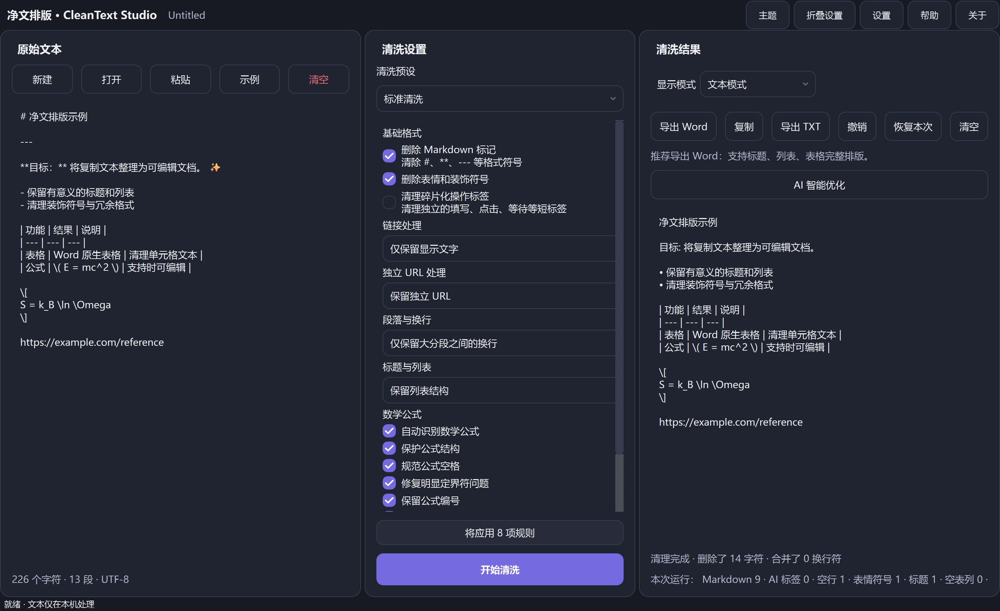
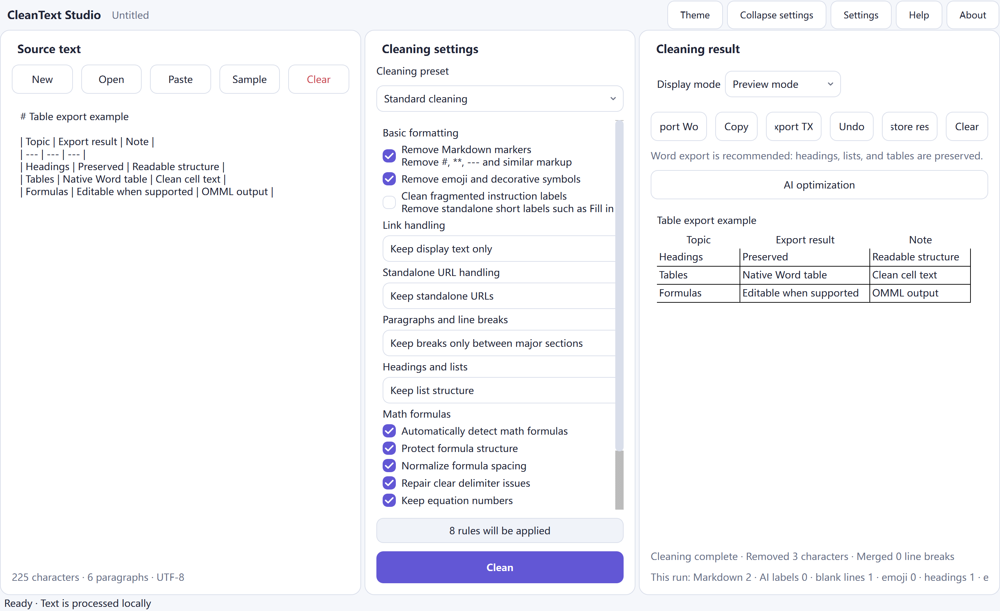
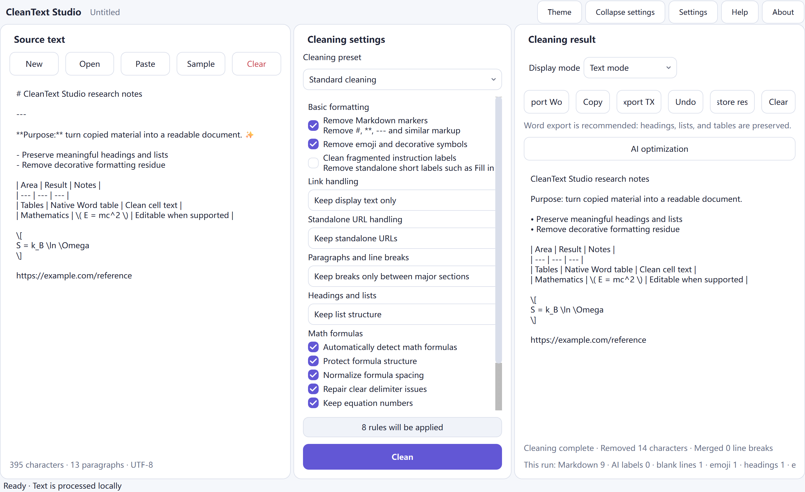
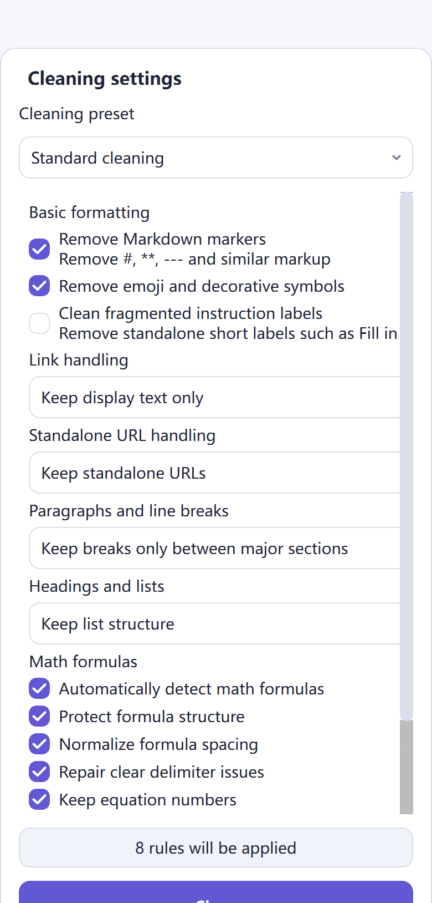

<p align="center">
  
</p>

<h1 align="center">CleanText Studio</h1>

<p align="center"><strong>本地优先文本清理、文档结构恢复、公式感知预览以及针对复制和 AI 生成文本的精炼 DOCX/TXT 导出。</strong></p>

<p align="center">
  <a href="README.md">English</a> · <a href="README.zh-CN.md">简体中文</a> · <a href="README.zh-TW.md">繁體中文</a> · <a href="README.ja.md">日本語</a> · <a href="README.ko.md">한국어</a> · <a href="README.es.md">Español</a> · <a href="README.fr.md">Français</a> · <a href="README.de.md">Deutsch</a> · <a href="README.pt-BR.md">Português (Brasil)</a> · <a href="README.ru.md">Русский</a> · <a href="README.ar.md">العربية</a> · <a href="README.hi.md">हिन्दी</a>
</p>

<p align="center">
  <a href="https://github.com/SiriZhao/CleanText-Studio/releases/tag/v1.5.2"></a>
  <a href="https://github.com/SiriZhao/CleanText-Studio/actions/workflows/ci.yml"></a>
  
  
  <a href="LICENSE"></a>
</p>

> **当前版本：v1.5.2 · Windows x64 · 默认本地优先**

<p align="center">
  <a href="https://github.com/SiriZhao/CleanText-Studio/releases/download/v1.5.2/CleanText-Studio-v1.5.2-Windows-x64-Setup.exe"><strong>下载安装程序</strong></a> ·
  <a href="https://github.com/SiriZhao/CleanText-Studio/releases/download/v1.5.2/CleanText-Studio-v1.5.2-Windows-x64-Portable.zip"><strong>下载便携式 ZIP</strong></a> ·
  <a href="https://github.com/SiriZhao/CleanText-Studio/releases/download/v1.5.2/SHA256SUMS.txt">SHA256 校验和</a>
</p>



CleanText Studio 将杂乱的复制文本转换为可读、可编辑的文档，而不将有用的结构视为噪音。它删除多余的 Markdown 和装饰，恢复标题、列表、表格和常见数学符号，然后为您提供文本视图、结构化预览以及 DOCX 或 TXT 导出。对设备进行基本清理；可选的 AI 优化仅使用您自己配置的 API 提供程序。

**为什么有用**

- 保留含义，同时消除网页、聊天、笔记和生成草稿中的视觉残留。
- 保留文档模型，以便标题、表格、链接和公式在导出之前不会默默地变平。
- 在编写本机 Word 表、可编辑方程或 UTF-8 文本文件之前查看结果。
- 在运行时切换界面语言和主题，无需更改源、结果或清理设置。

## 下载 Windows

CleanText Studio v1.5.2 已针对 **Windows x64** 发布。选择正常的每用户安装的安装程序，或者当您希望从提取的文件夹运行时选择便携式 ZIP。这两个包都不需要单独安装 Python。

|套餐 |预期用途 |下载 |
| --- | --- | --- |
|设置 |安装、开始菜单条目和卸载支持 | [CleanText-Studio-v1.5.2-Windows-x64-Setup.exe](https://github.com/SiriZhao/CleanText-Studio/releases/download/v1.5.2/CleanText-Studio-v1.5.2-Windows-x64-Setup.exe) |
|便携式|解压ZIP后运行；无需安装| [CleanText-Studio-v1.5.2-Windows-x64-Portable.zip](https://github.com/SiriZhao/CleanText-Studio/releases/download/v1.5.2/CleanText-Studio-v1.5.2-Windows-x64-Portable.zip) |
|验证|检查下载的包 | [SHA256SUMS.txt](https://github.com/SiriZhao/CleanText-Studio/releases/download/v1.5.2/SHA256SUMS.txt) |

发布页面是可用文件的真实来源：[CleanText Studio v1.5.2](https://github.com/SiriZhao/CleanText-Studio/releases/tag/v1.5.2)。

## CleanText Studio 的作用

### 专为实用文档清理而设计

复制的内容通常带有以标记、重复分隔符、装饰性表情符号、折线换行、教程标签、粘贴链接或仅在视觉上呈表格形式的表格形式编写的标题。 CleanText Studio 使这些选择变得明确，而不是应用隐藏的一刀切重写。选择一个预设，检查结果，然后仅在结构看起来正确后导出。

### 典型场景- 规范化研究笔记、会议笔记、知识库摘录和网页副本。
- 准备人工智能辅助草稿以进行编辑和专业文档交付。
- 在将 Markdown 表作为本机 Word 表发送之前恢复它。
- 保留简单的内联和块数学，同时消除周围的格式噪音。
- 当不需要 Word 布局时，创建干净的 TXT 切换。

## 核心能力

### Markdown 和格式清理

清理管道可以删除 Markdown 标题标记、强调标记、内联代码标记、图像语法、水平规则、复制的 HTML 残留物、装饰符号、表情符号和碎片教学标签。它保留普通文本并使清理选项在设置面板中可见。

### 文档结构恢复

标题、列表、引文、代码块、段落、表格、链接和数学块被表示为文档结构，而不是盲目地折叠成字符流。这就是为什么预览和导出可以做出相同的结构决策。

### 标题和列表

选择是保留标记、自然化结构还是在适当的情况下删除标记。该工具旨在保留有用的层次结构和列表语义；它不是一个发明新大纲的通用重写器。

### 段落和换行符

三种模式涵盖常见的源材料：

|模式|当 | 时使用它
| --- | --- |
|紧凑|您希望将普通的换行源代码行连接成紧凑的段落。 |
|智能版块|您需要自然的段落间距，同时保留有意义的分节符。 |
|保留所有|您需要尽可能紧密地保持源段落边界。 |

### 链接和独立 URL

链接处理可以保留 Markdown、仅保留显示文本或保留显示文本及其 URL。独立的 URL 可以保留、与前面的段落合并，或者当它们只是教程残留时删除。 URL 是经过有意处理的，而不是作为 Markdown 清理的副作用而消失。

## 表格、方程和预览

### Markdown 表和 Word 表

Markdown 表被解析为结构化表块。预览模式将表格显示为表格，DOCX 导出创建一个本机 Word 表格，其中包含标题行、可读单元格内容、边框和从内容中选择的宽度，而不是固定的等分割。如果活动清理设置允许，则在导出之前会清理 Markdown 分隔符行、残留强调标记、无意义的空列和意外的软换行符。



### 数学公式和可编辑的 Word 方程

常见的内联和显示 LaTeX 分隔符、Unicode 数学表达式和简单方程受到保护，同时清除周围的文本。支持的公式以 Word OMML 本机方程形式发出，因此常见变量和表达式在 Word 中仍然可编辑。公式间距、明显的分隔符问题和公式编号可以根据所选选项进行标准化。

复杂的自定义宏不会被默默地丢弃。当公式超出支持的转换范围时，应用程序会保留可读的回退并在导出质量信息中报告它。


### 文本模式和预览模式

文本模式对于查看标准化的纯文本结果非常有用。预览模式以面向文档的形式显示标题、列表、表格、链接和公式。切换显示模式不会重新运行清理或更改结果。

## 之前和之后以下紧凑的示例显示了该应用程序旨在清除的残留物类型，同时保留有用的内容。

**来源**```markdown
### **Project notes** ✨
---
Read the **draft** first.

- Keep the main conclusion
- Remove decorative labels

| Item | Value |
| --- | --- |
| Formula | \( E = mc^2 \) |

https://example.com/reference
```**结果概念**```text
Project notes

Read the draft first.

• Keep the main conclusion
• Remove decorative labels

The table and E = mc² formula remain structured in Preview and DOCX export.
```

## 导出格式

### 导出Word

当目标需要标题、列表、表格和支持的公式作为可编辑文档元素时，选择 Word 导出。导出器生成一个 `.docx` 文件；它不会自动执行本地安装的 Word 应用程序。在导出之前，应用程序可以显示结构和质量摘要，以便可恢复的公式/表格限制可见。

### 导出TXT

选择 TXT 以获得可移植的 UTF-8 纯文本结果。 TXT 导出保留规范化文本内容，但不能将 Word 本机表或可编辑 OMML 方程表示为丰富的文档对象。

|输入|输出|
| --- | --- |
| TXT、Markdown、医学博士、DOCX | UTF-8 TXT 和结构化 DOCX |

## 语言、主题和可访问性

桌面界面提供简体中文、繁体中文、英语、日语、韩语、西班牙语、法语、德语、巴西葡萄牙语、俄语、阿拉伯语和印地语。语言更改在运行时应用并保留文本、结果、当前选择和撤消历史记录。阿拉伯语使用从右到左的界面，而 URL、API 键和代码等技术值仍然是从左到右可读的。

浅色和深色主题共享相同的面板、控制、焦点和圆形表面系统。应用程序使用法律系统字体后备（如果可用）；它**不**捆绑 Apple PingFang 文件。



## 可选的AI优化（BYOK）

AI优化是可选的。基本清理、预览、TXT 导出和 DOCX 导出无需网络连接即可使用。当您有意启用 AI 优化时，您可以选择受支持的提供商、端点、模型和您自己的 API 密钥。该应用程序不提供共享的免费 API 密钥或代理您的提供商帐户。

可以通过 AI 设置对话框选择 DeepSeek 和已安装的应用程序配置公开的其他提供程序。提供者和模型标识符与翻译的显示标签保持分离。在发送敏感材料之前，请查看提供商自己的数据条款。


## 快速开始

1. 启动 CleanText Studio 并粘贴文本，或打开支持的文件。
2. 选择清洁预设并仅调整本文档所需的选项。
3. 单击**清理**，然后检查文本模式或预览模式。
4. 导出到 Word 进行结构化交付，或导出到 TXT 进行标准化纯文本文件。
5. 如果需要，配置您自己的 AI 提供程序并有意识地选择何时向其发送文本。

### 安装程序或便携式版本

- **安装程序：**运行安装程序可执行文件，按照安装程序进行操作，然后从“开始”菜单启动 CleanText Studio。使用 Windows 应用程序设置或卸载程序将其删除。
- **便携式：** 将 ZIP 解压到可写文件夹并启动其中的可执行文件。将提取的文件放在一起；不要直接从压缩档案运行它。

### 完整的工作流程

1. 将源文本放入左侧面板中。
2. 使用中心面板决定如何处理 Markdown、链接、段落、列表和公式。
3. 查看右侧的清理结果并使用表格和方程的预览。
4. 使用结果工具栏复制、撤消、恢复最新结果、清除、导出 TXT 或导出 Word。
5. 当文档具有法律、档案或出版意义时，保留原始来源的副本。

## 隐私、安全和数据流

### 本地优先基本处理基本清理在本地运行。该应用程序没有帐户系统、广告服务、遥测服务或共享公共 API 密钥。您的文本不会仅仅因为在本地粘贴、预览、清理或导出而被上传。

### AI 请求是选择性加入的

只有显式 AI 优化操作才会使用您配置的第三方提供商。提供商根据自己的条款接收该请求所需的材料。请勿将提供商请求用于您无权共享的材料。

### API 密钥处理

API 密钥由用户提供，不会写入导出的文档配置中。在 Windows 上，应用程序使用其配置的凭证存储机制（如果可用）；如果安全凭证存储不可用，它会安全地回退，而不是默默地导出明文密钥。将您的操作系统帐户和提供商凭据视为安全边界。

## 系统要求

- Windows x64。
- 当前支持的 Windows 桌面环境。
- 没有单独安装发布包的 Python 运行时。
- 互联网接入是可选的，仅在 GitHub 下载、可选 AI 使用或用户打开的链接时需要。

Windows SmartScreen 可以针对新的未签名或低信誉版本显示信誉警告。仅从存储库发布页面下载，验证 SHA256 校验和，并遵循组织的软件安装策略。

## 技术栈和项目架构

CleanText Studio 是一个 Python 桌面应用程序，使用 PySide6 作为界面，使用 python-docx 进行 DOCX 编写，使用 PyInstaller 进行便携式打包，使用 Inno Setup 进行 Windows 安装程序，使用 pytest/Ruff/mypy 进行质量检查。清理和文档块模型位于表示层下方，允许文本、预览和导出使用相同的标准化结构。```text
src/cleantext_studio/
├── app.py                 # desktop window and presentation wiring
├── cleaners/              # stable text-cleaning pipeline
├── math/                  # detection, parsing, preview, and OMML support
├── exporters/             # DOCX and TXT exporters
├── i18n/                  # locale catalogs and runtime translation service
├── ui/                    # cards, controls, and theme components
└── llm/                   # optional provider configuration and requests
assets/                    # icon, screenshots, and packaged resources
scripts/                   # validation, screenshot, and Windows-build helpers
tests/                     # unit, GUI, integration, and regression checks
```## 从源代码运行

以下命令与 PowerShell 上的存储库的开发布局相匹配。```powershell
git clone https://github.com/SiriZhao/CleanText-Studio.git
cd CleanText-Studio
py -3.12 -m venv .venv
.\.venv\Scripts\pip install -e ".[dev]"
$env:PYTHONPATH = "src"
.\.venv\Scripts\python -m cleantext_studio.main
```## 测试和构建```powershell
$env:PYTHONPATH = "src"
.\.venv\Scripts\ruff check .
.\.venv\Scripts\mypy src/cleantext_studio
.\.venv\Scripts\python -m pytest -q
.\.venv\Scripts\python scripts/check_translations.py
.\.venv\Scripts\python scripts/check_readme_quality.py
.\.venv\Scripts\python scripts/check_screenshot_quality.py
.\.venv\Scripts\python scripts/verify_cleaning_freeze.py
.\scripts\build_windows.ps1
```Windows 构建将其当前工件、校验和和发行说明写入 `dist/`。构建输出故意不提交到存储库。

## 发布工件和 SHA256 验证

每个版本都提供安装程序可执行文件、可移植 ZIP、`SHA256SUMS.txt` 和发行说明（如果有）。在 PowerShell 中，将下载的工件与发布的校验和进行比较：```powershell
Get-FileHash .\CleanText-Studio-v1.5.2-Windows-x64-Setup.exe -Algorithm SHA256
Get-Content .\SHA256SUMS.txt
```## 国际化和翻译贡献

官方语言环境目录为 `zh_CN`、`zh_TW`、`en_US`、`ja_JP`、`ko_KR`、`es_ES`、`fr_FR`、`de_DE`、`pt_BR`、`ru_RU`、`ar` 和`hi_IN`。在建议术语更改之前，请参阅 [docs/TRANSLATION_GLOSSARY.md](docs/TRANSLATION_GLOSSARY.md) 和 [docs/README_TRANSLATION_STATUS.md](docs/README_TRANSLATION_STATUS.md)。欢迎社区翻译评审；该存储库并不声称每个文档翻译都经过了母语人士的审查。

## 路线图

当前的公开版本是 Windows x64。未来的平台工作、更丰富的进口保真度和更广泛的配方覆盖范围是路线图主题，而不是当前的运输索赔。欢迎功能请求和问题报告，但路线图项目不是承诺或发布公告。

## 已知限制

- 复杂的自定义 LaTeX 宏可能需要可读的后备，而不是本机 Word 方程转换。
- DOCX 导入无法保留任意 Word 文件中的每个原始样式、嵌入对象或布局功能。
- TXT 无法编码丰富的 Word 原生表格或可编辑方程。
- 可选的人工智能输出由您选择的第三方提供商生成，需要人工审核。
- Windows 包装是此处所述的唯一发布平台； macOS、Linux、Android 和 iOS 目前尚未作为已发布版本进行宣传。

## 常见问题解答

### 我必须在线吗？

不需要。无需网络连接即可进行本地清理、预览和本地导出。只有下载版本、打开外部链接或您选择发出的 AI 请求等操作才需要网络访问权限。

### 应用程序会上传我的文本吗？

不适用于基本的本地处理。仅当您通过自己配置的提供程序明确使用 AI 优化时，才会出现第三方请求。

### 我必须配置 API 密钥吗？

不需要。只有可选的 AI 优化才需要 API 密钥。

### 我可以使用哪些文件？

应用程序接受 TXT、Markdown/MD 和 DOCX 输入，并可以导出 UTF-8 TXT 或结构化 DOCX。

### Word 和 TXT 导出有什么区别？

Word 可以保留丰富的结构，例如标题、本机表格和支持的可编辑方程。 TXT 是一个干净的 UTF-8 文本切换，没有丰富的文档对象。

### 为什么某些文档建议使用 Word 导出？

它是能够最忠实地承载恢复的文档结构的格式，尤其是表格和支持的公式。

### 公式可以编辑吗？

支持的公式导出为 Word OMML 本机方程。不受支持的复杂宏可能会使用可读的后备，应在发布前进行检查。

### 表是否导出为 Word 表？

选择 Word 导出时，结构化 Markdown 表将导出为本机 Word 表。

### 如何更改语言或主题？

使用应用程序工具栏/设置中的语言和主题控件。运行时开关保留活动文档和清理选择。

### 我的 API 密钥存储在哪里？

应用程序使用其配置的 Windows 凭证存储路径（如果可用），并且在导出的配置中不包含密钥。检查已安装版本的设置和您的系统安全策略。

### 安装程序还是便携式 ZIP？

选择正常 Windows 集成和卸载支持的安装程序。当您需要提取的独立文件夹时，请选择便携式。

### 如何报告问题或贡献翻译？在 [SiriZhao/CleanText-Studio](https://github.com/SiriZhao/CleanText-Studio) 中打开问题或拉取请求，包括非敏感示例和可能的预期结果。

## 贡献

在打开拉取请求之前，请阅读 [CONTRIBUTING.md](CONTRIBUTING.md)。保持变更重点，在行为发生变化时添加测试，避免提交构建输出或凭据，并保留项目本地优先的隐私态势。

## 开发者

由 [SiriZhao](https://github.com/SiriZhao) 维护。项目主页：[SiriZhao/CleanText-Studio](https://github.com/SiriZhao/CleanText-Studio)。

## 第三方许可证

有关分布式和运行时依赖项声明，请参阅 [THIRD_PARTY_LICENSES.md](THIRD_PARTY_LICENSES.md)。 CleanText Studio 不打包 Apple PingFang 字体文件。

## 许可证

CleanText Studio 可在 [MIT License]（许可证）下使用。

> 欢迎社区协助审校本 README 的中文表述。
