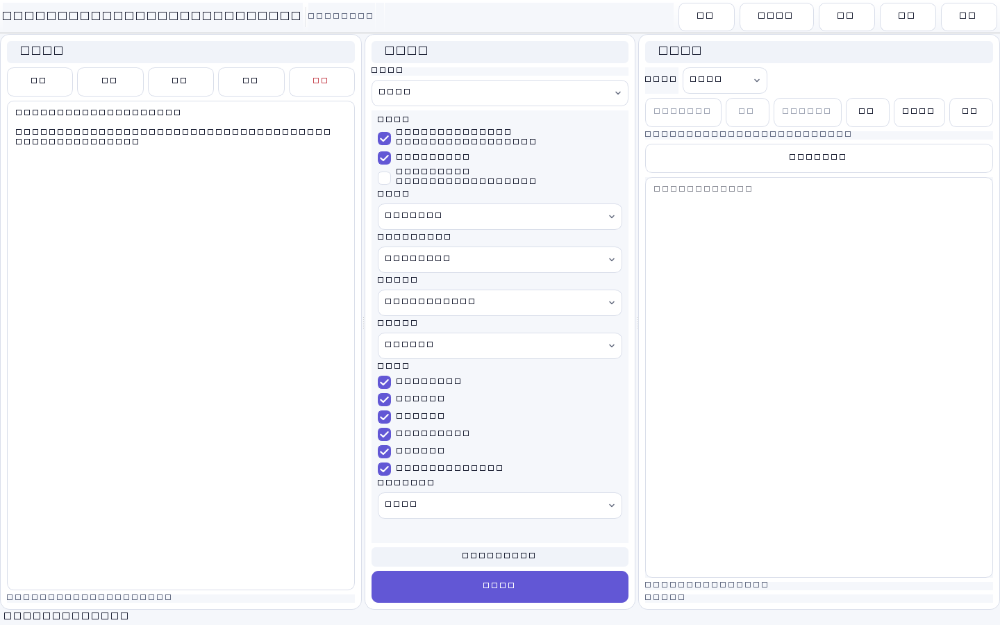

<p align="center"></p>

# 净文排版 · CleanText Studio

**一款本地优先的文本格式清洗、文档结构整理、公式预览与 Word/TXT 导出工具。**

[English](README.md) · **简体中文** · [繁體中文](README.zh-TW.md) · [日本語](README.ja.md) · [한국어](README.ko.md) · [Español](README.es.md) · [Français](README.fr.md) · [Deutsch](README.de.md) · [Português](README.pt-BR.md) · [Русский](README.ru.md) · [العربية](README.ar.md) · [हिन्दी](README.hi.md)

[](https://github.com/SiriZhao/CleanText-Studio/releases) [](https://github.com/SiriZhao/CleanText-Studio/actions/workflows/ci.yml)   [](LICENSE)

<!-- section:download -->
## Windows 下载

当前版本：**v1.4.2**。请从 [Releases](https://github.com/SiriZhao/CleanText-Studio/releases/latest) 下载 Windows x64 安装版，或下载 **Portable ZIP** 解压运行。安装版默认只为当前用户安装；两种版本均不要求另行安装 Python。



<!-- section:features -->
## v1.4.2 更新重点

- 修复按钮、显示模式、输入/结果占位文字、状态栏、规则数量和公式提示的运行时翻译刷新。
- 下拉框显示文字与稳定业务值彻底解耦；切换语言不会改变清洗预设、不会触发清洗。
- 通过统一 DesignToken 整合面板、复选框、下拉框、焦点边框和统计提示的圆角与间距。
- 使用合法系统字体回退；本版本不内置苹方、HarmonyOS Sans 或任何来源不明的字体文件。
- 重写项目首页文档，并加入 README、界面语言一致性与清洗冻结自动检查。

## 能解决什么问题

净文排版用于整理从聊天工具、网页、Office 或各类模型复制出来的格式混乱文本。它会清除无用 Markdown 和复制残留，同时尽量保留标题、列表、引用、代码、表格和数学公式等有价值的结构。预览、TXT 和 Word 导出共享同一份结构化文档模型，避免“预览正常、导出丢表格或公式”的问题。

### 文本清洗与结构恢复

- 清理 Markdown 标题、强调、行内代码、链接、图片、分隔线、HTML 复制残留、表情和装饰符号。
- 识别标题、列表、引用、代码块和表格，不把它们粗暴压成字符墙。
- 提供紧凑合并、智能分段和原样保留三种段落换行模式。
- 默认保留独立 URL；链接和 URL 的处理方式均可明确配置。

### 表格与 Word 导出

Markdown 表格会被解析为结构块。预览模式显示真实表格，Word 导出生成原生表格：表头加粗、边框可见、列宽按内容规划、单元格文字已完成清洗。较长中文不会被无意义地拆成大量短行。

### 数学公式

常用行内/块级 LaTeX、Unicode 数学表达式和简单方程会先被保护，再参与 Markdown 清洗。支持范围内的公式导出为 Word OMML 原生公式；复杂公式会降级为完整可读文本，而不会静默丢失变量。程序不会计算、证明、化简或改写数学含义。

### 可选的 BYOK AI 优化

基础清洗、预览、TXT 和 Word 导出都可离线使用。AI 优化仅在用户主动配置自己的 Provider、Base URL、模型和 API Key 后调用。项目不提供公共 API Key、不代付模型费用、不代理模型服务；请勿提交不适合交由第三方处理的敏感内容。

<!-- section:privacy -->
## 隐私与安全

本地清洗不会上传文本，也没有广告、遥测、账号系统或公共密钥。本软件用于文本格式清理、结构整理和文档排版；不提供规避 AI 检测、绕过查重、伪装人工写作、学术不端或伪造引用功能。

## 快速开始

1. 启动应用，粘贴文本或打开 TXT、Markdown、DOCX。
2. 选择清洗预设与段落模式。
3. 点击“开始清洗”，在文本模式或预览模式检查结果。
4. 导出 UTF-8 TXT 或结构化 Word 文档。

```text
清洗前：### 测试账号
        ---
        **无需登录**

清洗后：测试账号
        无需登录
```

## 输入、输出与系统要求

支持导入 `.txt`、`.md`、`.markdown`、`.docx`，导出 UTF-8 `.txt` 和结构化 `.docx`。v1.4.2 当前正式发布 Windows x64 桌面版本；macOS、Linux 和 Android 尚未作为已发布平台宣传。

## 从源码运行

```powershell
py -3.12 -m venv .venv
.\.venv\Scripts\pip install -e ".[dev]"
$env:PYTHONPATH = "src"
.\.venv\Scripts\python -m cleantext_studio.main
```

<!-- section:build -->
## 测试与 Windows 构建

```powershell
$env:PYTHONPATH = "src"
.\.venv\Scripts\ruff check .
.\.venv\Scripts\mypy src/cleantext_studio
.\.venv\Scripts\python -m pytest -q
.\.venv\Scripts\python scripts/check_translations.py
.\.venv\Scripts\python scripts/check_ui_language_consistency.py
.\.venv\Scripts\python scripts/check_readme_quality.py
.\.venv\Scripts\python scripts/verify_cleaning_freeze.py
.\scripts\build_windows.ps1
```

构建脚本会在 `dist/` 下生成 onedir 应用、便携版 ZIP、Inno Setup 安装包、SHA256 校验文件和发布说明。

## 多语言、贡献与已知限制

界面支持简体中文、繁體中文、English、日本語、한국어、Español、Français、Deutsch、Português（Brasil）、Русский、العربية（RTL）和 हिन्दी。欢迎协助审校翻译，参见 [翻译指南](docs/TRANSLATION_GUIDE.md)。复杂自定义 LaTeX 宏可能回退为可读文本；DOCX 导入不保证保留所有原始样式或嵌入图片。

开发者：[SiriZhao](https://github.com/SiriZhao) · 项目主页：[SiriZhao/CleanText-Studio](https://github.com/SiriZhao/CleanText-Studio) · 贡献方式见 [CONTRIBUTING.md](CONTRIBUTING.md)。

<!-- section:license -->
## 许可证

MIT License。第三方说明见 [THIRD_PARTY_LICENSES.md](THIRD_PARTY_LICENSES.md)。
