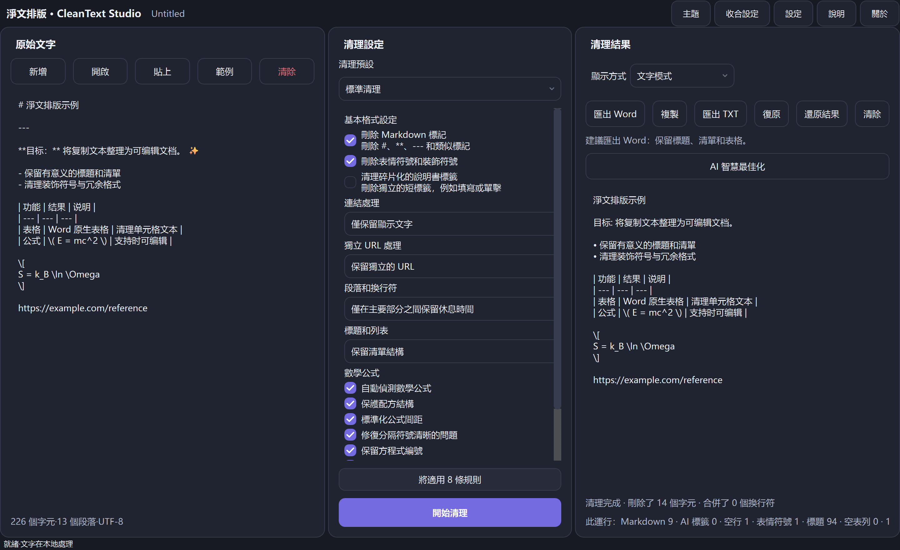

<p align="center">
  
</p>

<h1 align="center">CleanText Studio</h1>

<p align="center"><strong>本地優先文字清理、文件結構恢復、公式感知預覽以及針對複製和 AI 生成文本的精煉 DOCX/TXT 導出。 </strong></p>

<p align="center">
  <a href="README.md">English</a> · <a href="README.zh-CN.md">简体中文</a> · <a href="README.zh-TW.md">繁體中文</a> · <a href="README.ja.md">日本語</a> · <a href="README.ko.md">한국어</a> · <a href="README.es.md">Español</a> · <a href="README.fr.md">Français</a> · <a href="README.de.md">Deutsch</a> · <a href="README.pt-BR.md">Português (Brasil)</a> · <a href="README.ru.md">Русский</a> · <a href="README.ar.md">العربية</a> · <a href="README.hi.md">हिन्दी</a>
</p>

<p align="center">
  <a href="https://github.com/SiriZhao/CleanText-Studio/releases/tag/v1.5.1"></a>
  <a href="https://github.com/SiriZhao/CleanText-Studio/actions/workflows/ci.yml"></a>
  
  
  <a href="LICENSE"></a>
</p>

> **目前版本：v1.5.1 · Windows x64 · 預設本地優先**

<p align="center">
  <a href="https://github.com/SiriZhao/CleanText-Studio/releases/download/v1.5.1/CleanText-Studio-v1.5.1-Windows-x64-Setup.exe"><strong>下載安裝程式</strong></a> ·
  <a href="https://github.com/SiriZhao/CleanText-Studio/releases/download/v1.5.1/CleanText-Studio-v1.5.1-Windows-x64-Portable.zip"><strong>下載便攜式 ZIP</strong></a> ·
  <a href="https://github.com/SiriZhao/CleanText-Studio/releases/download/v1.5.1/SHA256SUMS.txt">SHA256 校驗與</a>
</p>



CleanText Studio 將雜亂的複製文字轉換為可讀、可編輯的文檔，而不將有用的結構視為噪音。它刪除多餘的 Markdown 和裝飾，恢復標題、列表、表格和常見數學符號，然後為您提供文字視圖、結構化預覽以及 DOCX 或 TXT 匯出。對設備進行基本清理；可選的 AI 最佳化僅使用您自己配置的 API 提供者。

**為什麼有用**

- 保留含義，同時消除網頁、聊天、筆記和生成草稿中的視覺殘留。
- 保留文件模型，以便標題、表格、連結和公式在匯出之前不會默默地變平。
- 在撰寫本機 Word 表、可編輯方程式或 UTF-8 文字檔案之前查看結果。
- 在運行時切換介面語言和主題，無需更改來源、結果或清理設定。

## 下載 Windows

CleanText Studio v1.5.1 已針對 **Windows x64** 發布。選擇正常的每個使用者安裝的安裝程序，或當您希望從提取的資料夾運行時選擇便攜式 ZIP。這兩個包都不需要單獨安裝 Python。

|套餐 |預期用途 |下載 |
| --- | --- | --- |
|設定 |安裝、開始功能表項目和卸載支援 | [CleanText-Studio-v1.5.1-Windows-x64-Setup.exe](https://github.com/SiriZhao/CleanText-Studio/releases/download/v1.5.1/CleanText-Studio-v1.5.1-Windows-x64-Setup.exe) |
|便攜式|解壓縮ZIP後運作；無需安裝| [CleanText-Studio-v1.5.1-Windows-x64-Portable.zip](https://github.com/SiriZhao/CleanText-Studio/releases/download/v1.5.1/CleanText-Studio-v1.5.1-Windows-x64-Portable.zip) |
|驗證|檢查下載的套件 | [SHA256SUMS.txt](https://github.com/SiriZhao/CleanText-Studio/releases/download/v1.5.1/SHA256SUMS.txt) |

發布頁面是可用文件的真實來源：[CleanText Studio v1.5.1](https://github.com/SiriZhao/CleanText-Studio/releases/tag/v1.5.1)。

## CleanText Studio 的作用

### 專為實用文件清理而設計

複製的內容通常帶有以標記、重複分隔符號、裝飾性表情符號、折線換行、教程標籤、貼上連結或僅在視覺上呈表格形式的表格形式編寫的標題。 CleanText Studio 使這些選擇變得明確，而不是應用隱藏的一刀切重寫。選擇一個預設，檢查結果，然後僅在結構看起來正確後匯出。

### 典型場景- 規範化研究筆記、會議筆記、知識庫摘錄和網頁副本。
- 準備人工智慧輔助草稿以進行編輯和專業文件交付。
- 在將 Markdown 表作為本機 Word 表發送之前恢復它。
- 保留簡單的內聯和區塊數學，同時消除周圍的格式雜訊。
- 當不需要 Word 佈局時，建立乾淨的 TXT 切換。

## 核心能力

### Markdown 與格式清理

清理管道可以刪除 Markdown 標題標記、強調標記、內聯程式碼標記、圖像語法、水平規則、複製的 HTML 殘留物、裝飾符號、表情符號和碎片教學標籤。它保留普通文字並使清理選項在設定面板中可見。

### 文檔結構恢復

標題、列表、引文、程式碼區塊、段落、表格、連結和數學區塊被表示為文件結構，而不是盲目地折疊成字元流。這就是為什麼預覽和匯出可以做出相同的結構決策。

### 標題和列表

選擇是否保留標記、自然化結構或在適當的情況下刪除標記。該工具旨在保留有用的層次結構和列表語義；它不是一個發明新大綱的通用重寫器。

### 段落和換行符

三種模式涵蓋常見的來源材料：

|模式|當 | 時使用它
| --- | --- |
|緊湊|您希望將普通的換行原始程式碼行連接成緊湊的段落。 |
|智慧版塊|您需要自然的段落間距，同時保留有意義的分節符。 |
|保留所有|您需要盡可能緊密地保持來源段落邊界。 |

### 連結和獨立 URL

連結處理可以保留 Markdown、僅保留顯示文字或保留顯示文字及其 URL。獨立的 URL 可以保留、與前面的段落合併，或者當它們只是教程殘留時刪除。 URL 是經過有意處理的，而不是作為 Markdown 清理的副作用而消失。

## 表格、方程式和預覽

### Markdown 表和 Word 表

Markdown 表被解析為結構化表塊。預覽模式將表格顯示為表格，DOCX 匯出建立一個本機 Word 表格，其中包含標題行、可讀儲存格內容、邊框和從內容中選擇的寬度，而不是固定的等分割。如果活動清理設定允許，則在匯出之前會清理 Markdown 分隔符號行、殘留強調標記、無意義的空列和意外的軟換行符。


### 數學公式和可編輯的 Word 方程

常見的內聯和顯示 LaTeX 分隔符號、Unicode 數學表達式和簡單方程式受到保護，同時清除周圍的文字。支援的公式以 Word OMML 本機方程式形式發出，因此常見變數和表達式在 Word 中仍可編輯。公式間距、明顯的分隔符號問題和公式編號可以根據所選選項進行標準化。

複雜的自訂巨集不會被默默地丟棄。當公式超出支援的轉換範圍時，應用程式會保留可讀的回退並在匯出品質資訊中報告它。


### 文字模式與預覽模式

文字模式對於查看標準化的純文字結果非常有用。預覽模式以以文件為導向的形式顯示標題、清單、表格、連結和公式。切換顯示模式不會重新執行清理或變更結果。

## 之前和之後以下緊湊的範例顯示了該應用程式旨在清除的殘留物類型，同時保留有用的內容。

**來源**```markdown
### **Project notes** ✨
---
Read the **draft** first.

- Keep the main conclusion
- Remove decorative labels

| Item | Value |
| --- | --- |
| Formula | \( E = mc^2 \) |

https://example.com/reference
```**結果概念**```text
Project notes

Read the draft first.

• Keep the main conclusion
• Remove decorative labels

The table and E = mc² formula remain structured in Preview and DOCX export.
```

## 匯出格式

### 匯出Word

當目標需要標題、清單、表格和支援的公式作為可編輯文件元素時，選擇 Word 匯出。匯出器產生一個 `.docx` 檔案；它不會自動執行本機安裝的 Word 應用程式。在匯出之前，應用程式可以顯示結構和品質摘要，以便可恢復的公式/表格限制可見。

### 匯出TXT

選擇 TXT 以獲得可移植的 UTF-8 純文字結果。 TXT 匯出保留規範化文字內容，但不能將 Word 本機表或可編輯 OMML 方程式表示為豐富的文件物件。

|輸入|輸出|
| --- | --- |
| TXT、Markdown、醫學博士、DOCX | UTF-8 TXT 與結構化 DOCX |

## 語言、主題和可訪問性

桌面介面提供簡體中文、繁體中文、英文、日文、韓文、西班牙文、法文、德文、巴西葡萄牙文、俄文、阿拉伯語和印地語。語言變更在運行時套用並保留文字、結果、目前選擇和撤銷歷史記錄。阿拉伯語使用從右到左的介面，而 URL、API 鍵和程式碼等技術值仍然是從左到右可讀的。

淺色和深色主題共享相同的面板、控制、焦點和圓形表面系統。應用程式使用法律系統字體後備（如果可用）；它**不**捆綁 Apple PingFang 檔案。


## 可選的AI優化（BYOK）

AI優化是可選的。基本清理、預覽、TXT 匯出和 DOCX 匯出無需網路連線即可使用。當您有意啟用 AI 最佳化時，您可以選擇受支援的供應商、端點、模型和您自己的 API 金鑰。該應用程式不提供共享的免費 API 密鑰或代理您的提供者帳戶。

可透過 AI 設定對話方塊選擇 DeepSeek 和已安裝的應用程式設定公開的其他提供者。提供者和模型標識符與翻譯的顯示標籤保持分離。在發送敏感資料之前，請查看提供者自己的資料條款。


## 快速開始

1. 啟動 CleanText Studio 並貼上文本，或開啟支援的文件。
2. 選擇清潔預設並僅調整本文檔所需的選項。
3. 按一下**清理**，然後檢查文字模式或預覽模式。
4. 匯出至 Word 進行結構化交付，或匯出至 TXT 進行標準化純文字檔案。
5. 如果需要，配置您自己的 AI 提供者並有意識地選擇何時向其發送文字。

### 安裝程式或可攜式版本

- **安裝程式：**執行安裝程式可執行文件，依照安裝程式進行操作，然後從「開始」功能表啟動 CleanText Studio。使用 Windows 應用程式設定或解除安裝程式將其刪除。
- **可攜式：** 將 ZIP 解壓縮到可寫入資料夾並啟動其中的可執行檔。將提取的文件放在一起；不要直接從壓縮檔案運行它。

### 完整的工作流程

1. 將來源文字放入左側面板中。
2. 使用中心面板決定如何處理 Markdown、連結、段落、清單和公式。
3. 查看右側的清理結果並使用表格和方程式的預覽。
4. 使用結果工具列複製、撤銷、還原最新結果、清除、匯出 TXT 或匯出 Word。
5. 當文件具有法律、檔案或出版意義時，保留原始來源的副本。

## 隱私、安全與資料流

### 本地優先基本處理基本清理在本地運行。該應用程式沒有帳戶系統、廣告服務、遙測服務或共享公共 API 密鑰。您的文字不會僅僅因為在本地貼上、預覽、清理或匯出而被上傳。

### AI 請求是選擇性加入的

只有顯式 AI 最佳化操作才會使用您配置的第三方提供者。提供者根據自己的條款接收該請求所需的材料。請勿將提供者要求用於您無權共享的資料。

### API 密鑰處理

API 密鑰由使用者提供，不會寫入匯出的文件配置。在 Windows 上，應用程式使用其配置的憑證儲存機制（如果可用）；如果安全憑證儲存不可用，它會安全地回退，而不是默默地導出明文金鑰。將您的作業系統帳戶和提供者憑證視為安全邊界。

## 系統需求

- Windows x64。
- 目前支援的 Windows 桌面環境。
- 沒有單獨安裝發布包的 Python 運行時。
- 網路存取是可選的，僅在 GitHub 下載、可選 AI 使用或用戶開啟的連結時需要。

Windows SmartScreen 可以針對新的未簽署或低信譽版本顯示信譽警告。僅從儲存庫發布頁面下載，驗證 SHA256 校驗和，並遵循組織的軟體安裝策略。

## 技術堆疊和專案架構

CleanText Studio 是一個 Python 桌面應用程序，使用 PySide6 作為界面，使用 python-docx 進行 DOCX 編寫，使用 PyInstaller 進行便攜式打包，使用 Inno Setup 進行 __TOKEN17__ 進行便攜式安裝，使用 Inno Setup 進行 __TOK清理和文件區塊模型位於表示層下方，允許文字、預覽和匯出使用相同的標準化結構。```text
src/cleantext_studio/
├── app.py                 # desktop window and presentation wiring
├── cleaners/              # stable text-cleaning pipeline
├── math/                  # detection, parsing, preview, and OMML support
├── exporters/             # DOCX and TXT exporters
├── i18n/                  # locale catalogs and runtime translation service
├── ui/                    # cards, controls, and theme components
└── llm/                   # optional provider configuration and requests
assets/                    # icon, screenshots, and packaged resources
scripts/                   # validation, screenshot, and Windows-build helpers
tests/                     # unit, GUI, integration, and regression checks
```## 從原始碼運行

以下命令與 PowerShell 上的儲存庫的開發佈局相符。```powershell
git clone https://github.com/SiriZhao/CleanText-Studio.git
cd CleanText-Studio
py -3.12 -m venv .venv
.\.venv\Scripts\pip install -e ".[dev]"
$env:PYTHONPATH = "src"
.\.venv\Scripts\python -m cleantext_studio.main
```## 測試和構建```powershell
$env:PYTHONPATH = "src"
.\.venv\Scripts\ruff check .
.\.venv\Scripts\mypy src/cleantext_studio
.\.venv\Scripts\python -m pytest -q
.\.venv\Scripts\python scripts/check_translations.py
.\.venv\Scripts\python scripts/check_readme_quality.py
.\.venv\Scripts\python scripts/check_screenshot_quality.py
.\.venv\Scripts\python scripts/verify_cleaning_freeze.py
.\scripts\build_windows.ps1
```Windows 建置將其目前工件、校驗和和發行說明寫入 `dist/`。建置輸出故意不提交到儲存庫。

## 發布工件和 SHA256 驗證

每個版本都提供安裝程式可執行檔、可移植 ZIP、`SHA256SUMS.txt` 和發行說明（如果有）。在 PowerShell 中，將下載的工件與發佈的校驗和進行比較：```powershell
Get-FileHash .\CleanText-Studio-v1.5.1-Windows-x64-Setup.exe -Algorithm SHA256
Get-Content .\SHA256SUMS.txt
```## 國際化與翻譯貢獻

官方語言環境目錄為 `zh_CN`、`zh_TW`、`en_US`、`ja_JP`、`ko_KR`、`es_ES`、`fr_FR`、`de_DE`、`pt_BR`、`ru_RU`19__KEN109__K在建議術語變更之前，請參閱 [docs/TRANSLATION_GLOSSARY.md](docs/TRANSLATION_GLOSSARY.md) 和 [docs/README_TRANSLATION_STATUS.md](docs/README_TRANSLATION_STATUS.md)。歡迎社群翻譯評審；該儲存庫並不聲稱每個文件翻譯都經過了母語人士的審查。

## 路線圖

目前的公開版本是 Windows x64。未來的平台工作、更豐富的進口保真度和更廣泛的配方覆蓋範圍是路線圖主題，而不是當前的運輸索賠。歡迎功能請求和問題報告，但路線圖專案不是承諾或發佈公告。

## 已知限制

- 複雜的自訂 LaTeX 巨集可能需要可讀的後備，而不是本機 Word 方程式轉換。
- DOCX 匯入無法保留任意 Word 檔案中的每個原始樣式、嵌入物件或佈局功能。
- TXT 無法編碼豐富的 Word 原生表格或可編輯方程式。
- 可選的人工智慧輸出由您選擇的第三方提供者生成，需要人工審核。
- Windows 包裝是此處所述的唯一發布平台； macOS、Linux、Android 和 iOS 目前尚未作為已發布版本進行宣傳。

## 常見問題解答

### 我必須在線嗎？

不需要。無需網路連線即可進行本地清理、預覽和本地匯出。只有下載版本、開啟外部連結或您選擇發出的 AI 請求等操作才需要網路存取權限。

### 應用程式會上傳我的文字嗎？

不適用於基本的本地處理。只有當您透過自己設定的提供者明確使用 AI 最佳化時，才會出現第三方請求。

### 我必須配置 API 密鑰嗎？

不需要。只有可選的 AI 最佳化才需要 API 密鑰。

### 我可以使用哪些檔案？

應用程式接受 TXT、Markdown/MD 和 DOCX 輸入，並可匯出 UTF-8 TXT 或結構化 DOCX。

### Word 和 TXT 匯出有什麼不同？

Word 可以保留豐富的結構，例如標題、本機表格和支援的可編輯方程式。 TXT 是一個乾淨的 UTF-8 文字切換，沒有豐富的文檔物件。

### 為什麼某些文件建議使用 Word 匯出？

它是能夠最忠實地承載恢復的文件結構的格式，尤其是表格和支援的公式。

### 公式可以編輯嗎？

支援的公式匯出為 Word OMML 本機方程式。不受支援的複雜巨集可能會使用可讀的後備，應在發布前進行檢查。

### 表是否匯出為 Word 表？

選擇 Word 匯出時，結構化 Markdown 表將會匯出為本機 Word 表。

### 如何更改語言或主題？

使用應用程式工具列/設定中的語言和主題控制項。運行時開關保留活動文檔和清理選擇。

### 我的 API 密鑰儲存在哪裡？

應用程式使用其配置的 Windows 憑證儲存路徑（如果可用），並且在匯出的配置中不包含金鑰。檢查已安裝版本的設定和您的系統安全策略。

### 安裝程式還是便攜式 ZIP？

選擇正常 Windows 整合和卸載支援的安裝程式。當您需要提取的獨立資料夾時，請選擇便攜式。

### 如何回報問題或貢獻翻譯？在 [SiriZhao/CleanText-Studio](https://github.com/SiriZhao/CleanText-Studio) 中開啟問題或拉取請求，包括非敏感範例和可能的預期結果。

## 貢獻

在開啟拉取請求之前，請閱讀 [CONTRIBUTING.md](CONTRIBUTING.md)。保持變更重點，在行為發生變化時添加測試，避免提交建置輸出或憑證，並保留專案本地優先的隱私態勢。

## 開發者

由 [SiriZhao](https://github.com/SiriZhao) 維護。專案首頁：[SiriZhao/CleanText-Studio](https://github.com/SiriZhao/CleanText-Studio)。

## 第三方許可證

有關分散式和運行時相依性聲明，請參閱 [THIRD_PARTY_LICENSES.md](THIRD_PARTY_LICENSES.md)。 CleanText Studio 不打包 Apple PingFang 字型檔。

## 許可證

CleanText Studio 可在 [MIT License]（許可證）下使用。

> 歡迎社群協助校閱本 README 的中文表述。
