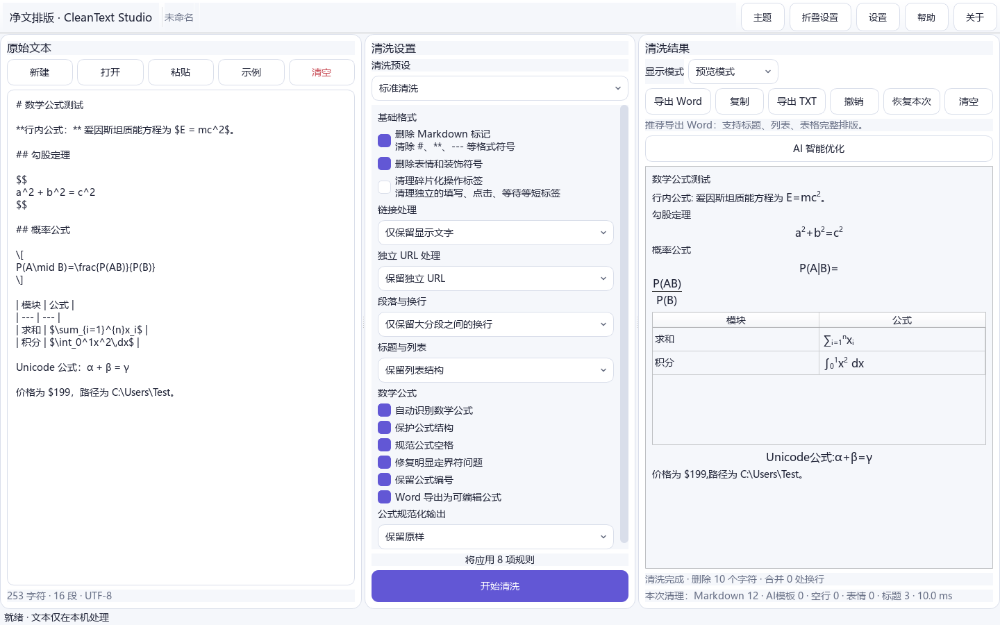
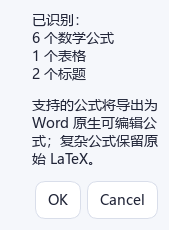

<p align="center"></p>

# CleanText Studio

A local-first Windows app for text cleanup, document structure, math typesetting, and TXT/DOCX export.

[](https://github.com/SiriZhao/CleanText-Studio/releases/tag/v1.3.1)  

## Windows download

Download the x64 installer or portable package from the [v1.3.1 release](https://github.com/SiriZhao/CleanText-Studio/releases/tag/v1.3.1). Current version: **v1.3.1**. Developer: **SiriZhao**.

## What is new in v1.3.1

- Formula AST parsing and real offline rich-text preview instead of supported LaTeX source.
- Editable native Word OMML for fractions, roots, scripts, n-ary operators, Greek letters, matrices, and cases.
- Deep Markdown/HTML cleanup inside table cells while preserving inline formulas.
- Integrity-checked conversion with readable, delimiter-free fallback for unsupported macros.

## Screenshots

| Math cleanup | Formula preview |
|---|---|
|  |  |

## Formula rendering


## Native Word equations



## Clean tables and formulas


## Core features

Deterministic Markdown cleanup, structured headings/lists/quotes/code/tables/math, three paragraph modes, TXT/DOCX import/export, system/light/dark themes, and optional BYOK AI providers.

## Before and after

`**Formula:** \[S = k_B \ln \Omega\]` becomes clean text with a rendered preview and editable Word equation. Markdown headings, emphasis, separators, and table-cell markers are removed without flattening document structure.

## Formats and usage

Imports `.txt`, `.md`, `.markdown`, and `.docx`; exports UTF-8 TXT and structured DOCX. Paste or open text, choose a preset, clean, review in text/preview mode, and export.

## BYOK AI configuration

AI is optional and disabled by default. Keys are stored in Windows Credential Manager or session memory. The project does not provide keys, pay provider fees, or proxy model services.

## Offline mode and privacy

Cleanup, preview, TXT, and Word export work entirely offline. No telemetry or automatic text upload is used. Third-party handling applies only after the user explicitly invokes a configured API.

## Word and math support

Word export uses native headings, lists, tables, and OMML. Supported math includes `$`, `$$`, `\(\)`, `\[\]`, common equation/align/matrix/cases environments, scripts, fractions, roots, sums, integrals, relations, functions, Greek letters, and `\text{...}`. The app never evaluates or rewrites math semantics.

## Known limitations

Complex custom macros, uncommon environments, and deeply nested TeX may use readable text fallback. The lightweight preview is not a complete TeX engine. DOCX import does not preserve images or all advanced styles.

## Install, develop, test, and build

The installer uses per-user installation; the portable build needs no Python. For source development:

```powershell
py -3.12 -m venv .venv
.\.venv\Scripts\pip install -e ".[dev]"
.\.venv\Scripts\python -m cleantext_studio.main
.\.venv\Scripts\ruff check .
.\.venv\Scripts\mypy src/cleantext_studio
.\.venv\Scripts\pytest
.\scripts\build_windows.ps1
```

## Roadmap, contributing, developer, and license

Future work covers broader complex-math compatibility, templates, granular diff restoration, and accessibility. See [CONTRIBUTING.md](CONTRIBUTING.md). Developer: **SiriZhao** · [Repository](https://github.com/SiriZhao/CleanText-Studio). MIT licensed.

This project does not provide AI-detection evasion, plagiarism bypass, or academic misconduct features.
