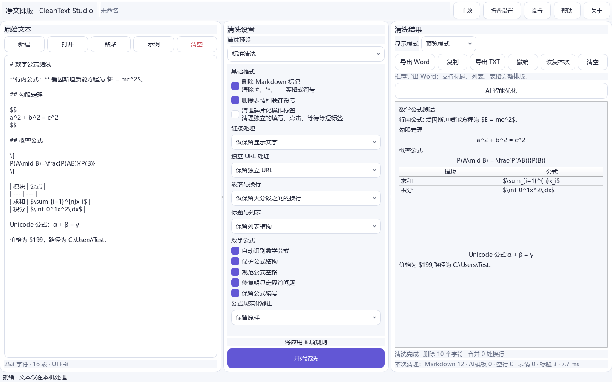

# CleanText Studio

CleanText Studio v1.3.0 is a local-first Windows desktop application for deterministic text cleanup, document structure normalization, math protection, and native TXT/DOCX export.

## Math support in v1.3.0

- Protects `$...$`, `$$...$$`, `\\(...\\)`, `\\[...\\]`, and common LaTeX environments before Markdown cleanup.
- Recognizes Unicode math, plain equations, equation numbers, and formulas mixed with tables.
- Exports a safe LaTeX subset as editable Word OMML; unsupported constructs safely remain original LaTeX.
- Uses an offline lightweight preview with no CDN, remote renderer, TeX execution, or semantic rewriting.

Complex macros, custom commands, and uncommon environments may remain as original LaTeX text.

Developer: **SiriZhao** · Repository: [github.com/SiriZhao/CleanText-Studio](https://github.com/SiriZhao/CleanText-Studio)

Offline cleanup requires no account or API. Optional BYOK optimization supports OpenAI, DeepSeek, Anthropic, OpenAI-compatible, and local-compatible endpoints. DeepSeek now suggests `deepseek-v4-flash` for new configurations; existing user-selected models remain unchanged.

v1.2.0 parses Markdown tables into structured blocks, displays them in preview mode, and exports native Word tables with headers, borders, wrapping, and Chinese font settings. It also improves Provider controls and removes the unstable boilerplate-cleaning feature.

v1.2.1 splits cleanup into explicit normalization, Markdown, structure, high-confidence AI pattern, URL, and paragraph-formatting stages. Tutorial URL instructions are removed while ordinary document URLs remain intact.

v1.2.2 adds opt-in instructional-label cleanup, three context-aware standalone URL modes, block-aware residual warnings, consistent modification records, and a Word export structure summary. Preview and DOCX export use the same structured block result.

Run `python -m cleantext_studio.main`; package with `scripts/build_windows.ps1`. MIT licensed.
